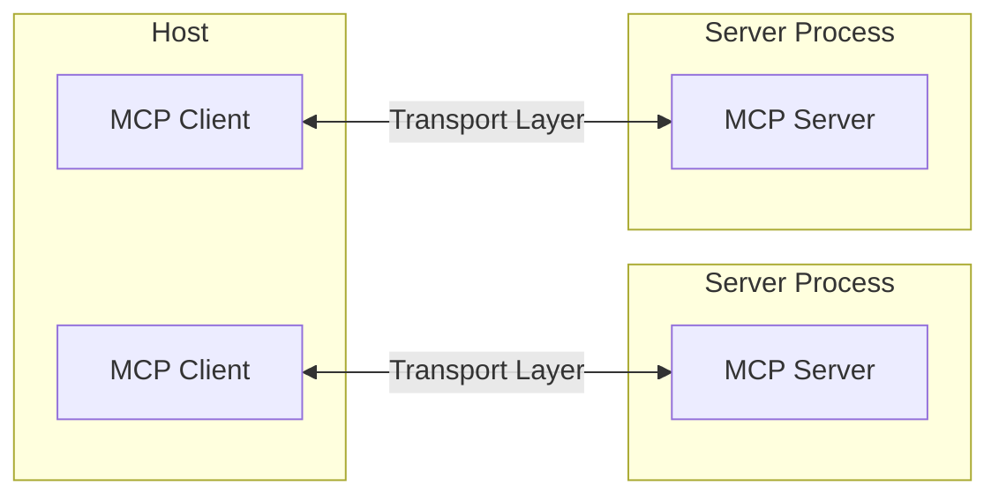
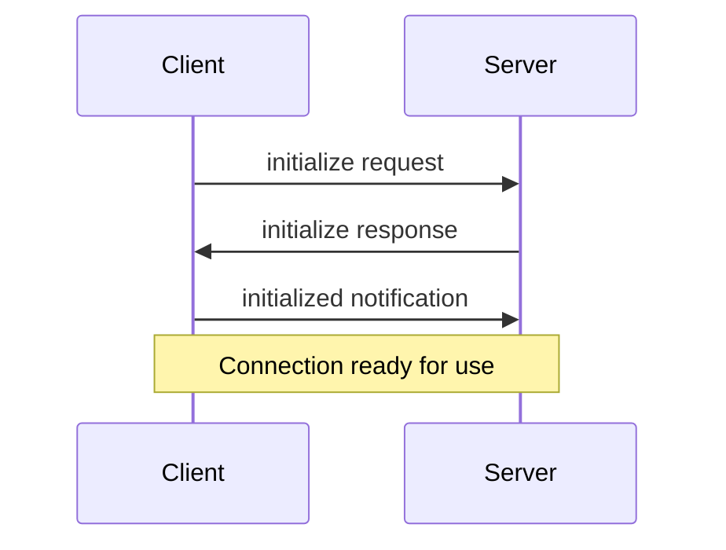
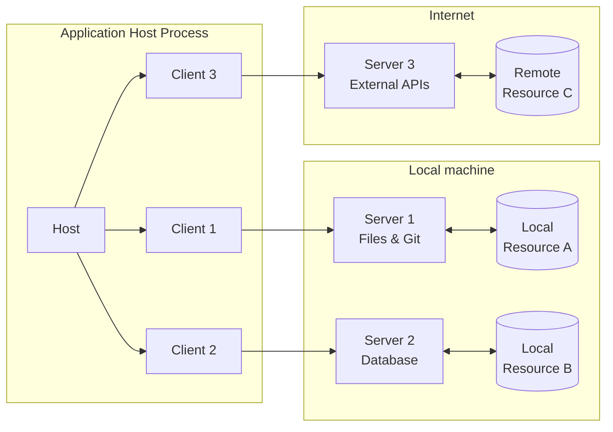
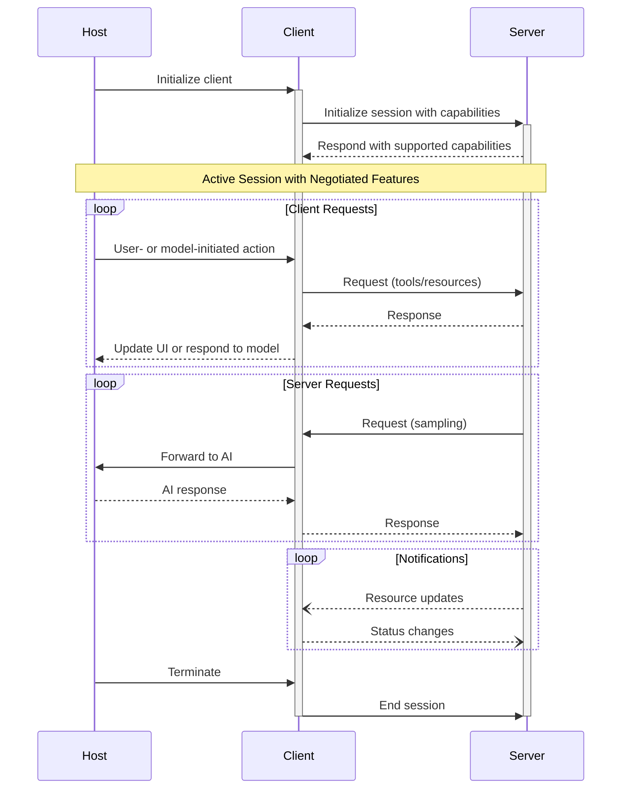
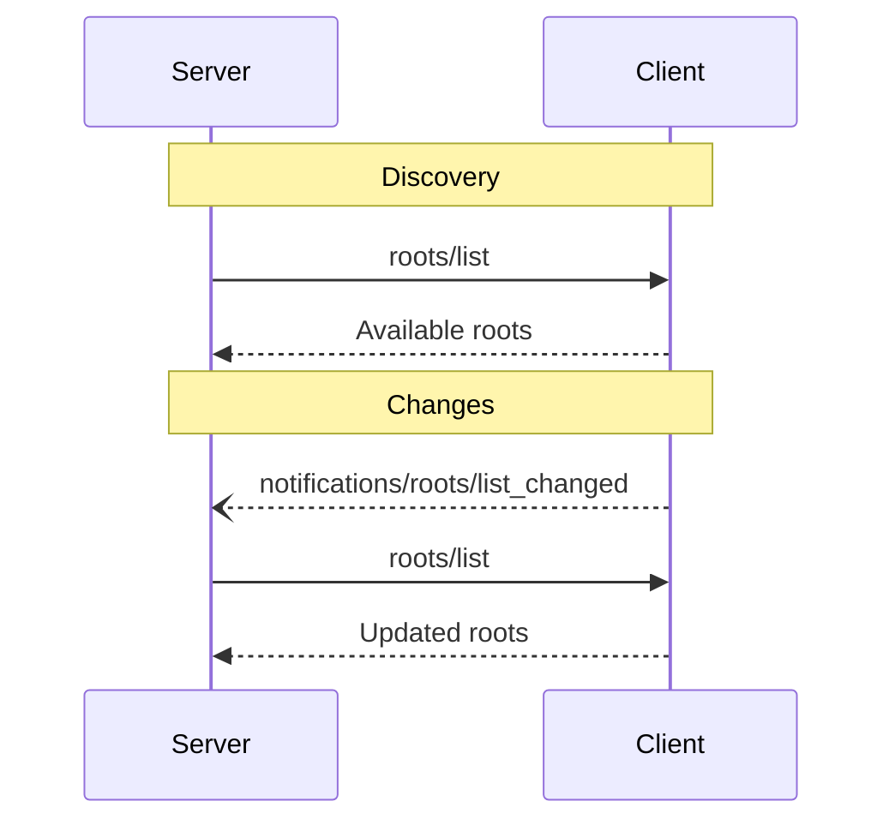
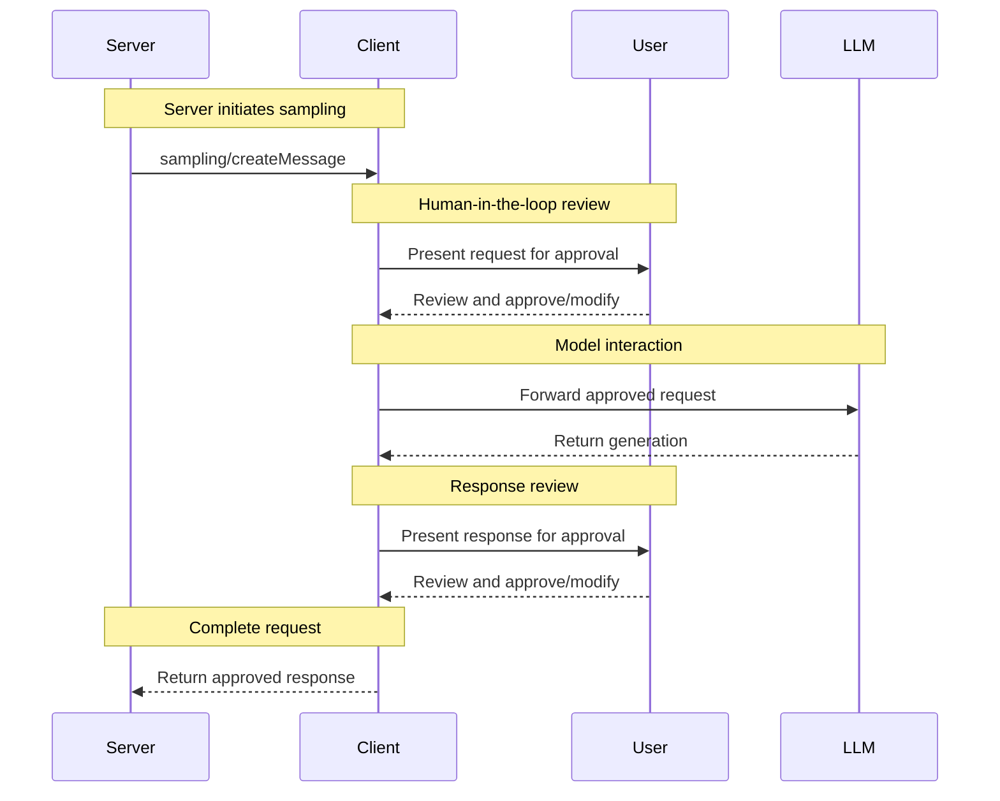

# Core architecture

> Understand how MCP connects clients, servers, and LLMs

The Model Context Protocol (MCP) is built on a flexible, extensible architecture that enables seamless communication between LLM applications and integrations. This document covers the core architectural components and concepts.

## Overview

MCP follows a client-server architecture where:

 >**Hosts** are LLM applications (like Claude Desktop or IDEs) that initiate connections 

 **Host**는 연결을 시작하는 LLM 애플리케이션입니다 (Claude Desktop이나 IDE 등)

> **Clients** maintain 1:1 connections with servers, inside the host application 

 **Client**는 호스트 애플리케이션 내에서 서버와 1:1 연결을 유지합니다

> **Servers** provide context, tools, and prompts to clients 

 **Server**는 클라이언트에게 context, tools, prompts를 제공합니다



## Core components

### Protocol layer

The protocol layer handles message framing, request/response linking, and high-level communication patterns.

```typescript
    class Protocol<Request, Notification, Result> {
        // Handle incoming requests
        setRequestHandler<T>(schema: T, handler: (request: T, extra: RequestHandlerExtra) => Promise<Result>): void

        // Handle incoming notifications
        setNotificationHandler<T>(schema: T, handler: (notification: T) => Promise<void>): void

        // Send requests and await responses
        request<T>(request: Request, schema: T, options?: RequestOptions): Promise<T>

        // Send one-way notifications
        notification(notification: Notification): Promise<void>
    }
    ```

```python
    class Session(BaseSession[RequestT, NotificationT, ResultT]):
        async def send_request(
            self,
            request: RequestT,
            result_type: type[Result]
        ) -> Result:
            """Send request and wait for response. Raises McpError if response contains error."""
            # Request handling implementation

        async def send_notification(
            self,
            notification: NotificationT
        ) -> None:
            """Send one-way notification that doesn't expect response."""
            # Notification handling implementation

        async def _received_request(
            self,
            responder: RequestResponder[ReceiveRequestT, ResultT]
        ) -> None:
            """Handle incoming request from other side."""
            # Request handling implementation

        async def _received_notification(
            self,
            notification: ReceiveNotificationT
        ) -> None:
            """Handle incoming notification from other side."""
            # Notification handling implementation
```

Key classes include:

* `Protocol`
* `Client`
* `Server`

### Transport layer

The transport layer handles the actual communication between clients and servers. MCP supports multiple transport mechanisms:

전송 계층은 클라이언트와 서버 간의 실제 통신을 처리합니다. MCP는 여러 전송 메커니즘을 지원합니다:

1. **Stdio transport**

   * Uses standard input/output for communication
   * Ideal for local processes

2. **Streamable HTTP transport**
   * Uses HTTP with optional Server-Sent Events for streaming
   * HTTP POST for client-to-server messages

All transports use [JSON-RPC](https://www.jsonrpc.org/) 2.0 to exchange messages. See the [specification](/specification/) for detailed information about the Model Context Protocol message format.

information about the Model Context Protocol message format. 모든 전송은 메시지 교환을 위해 [JSON-RPC](https://www.jsonrpc.org/) 2.0을 사용합니다. Model Context Protocol 메시지 형식에 대한 자세한 정보는 [specification](/specification/)을 참조.

---
### Message types

MCP has these main types of messages:

1. **Requests** expect a response from the other side:

   ```typescript
   interface Request {
     method: string;
     params?: { ... };
   }
   ```

2. **Results** are successful responses to requests:

   ```typescript
   interface Result {
     [key: string]: unknown;
   }
   ```

3. **Errors** indicate that a request failed:

   ```typescript
   interface Error {
     code: number;
     message: string;
     data?: unknown;
   }
   ```

4. **Notifications** are one-way messages that don't expect a response:
   ```typescript
   interface Notification {
     method: string;
     params?: { ... };
   }
   ```

---
## Connection lifecycle

### 1. Initialization



1. Client sends `initialize` request with protocol version and capabilities
2. Server responds with its protocol version and capabilities
3. Client sends `initialized` notification as acknowledgment
4. Normal message exchange begins

일종의 handshake

### 2. Message exchange

After initialization, the following patterns are supported:

* **Request-Response**: Client or server sends requests, the other responds
* **Notifications**: Either party sends one-way messages

어느쪽이든 단방향임.

### 3. Termination

Either party can terminate the connection:

* Clean shutdown via `close()`
* Transport disconnection
* Error conditions

어느쪽이든 연결 종료 가능.

## Error handling

MCP defines these standard error codes:

```typescript
enum ErrorCode {
  // Standard JSON-RPC error codes
  ParseError = -32700,
  InvalidRequest = -32600,
  MethodNotFound = -32601,
  InvalidParams = -32602,
  InternalError = -32603,
}
```

SDKs and applications can define their own error codes above -32000.

Errors are propagated through:

* Error responses to requests
* Error events on transports
* Protocol-level error handlers

## Implementation example

Here's a basic example of implementing an MCP server:

```typescript
    import { Server } from "@modelcontextprotocol/sdk/server/index.js";
    import { StdioServerTransport } from "@modelcontextprotocol/sdk/server/stdio.js";

    const server = new Server({
      name: "example-server",
      version: "1.0.0"
    }, {
      capabilities: {
        resources: {}
      }
    });

    // Handle requests
    server.setRequestHandler(ListResourcesRequestSchema, async () => {
      return {
        resources: [
          {
            uri: "example://resource",
            name: "Example Resource"
          }
        ]
      };
    });

    // Connect transport
    const transport = new StdioServerTransport();
    await server.connect(transport);
    ```


```python
    import asyncio
    import mcp.types as types
    from mcp.server import Server
    from mcp.server.stdio import stdio_server

    app = Server("example-server")

    @app.list_resources()
    async def list_resources() -> list[types.Resource]:
        return [
            types.Resource(
                uri="example://resource",
                name="Example Resource"
            )
        ]

    async def main():
        async with stdio_server() as streams:
            await app.run(
                streams[0],
                streams[1],
                app.create_initialization_options()
            )

    if __name__ == "__main__":
        asyncio.run(main())
```

## Best practices

### Transport selection

1. **Local communication**

   * Use stdio transport for local processes
   * Efficient for same-machine communication
   * Simple process management

2. **Remote communication**
   * Use Streamable HTTP for scenarios requiring HTTP compatibility
   * Consider security implications including authentication and authorization

로컬통신, 리모트통신
### Message handling

1. **Request processing**

   * Validate inputs thoroughly
   * Use type-safe schemas
   * Handle errors gracefully
   * Implement timeouts

2. **Progress reporting**

   * Use progress tokens for long operations
   * Report progress incrementally
   * Include total progress when known

3. **Error management**
   * Use appropriate error codes
   * Include helpful error messages
   * Clean up resources on errors

## Security considerations

보안적 고려사항들.

1. **Transport security**

   * Use TLS for remote connections
   * Validate connection origins
   * Implement authentication when needed

2. **Message validation**

   * Validate all incoming messages
   * Sanitize inputs
   * Check message size limits
   * Verify JSON-RPC format

3. **Resource protection**

   * Implement access controls
   * Validate resource paths
   * Monitor resource usage
   * Rate limit requests

4. **Error handling**
   * Don't leak sensitive information
   * Log security-relevant errors
   * Implement proper cleanup
   * Handle DoS scenarios

## Debugging and monitoring

1. **Logging**

   * Log protocol events
   * Track message flow
   * Monitor performance
   * Record errors

2. **Diagnostics**

   * Implement health checks
   * Monitor connection state
   * Track resource usage
   * Profile performance

3. **Testing**
   * Test different transports
   * Verify error handling
   * Check edge cases
   * Load test servers

# Resources

> Expose data and content from your servers to LLMs

Resources are a core primitive in the Model Context Protocol (MCP) that allow servers to expose data and content that can be read by clients and used as context for LLM interactions.

Resources는 Model Context Protocol (MCP)의 핵심 프리미티브로, 서버가 클라이언트가 읽고 LLM 상호작용의 컨텍스트로 사용할 수 있는 데이터와 콘텐츠를 노출할 수 있게 합니다.

<Note>
  Resources are designed to be **application-controlled**, meaning that the client application can decide how and when they should be used.
  Different MCP clients may handle resources differently. For example:

  * Claude Desktop currently requires users to explicitly select resources before they can be used
  * Other clients might automatically select resources based on heuristics
  * Some implementations may even allow the AI model itself to determine which resources to use

  Server authors should be prepared to handle any of these interaction patterns when implementing resource support. In order to expose data to models automatically, server authors should use a **model-controlled** primitive such as [Tools](./tools).
</Note>

## Overview

Resources represent any kind of data that an MCP server wants to make available to clients. This can include:

Resources는 Model Context Protocol (MCP)의 핵심 프리미티브로, 서버가 클라이언트가 읽고 LLM 상호작용의 컨텍스트로 사용할 수 있는 데이터와 콘텐츠를 노출할 수 있음.

* File contents
* Database records
* API responses
* Live system data
* Screenshots and images
* Log files
* And more

Each resource is identified by a unique URI and can contain either text or binary data.

## Resource URIs

Resources are identified using URIs that follow this format:

```
[protocol]://[host]/[path]
```

For example:

* `file:///home/user/documents/report.pdf`
* `postgres://database/customers/schema`
* `screen://localhost/display1`

The protocol and path structure is defined by the MCP server implementation. Servers can define their own custom URI schemes.

## Resource types

Resources can contain two types of content:

### Text resources

Text resources contain UTF-8 encoded text data. These are suitable for:

* Source code
* Configuration files
* Log files
* JSON/XML data
* Plain text

### Binary resources

Binary resources contain raw binary data encoded in base64. These are suitable for:

* Images
* PDFs
* Audio files
* Video files
* Other non-text formats

## Resource discovery

Clients can discover available resources through two main methods:

### Direct resources

Servers expose a list of resources via the `resources/list` request. Each resource includes:

```typescript
{
  uri: string;           // Unique identifier for the resource
  name: string;          // Human-readable name
  description?: string;  // Optional description
  mimeType?: string;     // Optional MIME type
  size?: number;         // Optional size in bytes
}
```

### Resource templates

For dynamic resources, servers can expose [URI templates](https://datatracker.ietf.org/doc/html/rfc6570) that clients can use to construct valid resource URIs:

```typescript
{
  uriTemplate: string;   // URI template following RFC 6570
  name: string;          // Human-readable name for this type
  description?: string;  // Optional description
  mimeType?: string;     // Optional MIME type for all matching resources
}
```

## Reading resources

To read a resource, clients make a `resources/read` request with the resource URI.

The server responds with a list of resource contents:

```typescript
{
  contents: [
    {
      uri: string;        // The URI of the resource
      mimeType?: string;  // Optional MIME type

      // One of:
      text?: string;      // For text resources
      blob?: string;      // For binary resources (base64 encoded)
    }
  ]
}
```

<Tip>
  Servers may return multiple resources in response to one `resources/read` request. This could be used, for example, to return a list of files inside a directory when the directory is read.
</Tip>

## Resource updates

MCP supports real-time updates for resources through two mechanisms:

### List changes

Servers can notify clients when their list of available resources changes via the `notifications/resources/list_changed` notification.

### Content changes

Clients can subscribe to updates for specific resources:

1. Client sends `resources/subscribe` with resource URI
2. Server sends `notifications/resources/updated` when the resource changes
3. Client can fetch latest content with `resources/read`
4. Client can unsubscribe with `resources/unsubscribe`

## Example implementation

Here's a simple example of implementing resource support in an MCP server:


```typescript
    const server = new Server({
      name: "example-server",
      version: "1.0.0"
    }, {
      capabilities: {
        resources: {}
      }
    });

    // List available resources
    server.setRequestHandler(ListResourcesRequestSchema, async () => {
      return {
        resources: [
          {
            uri: "file:///logs/app.log",
            name: "Application Logs",
            mimeType: "text/plain"
          }
        ]
      };
    });

    // Read resource contents
    server.setRequestHandler(ReadResourceRequestSchema, async (request) => {
      const uri = request.params.uri;

      if (uri === "file:///logs/app.log") {
        const logContents = await readLogFile();
        return {
          contents: [
            {
              uri,
              mimeType: "text/plain",
              text: logContents
            }
          ]
        };
      }

      throw new Error("Resource not found");
    });
```


```python
    app = Server("example-server")

    @app.list_resources()
    async def list_resources() -> list[types.Resource]:
        return [
            types.Resource(
                uri="file:///logs/app.log",
                name="Application Logs",
                mimeType="text/plain"
            )
        ]

    @app.read_resource()
    async def read_resource(uri: AnyUrl) -> str:
        if str(uri) == "file:///logs/app.log":
            log_contents = await read_log_file()
            return log_contents

        raise ValueError("Resource not found")

    # Start server
    async with stdio_server() as streams:
        await app.run(
            streams[0],
            streams[1],
            app.create_initialization_options()
        )
```

## Best practices

When implementing resource support:

1. Use clear, descriptive resource names and URIs
2. Include helpful descriptions to guide LLM understanding
3. Set appropriate MIME types when known
4. Implement resource templates for dynamic content
5. Use subscriptions for frequently changing resources
6. Handle errors gracefully with clear error messages
7. Consider pagination for large resource lists
8. Cache resource contents when appropriate
9. Validate URIs before processing
10. Document your custom URI schemes

## Security considerations

When exposing resources:

* Validate all resource URIs
* Implement appropriate access controls
* Sanitize file paths to prevent directory traversal
* Be cautious with binary data handling
* Consider rate limiting for resource reads
* Audit resource access
* Encrypt sensitive data in transit
* Validate MIME types
* Implement timeouts for long-running reads
* Handle resource cleanup appropriately


# Prompts

> Create reusable prompt templates and workflows

Prompts enable servers to define reusable prompt templates and workflows that clients can easily surface to users and LLMs. They provide a powerful way to standardize and share common LLM interactions.

<Note>
  Prompts are designed to be **user-controlled**, meaning they are exposed from servers to clients with the intention of the user being able to explicitly select them for use.
</Note>

## Overview

Prompts in MCP are predefined templates that can:

* Accept dynamic arguments
* Include context from resources
* Chain multiple interactions
* Guide specific workflows
* Surface as UI elements (like slash commands)

## Prompt structure

Each prompt is defined with:

프롬프트 정의

```typescript
{
  name: string;              // Unique identifier for the prompt
  description?: string;      // Human-readable description
  arguments?: [              // Optional list of arguments
    {
      name: string;          // Argument identifier
      description?: string;  // Argument description
      required?: boolean;    // Whether argument is required
    }
  ]
}
```

## Discovering prompts

Clients can discover available prompts by sending a `prompts/list` request:

```typescript
// Request
{
  method: "prompts/list";
}

// Response
{
  prompts: [
    {
      name: "analyze-code",
      description: "Analyze code for potential improvements",
      arguments: [
        {
          name: "language",
          description: "Programming language",
          required: true,
        },
      ],
    },
  ];
}
```

## Using prompts

To use a prompt, clients make a `prompts/get` request:

````typescript
// Request
{
  method: "prompts/get",
  params: {
    name: "analyze-code",
    arguments: {
      language: "python"
    }
  }
}

// Response
{
  description: "Analyze Python code for potential improvements",
  messages: [
    {
      role: "user",
      content: {
        type: "text",
        text: "Please analyze the following Python code for potential improvements:\n\n```python\ndef calculate_sum(numbers):\n    total = 0\n    for num in numbers:\n        total = total + num\n    return total\n\nresult = calculate_sum([1, 2, 3, 4, 5])\nprint(result)\n```"
      }
    }
  ]
}
````

## Dynamic prompts

Prompts can be dynamic and include:

### Embedded resource context

```json
{
  "name": "analyze-project",
  "description": "Analyze project logs and code",
  "arguments": [
    {
      "name": "timeframe",
      "description": "Time period to analyze logs",
      "required": true
    },
    {
      "name": "fileUri",
      "description": "URI of code file to review",
      "required": true
    }
  ]
}
```

When handling the `prompts/get` request:

```json
{
  "messages": [
    {
      "role": "user",
      "content": {
        "type": "text",
        "text": "Analyze these system logs and the code file for any issues:"
      }
    },
    {
      "role": "user",
      "content": {
        "type": "resource",
        "resource": {
          "uri": "logs://recent?timeframe=1h",
          "text": "[2024-03-14 15:32:11] ERROR: Connection timeout in network.py:127\n[2024-03-14 15:32:15] WARN: Retrying connection (attempt 2/3)\n[2024-03-14 15:32:20] ERROR: Max retries exceeded",
          "mimeType": "text/plain"
        }
      }
    },
    {
      "role": "user",
      "content": {
        "type": "resource",
        "resource": {
          "uri": "file:///path/to/code.py",
          "text": "def connect_to_service(timeout=30):\n    retries = 3\n    for attempt in range(retries):\n        try:\n            return establish_connection(timeout)\n        except TimeoutError:\n            if attempt == retries - 1:\n                raise\n            time.sleep(5)\n\ndef establish_connection(timeout):\n    # Connection implementation\n    pass",
          "mimeType": "text/x-python"
        }
      }
    }
  ]
}
```

### Multi-step workflows

```typescript
const debugWorkflow = {
  name: "debug-error",
  async getMessages(error: string) {
    return [
      {
        role: "user",
        content: {
          type: "text",
          text: `Here's an error I'm seeing: ${error}`,
        },
      },
      {
        role: "assistant",
        content: {
          type: "text",
          text: "I'll help analyze this error. What have you tried so far?",
        },
      },
      {
        role: "user",
        content: {
          type: "text",
          text: "I've tried restarting the service, but the error persists.",
        },
      },
    ];
  },
};
```

## Example implementation

Here's a complete example of implementing prompts in an MCP server:

```typescript
    import { Server } from "@modelcontextprotocol/sdk/server";
    import {
      ListPromptsRequestSchema,
      GetPromptRequestSchema
    } from "@modelcontextprotocol/sdk/types";

    const PROMPTS = {
      "git-commit": {
        name: "git-commit",
        description: "Generate a Git commit message",
        arguments: [
          {
            name: "changes",
            description: "Git diff or description of changes",
            required: true
          }
        ]
      },
      "explain-code": {
        name: "explain-code",
        description: "Explain how code works",
        arguments: [
          {
            name: "code",
            description: "Code to explain",
            required: true
          },
          {
            name: "language",
            description: "Programming language",
            required: false
          }
        ]
      }
    };

    const server = new Server({
      name: "example-prompts-server",
      version: "1.0.0"
    }, {
      capabilities: {
        prompts: {}
      }
    });

    // List available prompts
    server.setRequestHandler(ListPromptsRequestSchema, async () => {
      return {
        prompts: Object.values(PROMPTS)
      };
    });

    // Get specific prompt
    server.setRequestHandler(GetPromptRequestSchema, async (request) => {
      const prompt = PROMPTS[request.params.name];
      if (!prompt) {
        throw new Error(`Prompt not found: ${request.params.name}`);
      }

      if (request.params.name === "git-commit") {
        return {
          messages: [
            {
              role: "user",
              content: {
                type: "text",
                text: `Generate a concise but descriptive commit message for these changes:\n\n${request.params.arguments?.changes}`
              }
            }
          ]
        };
      }

      if (request.params.name === "explain-code") {
        const language = request.params.arguments?.language || "Unknown";
        return {
          messages: [
            {
              role: "user",
              content: {
                type: "text",
                text: `Explain how this ${language} code works:\n\n${request.params.arguments?.code}`
              }
            }
          ]
        };
      }

      throw new Error("Prompt implementation not found");
    });
```

```python
    from mcp.server import Server
    import mcp.types as types

    # Define available prompts
    PROMPTS = {
        "git-commit": types.Prompt(
            name="git-commit",
            description="Generate a Git commit message",
            arguments=[
                types.PromptArgument(
                    name="changes",
                    description="Git diff or description of changes",
                    required=True
                )
            ],
        ),
        "explain-code": types.Prompt(
            name="explain-code",
            description="Explain how code works",
            arguments=[
                types.PromptArgument(
                    name="code",
                    description="Code to explain",
                    required=True
                ),
                types.PromptArgument(
                    name="language",
                    description="Programming language",
                    required=False
                )
            ],
        )
    }

    # Initialize server
    app = Server("example-prompts-server")

    @app.list_prompts()
    async def list_prompts() -> list[types.Prompt]:
        return list(PROMPTS.values())

    @app.get_prompt()
    async def get_prompt(
        name: str, arguments: dict[str, str] | None = None
    ) -> types.GetPromptResult:
        if name not in PROMPTS:
            raise ValueError(f"Prompt not found: {name}")

        if name == "git-commit":
            changes = arguments.get("changes") if arguments else ""
            return types.GetPromptResult(
                messages=[
                    types.PromptMessage(
                        role="user",
                        content=types.TextContent(
                            type="text",
                            text=f"Generate a concise but descriptive commit message "
                            f"for these changes:\n\n{changes}"
                        )
                    )
                ]
            )

        if name == "explain-code":
            code = arguments.get("code") if arguments else ""
            language = arguments.get("language", "Unknown") if arguments else "Unknown"
            return types.GetPromptResult(
                messages=[
                    types.PromptMessage(
                        role="user",
                        content=types.TextContent(
                            type="text",
                            text=f"Explain how this {language} code works:\n\n{code}"
                        )
                    )
                ]
            )

        raise ValueError("Prompt implementation not found")
```

## Best practices

When implementing prompts:

1. Use clear, descriptive prompt names
2. Provide detailed descriptions for prompts and arguments
3. Validate all required arguments
4. Handle missing arguments gracefully
5. Consider versioning for prompt templates
6. Cache dynamic content when appropriate
7. Implement error handling
8. Document expected argument formats
9. Consider prompt composability
10. Test prompts with various inputs

## UI integration

Prompts can be surfaced in client UIs as:

* Slash commands
* Quick actions
* Context menu items
* Command palette entries
* Guided workflows
* Interactive forms

## Updates and changes

Servers can notify clients about prompt changes:

1. Server capability: `prompts.listChanged`
2. Notification: `notifications/prompts/list_changed`
3. Client re-fetches prompt list

## Security considerations

When implementing prompts:

* Validate all arguments
* Sanitize user input
* Consider rate limiting
* Implement access controls
* Audit prompt usage
* Handle sensitive data appropriately
* Validate generated content
* Implement timeouts
* Consider prompt injection risks
* Document security requirements

# Tools

> Enable LLMs to perform actions through your server

LLM이 서버를 통해 작업을 수행할 수 있도록 활성화

Tools are a powerful primitive in the Model Context Protocol (MCP) that enable servers to expose executable functionality to clients. Through tools, LLMs can interact with external systems, perform computations, and take actions in the real world.

<Note>
  Tools are designed to be **model-controlled**, meaning that tools are exposed from servers to clients with the intention of the AI model being able to automatically invoke them (with a human in the loop to grant approval).
</Note>

## Overview

Tools in MCP allow servers to expose executable functions that can be invoked by clients and used by LLMs to perform actions. Key aspects of tools include:

MCP의 Tools는 서버가 클라이언트가 호출하고 LLM이 작업을 수행하는 데 사용할 수 있는 실행 가능한 함수를 노출할 수 있게 합니다. Tools의 주요 측면은 다음과 같습니다:

* **Discovery**: Clients can obtain a list of available tools by sending a `tools/list` request
	- 탐색
* **Invocation**: Tools are called using the `tools/call` request, where servers perform the 
* requested operation and return results
	* 호출
* **Flexibility**: Tools can range from simple calculations to complex API interactions
	* 유연성

Like [resources](/docs/concepts/resources), tools are identified by unique names and can include descriptions to guide their usage. However, unlike resources, tools represent dynamic operations that can modify state or interact with external systems.

## Tool definition structure

Each tool is defined with the following structure:

tool 의 정의

```typescript
{
  name: string;          // Unique identifier for the tool
  description?: string;  // Human-readable description
  inputSchema: {         // JSON Schema for the tool's parameters
    type: "object",
    properties: { ... }  // Tool-specific parameters
  },
  annotations?: {        // Optional hints about tool behavior
    title?: string;      // Human-readable title for the tool
    readOnlyHint?: boolean;    // If true, the tool does not modify its environment
    destructiveHint?: boolean; // If true, the tool may perform destructive updates
    idempotentHint?: boolean;  // If true, repeated calls with same args have no additional effect
    openWorldHint?: boolean;   // If true, tool interacts with external entities
  }
}
```

## Implementing tools

Here's an example of implementing a basic tool in an MCP server:

```typescript
    const server = new Server({
      name: "example-server",
      version: "1.0.0"
    }, {
      capabilities: {
        tools: {}
      }
    });

    // Define available tools
    server.setRequestHandler(ListToolsRequestSchema, async () => {
      return {
        tools: [{
          name: "calculate_sum",
          description: "Add two numbers together",
          inputSchema: {
            type: "object",
            properties: {
              a: { type: "number" },
              b: { type: "number" }
            },
            required: ["a", "b"]
          }
        }]
      };
    });

    // Handle tool execution
    server.setRequestHandler(CallToolRequestSchema, async (request) => {
      if (request.params.name === "calculate_sum") {
        const { a, b } = request.params.arguments;
        return {
          content: [
            {
              type: "text",
              text: String(a + b)
            }
          ]
        };
      }
      throw new Error("Tool not found");
    });
```

```python
    app = Server("example-server")

    @app.list_tools()
    async def list_tools() -> list[types.Tool]:
        return [
            types.Tool(
                name="calculate_sum",
                description="Add two numbers together",
                inputSchema={
                    "type": "object",
                    "properties": {
                        "a": {"type": "number"},
                        "b": {"type": "number"}
                    },
                    "required": ["a", "b"]
                }
            )
        ]

    @app.call_tool()
    async def call_tool(
        name: str,
        arguments: dict
    ) -> list[types.TextContent | types.ImageContent | types.EmbeddedResource]:
        if name == "calculate_sum":
            a = arguments["a"]
            b = arguments["b"]
            result = a + b
            return [types.TextContent(type="text", text=str(result))]
        raise ValueError(f"Tool not found: {name}")
```

## Example tool patterns

Here are some examples of types of tools that a server could provide:

### System operations

Tools that interact with the local system:

```typescript
{
  name: "execute_command",
  description: "Run a shell command",
  inputSchema: {
    type: "object",
    properties: {
      command: { type: "string" },
      args: { type: "array", items: { type: "string" } }
    }
  }
}
```

### API integrations

Tools that wrap external APIs:

```typescript
{
  name: "github_create_issue",
  description: "Create a GitHub issue",
  inputSchema: {
    type: "object",
    properties: {
      title: { type: "string" },
      body: { type: "string" },
      labels: { type: "array", items: { type: "string" } }
    }
  }
}
```

### Data processing

Tools that transform or analyze data:

```typescript
{
  name: "analyze_csv",
  description: "Analyze a CSV file",
  inputSchema: {
    type: "object",
    properties: {
      filepath: { type: "string" },
      operations: {
        type: "array",
        items: {
          enum: ["sum", "average", "count"]
        }
      }
    }
  }
}
```

## Best practices

When implementing tools:

1. Provide clear, descriptive names and descriptions
2. Use detailed JSON Schema definitions for parameters
3. Include examples in tool descriptions to demonstrate how the model should use them
4. Implement proper error handling and validation
5. Use progress reporting for long operations
6. Keep tool operations focused and atomic
7. Document expected return value structures
8. Implement proper timeouts
9. Consider rate limiting for resource-intensive operations
10. Log tool usage for debugging and monitoring

### Tool name conflicts

MCP client applications and MCP server proxies may encounter tool name conflicts when building their own tool lists. For example, two connected MCP servers `web1` and `web2` may both expose a tool named `search_web`.

Applications may disambiguiate tools with one of the following strategies (among others; not an exhaustive list):

* Concatenating a unique, user-defined server name with the tool name, e.g. `web1___search_web` and `web2___search_web`. This strategy may be preferable when unique server names are already provided by the user in a configuration file.
* Generating a random prefix for the tool name, e.g. `jrwxs___search_web` and `6cq52___search_web`. This strategy may be preferable in server proxies where user-defined unique names are not available.
* Using the server URI as a prefix for the tool name, e.g. `web1.example.com:search_web` and `web2.example.com:search_web`. This strategy may be suitable when working with remote MCP servers.

Note that the server-provided name from the initialization flow is not guaranteed to be unique and is not generally suitable for disambiguation purposes.

## Security considerations

When exposing tools:

### Input validation

* Validate all parameters against the schema
* Sanitize file paths and system commands
* Validate URLs and external identifiers
* Check parameter sizes and ranges
* Prevent command injection

### Access control

* Implement authentication where needed
* Use appropriate authorization checks
* Audit tool usage
* Rate limit requests
* Monitor for abuse

### Error handling

* Don't expose internal errors to clients
* Log security-relevant errors
* Handle timeouts appropriately
* Clean up resources after errors
* Validate return values

## Tool discovery and updates

MCP supports dynamic tool discovery:

1. Clients can list available tools at any time
2. Servers can notify clients when tools change using `notifications/tools/list_changed`
3. Tools can be added or removed during runtime
4. Tool definitions can be updated (though this should be done carefully)

## Error handling

Tool errors should be reported within the result object, not as MCP protocol-level errors. This allows the LLM to see and potentially handle the error. When a tool encounters an error:

1. Set `isError` to `true` in the result
2. Include error details in the `content` array

Here's an example of proper error handling for tools:

<Tabs>
  <Tab title="TypeScript">
    ```typescript
    try {
      // Tool operation
      const result = performOperation();
      return {
        content: [
          {
            type: "text",
            text: `Operation successful: ${result}`
          }
        ]
      };
    } catch (error) {
      return {
        isError: true,
        content: [
          {
            type: "text",
            text: `Error: ${error.message}`
          }
        ]
      };
    }
    ```
  </Tab>

  <Tab title="Python">
    ```python
    try:
        # Tool operation
        result = perform_operation()
        return types.CallToolResult(
            content=[
                types.TextContent(
                    type="text",
                    text=f"Operation successful: {result}"
                )
            ]
        )
    except Exception as error:
        return types.CallToolResult(
            isError=True,
            content=[
                types.TextContent(
                    type="text",
                    text=f"Error: {str(error)}"
                )
            ]
        )
    ```
  </Tab>
</Tabs>

This approach allows the LLM to see that an error occurred and potentially take corrective action or request human intervention.

## Tool annotations

Tool annotations provide additional metadata about a tool's behavior, helping clients understand how to present and manage tools. These annotations are hints that describe the nature and impact of a tool, but should not be relied upon for security decisions.

### Purpose of tool annotations

Tool annotations serve several key purposes:

1. Provide UX-specific information without affecting model context
2. Help clients categorize and present tools appropriately
3. Convey information about a tool's potential side effects
4. Assist in developing intuitive interfaces for tool approval

### Available tool annotations

The MCP specification defines the following annotations for tools:

| Annotation        | Type    | Default | Description                                                                                                                          |
| ----------------- | ------- | ------- | ------------------------------------------------------------------------------------------------------------------------------------ |
| `title`           | string  | -       | A human-readable title for the tool, useful for UI display                                                                           |
| `readOnlyHint`    | boolean | false   | If true, indicates the tool does not modify its environment                                                                          |
| `destructiveHint` | boolean | true    | If true, the tool may perform destructive updates (only meaningful when `readOnlyHint` is false)                                     |
| `idempotentHint`  | boolean | false   | If true, calling the tool repeatedly with the same arguments has no additional effect (only meaningful when `readOnlyHint` is false) |
| `openWorldHint`   | boolean | true    | If true, the tool may interact with an "open world" of external entities                                                             |

### Example usage

Here's how to define tools with annotations for different scenarios:

```typescript
// A read-only search tool
{
  name: "web_search",
  description: "Search the web for information",
  inputSchema: {
    type: "object",
    properties: {
      query: { type: "string" }
    },
    required: ["query"]
  },
  annotations: {
    title: "Web Search",
    readOnlyHint: true,
    openWorldHint: true
  }
}

// A destructive file deletion tool
{
  name: "delete_file",
  description: "Delete a file from the filesystem",
  inputSchema: {
    type: "object",
    properties: {
      path: { type: "string" }
    },
    required: ["path"]
  },
  annotations: {
    title: "Delete File",
    readOnlyHint: false,
    destructiveHint: true,
    idempotentHint: true,
    openWorldHint: false
  }
}

// A non-destructive database record creation tool
{
  name: "create_record",
  description: "Create a new record in the database",
  inputSchema: {
    type: "object",
    properties: {
      table: { type: "string" },
      data: { type: "object" }
    },
    required: ["table", "data"]
  },
  annotations: {
    title: "Create Database Record",
    readOnlyHint: false,
    destructiveHint: false,
    idempotentHint: false,
    openWorldHint: false
  }
}
```

### Integrating annotations in server implementation

```typescript
    server.setRequestHandler(ListToolsRequestSchema, async () => {
      return {
        tools: [{
          name: "calculate_sum",
          description: "Add two numbers together",
          inputSchema: {
            type: "object",
            properties: {
              a: { type: "number" },
              b: { type: "number" }
            },
            required: ["a", "b"]
          },
          annotations: {
            title: "Calculate Sum",
            readOnlyHint: true,
            openWorldHint: false
          }
        }]
      };
    });
```

```python
    from mcp.server.fastmcp import FastMCP

    mcp = FastMCP("example-server")

    @mcp.tool(
        annotations={
            "title": "Calculate Sum",
            "readOnlyHint": True,
            "openWorldHint": False
        }
    )
    async def calculate_sum(a: float, b: float) -> str:
        """Add two numbers together.

        Args:
            a: First number to add
            b: Second number to add
        """
        result = a + b
        return str(result)
```

### Best practices for tool annotations

1. **Be accurate about side effects**: Clearly indicate whether a tool modifies its environment and whether those modifications are destructive.

2. **Use descriptive titles**: Provide human-friendly titles that clearly describe the tool's purpose.

3. **Indicate idempotency properly**: Mark tools as idempotent only if repeated calls with the same arguments truly have no additional effect.

4. **Set appropriate open/closed world hints**: Indicate whether a tool interacts with a closed system (like a database) or an open system (like the web).

5. **Remember annotations are hints**: All properties in ToolAnnotations are hints and not guaranteed to provide a faithful description of tool behavior. Clients should never make security-critical decisions based solely on annotations.

## Testing tools

A comprehensive testing strategy for MCP tools should cover:

* **Functional testing**: Verify tools execute correctly with valid inputs and handle invalid inputs appropriately
* **Integration testing**: Test tool interaction with external systems using both real and mocked dependencies
* **Security testing**: Validate authentication, authorization, input sanitization, and rate limiting
* **Performance testing**: Check behavior under load, timeout handling, and resource cleanup
* **Error handling**: Ensure tools properly report errors through the MCP protocol and clean up resources

# Architecture

<div id="enable-section-numbers" />

The Model Context Protocol (MCP) follows a client-host-server architecture where each
host can run multiple client instances. This architecture enables users to integrate AI
capabilities across applications while maintaining clear security boundaries and
isolating concerns. Built on JSON-RPC, MCP provides a stateful session protocol focused
on context exchange and sampling coordination between clients and servers.

Model Context Protocol (MCP)는 각 호스트가 여러 클라이언트 인스턴스를 실행할 수 있는 클라이언트-호스트-서버 아키텍처를 따릅니다. 이 아키텍처는 사용자가 명확한 보안 경계를 유지하고 관심사를 격리하면서 애플리케이션 전반에 AI 기능을 통합할 수 있게 합니다. JSON-RPC를 기반으로 구축된 MCP는 클라이언트와 서버 간의 context 교환과 sampling 조정에 중점을 둔 상태 유지 세션 프로토콜을 제공합니다.

## Core Components



### Host

The host process acts as the container and coordinator:

호스트 프로세스는 컨테이너이자 조정자 역할을 합니다

* Creates and manages multiple client instances
* Controls client connection permissions and lifecycle
* Enforces security policies and consent requirements
* Handles user authorization decisions
* Coordinates AI/LLM integration and sampling
* Manages context aggregation across clients

### Clients

Each client is created by the host and maintains an isolated server connection:

각 클라이언트는 호스트에 의해 생성되며 격리된 서버 연결을 유지합니다

* Establishes one stateful session per server
* Handles protocol negotiation and capability exchange
* Routes protocol messages bidirectionally
* Manages subscriptions and notifications
* Maintains security boundaries between servers

A host application creates and manages multiple clients, with each client having a 1:1
relationship with a particular server.

### Servers

Servers provide specialized context and capabilities

서버는 특화된 context와 기능을 제공합니다

* Expose resources, tools and prompts via MCP primitives
* Operate independently with focused responsibilities
* Request sampling through client interfaces
* Must respect security constraints
* Can be local processes or remote services

## Design Principles

MCP is built on several key design principles that inform its architecture and
implementation:

1. **Servers should be extremely easy to build**

   * Host applications handle complex orchestration responsibilities
   * Servers focus on specific, well-defined capabilities
   * Simple interfaces minimize implementation overhead
   * Clear separation enables maintainable code

2. **Servers should be highly composable**

   * Each server provides focused functionality in isolation
   * Multiple servers can be combined seamlessly
   * Shared protocol enables interoperability
   * Modular design supports extensibility

3. **Servers should not be able to read the whole conversation, nor "see into" other
   servers**

   * Servers receive only necessary contextual information
   * Full conversation history stays with the host
   * Each server connection maintains isolation
   * Cross-server interactions are controlled by the host
   * Host process enforces security boundaries

4. **Features can be added to servers and clients progressively**
   * Core protocol provides minimal required functionality
   * Additional capabilities can be negotiated as needed
   * Servers and clients evolve independently
   * Protocol designed for future extensibility
   * Backwards compatibility is maintained

## Capability Negotiation

The Model Context Protocol uses a capability-based negotiation system where clients and
servers explicitly declare their supported features during initialization. Capabilities
determine which protocol features and primitives are available during a session.

Model Context Protocol은 클라이언트와 서버가 초기화 중에 지원하는 기능을 명시적으로 선언하는 capability 기반 협상 시스템을 사용합니다. Capabilities는 세션 중에 사용할 수 있는 프로토콜 기능과 프리미티브를 결정합니다.

* Servers declare capabilities like resource subscriptions, tool support, and prompt
  templates
* Clients declare capabilities like sampling support and notification handling
* Both parties must respect declared capabilities throughout the session
* Additional capabilities can be negotiated through extensions to the protocol



Each capability unlocks specific protocol features for use during the session. For
example:

* Implemented [server features](/specification/2025-06-18/server) must be advertised in the
  server's capabilities
* Emitting resource subscription notifications requires the server to declare
  subscription support
* Tool invocation requires the server to declare tool capabilities
* [Sampling](/specification/2025-06-18/client) requires the client to declare support in its
  capabilities

This capability negotiation ensures clients and servers have a clear understanding of
supported functionality while maintaining protocol extensibility.

---
# Client side feature

## Roots

The Model Context Protocol (MCP) provides a standardized way for clients to expose
filesystem "roots" to servers. Roots define the boundaries of where servers can operate
within the filesystem, allowing them to understand which directories and files they have
access to. Servers can request the list of roots from supporting clients and receive
notifications when that list changes.

Model Context Protocol (MCP)는 클라이언트가 파일시스템 "roots"를 서버에 노출하는 표준화된 방법을 제공합니다. Roots는 서버가 파일시스템 내에서 작동할 수 있는 경계를 정의하여, 어떤 디렉토리와 파일에 접근할 수 있는지 이해할 수 있게 합니다. 서버는 지원하는 클라이언트로부터 roots 목록을 요청하고 해당 목록이 변경될 때 알림을 받을 수 있습니다.
## User Interaction Model

Roots in MCP are typically exposed through workspace or project configuration interfaces.

MCP의 Roots는 일반적으로 작업 공간 또는 프로젝트 구성 인터페이스를 통해 노출됩니다.

For example, implementations could offer a workspace/project picker that allows users to
select directories and files the server should have access to. This can be combined with
automatic workspace detection from version control systems or project files.

예를 들어, 구현은 사용자가 서버가 접근해야 하는 디렉토리와 파일을 선택할 수 있는 작업 공간/프로젝트 선택기를 제공할 수 있습니다. 이는 버전 제어 시스템이나 프로젝트 파일에서 자동 작업 공간 감지와 결합할 수 있습니다.

However, implementations are free to expose roots through any interface pattern that
suits their needs—the protocol itself does not mandate any specific user
interaction model.

그러나 구현은 필요에 맞는 모든 인터페이스 패턴을 통해 roots를 노출할 수 있습니다. 프로토콜 자체는 특정 사용자 상호작용 모델을 강제하지 않습니다.
## Capabilities

Clients that support roots **MUST** declare the `roots` capability during
[initialization](/specification/2025-06-18/basic/lifecycle#initialization):

```json
{
  "capabilities": {
    "roots": {
      "listChanged": true
    }
  }
}
```

`listChanged` indicates whether the client will emit notifications when the list of roots
changes.

## Protocol Messages

### Listing Roots

To retrieve roots, servers send a `roots/list` request:

**Request:**

```json
{
  "jsonrpc": "2.0",
  "id": 1,
  "method": "roots/list"
}
```

**Response:**

```json
{
  "jsonrpc": "2.0",
  "id": 1,
  "result": {
    "roots": [
      {
        "uri": "file:///home/user/projects/myproject",
        "name": "My Project"
      }
    ]
  }
}
```

### Root List Changes

When roots change, clients that support `listChanged` **MUST** send a notification:

```json
{
  "jsonrpc": "2.0",
  "method": "notifications/roots/list_changed"
}
```

## Message Flow



## Data Types

### Root

A root definition includes:

* `uri`: Unique identifier for the root. This **MUST** be a `file://` URI in the current
  specification.
* `name`: Optional human-readable name for display purposes.

Example roots for different use cases:

#### Project Directory

```json
{
  "uri": "file:///home/user/projects/myproject",
  "name": "My Project"
}
```

#### Multiple Repositories

```json
[
  {
    "uri": "file:///home/user/repos/frontend",
    "name": "Frontend Repository"
  },
  {
    "uri": "file:///home/user/repos/backend",
    "name": "Backend Repository"
  }
]
```

## Error Handling

Clients **SHOULD** return standard JSON-RPC errors for common failure cases:

* Client does not support roots: `-32601` (Method not found)
* Internal errors: `-32603`

Example error:

```json
{
  "jsonrpc": "2.0",
  "id": 1,
  "error": {
    "code": -32601,
    "message": "Roots not supported",
    "data": {
      "reason": "Client does not have roots capability"
    }
  }
}
```

## Security Considerations

1. Clients **MUST**:

   * Only expose roots with appropriate permissions
   * Validate all root URIs to prevent path traversal
   * Implement proper access controls
   * Monitor root accessibility

2. Servers **SHOULD**:
   * Handle cases where roots become unavailable
   * Respect root boundaries during operations
   * Validate all paths against provided roots

## Implementation Guidelines

1. Clients **SHOULD**:

   * Prompt users for consent before exposing roots to servers
   * Provide clear user interfaces for root management
   * Validate root accessibility before exposing
   * Monitor for root changes

2. Servers **SHOULD**:
   * Check for roots capability before usage
   * Handle root list changes gracefully
   * Respect root boundaries in operations
   * Cache root information appropriately

## Sampling

The Model Context Protocol (MCP) provides a standardized way for servers to request LLM
sampling ("completions" or "generations") from language models via clients. This flow
allows clients to maintain control over model access, selection, and permissions while
enabling servers to leverage AI capabilities—with no server API keys necessary.
Servers can request text, audio, or image-based interactions and optionally include
context from MCP servers in their prompts.

Model Context Protocol (MCP)는 서버가 클라이언트를 통해 언어 모델로부터 LLM sampling("completions" 또는 "generations")을 요청하는 표준화된 방법을 제공합니다. 이 흐름을 통해 클라이언트는 모델 접근, 선택 및 권한에 대한 제어를 유지하면서 서버가 AI 기능을 활용할 수 있게 합니다—서버 API 키가 필요하지 않습니다. 서버는 텍스트, 오디오 또는 이미지 기반 상호작용을 요청하고 선택적으로 프롬프트에 MCP 서버의 컨텍스트를 포함할 수 있습니다.

## User Interaction Model

Sampling in MCP allows servers to implement agentic behaviors, by enabling LLM calls to
occur *nested* inside other MCP server features.

Implementations are free to expose sampling through any interface pattern that suits
their needs—the protocol itself does not mandate any specific user interaction
model.

<Warning>
  For trust & safety and security, there **SHOULD** always
  be a human in the loop with the ability to deny sampling requests.

  Applications **SHOULD**:

  * Provide UI that makes it easy and intuitive to review sampling requests
  * Allow users to view and edit prompts before sending
  * Present generated responses for review before delivery
</Warning>

## Capabilities

Clients that support sampling **MUST** declare the `sampling` capability during
[initialization](/specification/2025-06-18/basic/lifecycle#initialization):

```json
{
  "capabilities": {
    "sampling": {}
  }
}
```

## Protocol Messages

### Creating Messages

To request a language model generation, servers send a `sampling/createMessage` request:

**Request:**

```json
{
  "jsonrpc": "2.0",
  "id": 1,
  "method": "sampling/createMessage",
  "params": {
    "messages": [
      {
        "role": "user",
        "content": {
          "type": "text",
          "text": "What is the capital of France?"
        }
      }
    ],
    "modelPreferences": {
      "hints": [
        {
          "name": "claude-3-sonnet"
        }
      ],
      "intelligencePriority": 0.8,
      "speedPriority": 0.5
    },
    "systemPrompt": "You are a helpful assistant.",
    "maxTokens": 100
  }
}
```

**Response:**

```json
{
  "jsonrpc": "2.0",
  "id": 1,
  "result": {
    "role": "assistant",
    "content": {
      "type": "text",
      "text": "The capital of France is Paris."
    },
    "model": "claude-3-sonnet-20240307",
    "stopReason": "endTurn"
  }
}
```

## Message Flow



## Data Types

### Messages

Sampling messages can contain:

#### Text Content

```json
{
  "type": "text",
  "text": "The message content"
}
```

#### Image Content

```json
{
  "type": "image",
  "data": "base64-encoded-image-data",
  "mimeType": "image/jpeg"
}
```

#### Audio Content

```json
{
  "type": "audio",
  "data": "base64-encoded-audio-data",
  "mimeType": "audio/wav"
}
```

### Model Preferences

Model selection in MCP requires careful abstraction since servers and clients may use
different AI providers with distinct model offerings. A server cannot simply request a
specific model by name since the client may not have access to that exact model or may
prefer to use a different provider's equivalent model.

To solve this, MCP implements a preference system that combines abstract capability
priorities with optional model hints:

#### Capability Priorities

Servers express their needs through three normalized priority values (0-1):

* `costPriority`: How important is minimizing costs? Higher values prefer cheaper models.
* `speedPriority`: How important is low latency? Higher values prefer faster models.
* `intelligencePriority`: How important are advanced capabilities? Higher values prefer
  more capable models.

#### Model Hints

While priorities help select models based on characteristics, `hints` allow servers to
suggest specific models or model families:

* Hints are treated as substrings that can match model names flexibly
* Multiple hints are evaluated in order of preference
* Clients **MAY** map hints to equivalent models from different providers
* Hints are advisory—clients make final model selection

For example:

```json
{
  "hints": [
    { "name": "claude-3-sonnet" }, // Prefer Sonnet-class models
    { "name": "claude" } // Fall back to any Claude model
  ],
  "costPriority": 0.3, // Cost is less important
  "speedPriority": 0.8, // Speed is very important
  "intelligencePriority": 0.5 // Moderate capability needs
}
```

The client processes these preferences to select an appropriate model from its available
options. For instance, if the client doesn't have access to Claude models but has Gemini,
it might map the sonnet hint to `gemini-1.5-pro` based on similar capabilities.

## Error Handling

Clients **SHOULD** return errors for common failure cases:

Example error:

```json
{
  "jsonrpc": "2.0",
  "id": 1,
  "error": {
    "code": -1,
    "message": "User rejected sampling request"
  }
}
```

## Security Considerations

1. Clients **SHOULD** implement user approval controls
2. Both parties **SHOULD** validate message content
3. Clients **SHOULD** respect model preference hints
4. Clients **SHOULD** implement rate limiting
5. Both parties **MUST** handle sensitive data appropriately