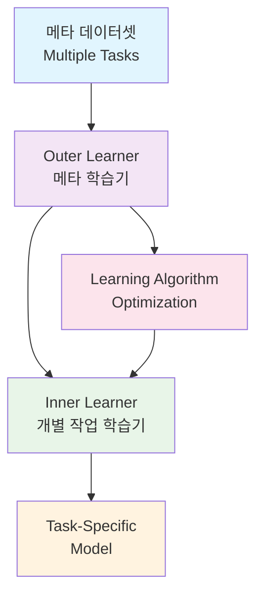
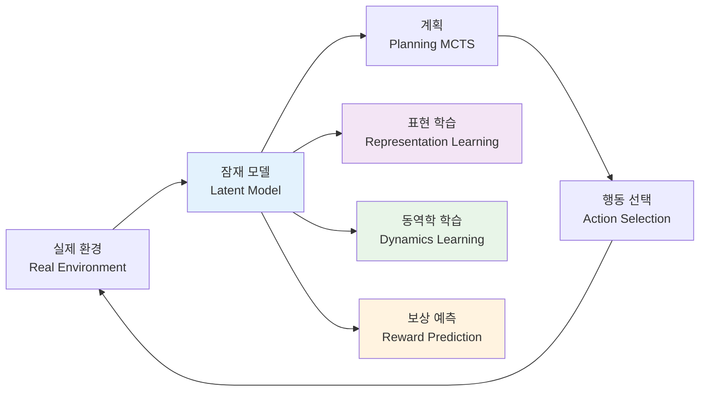
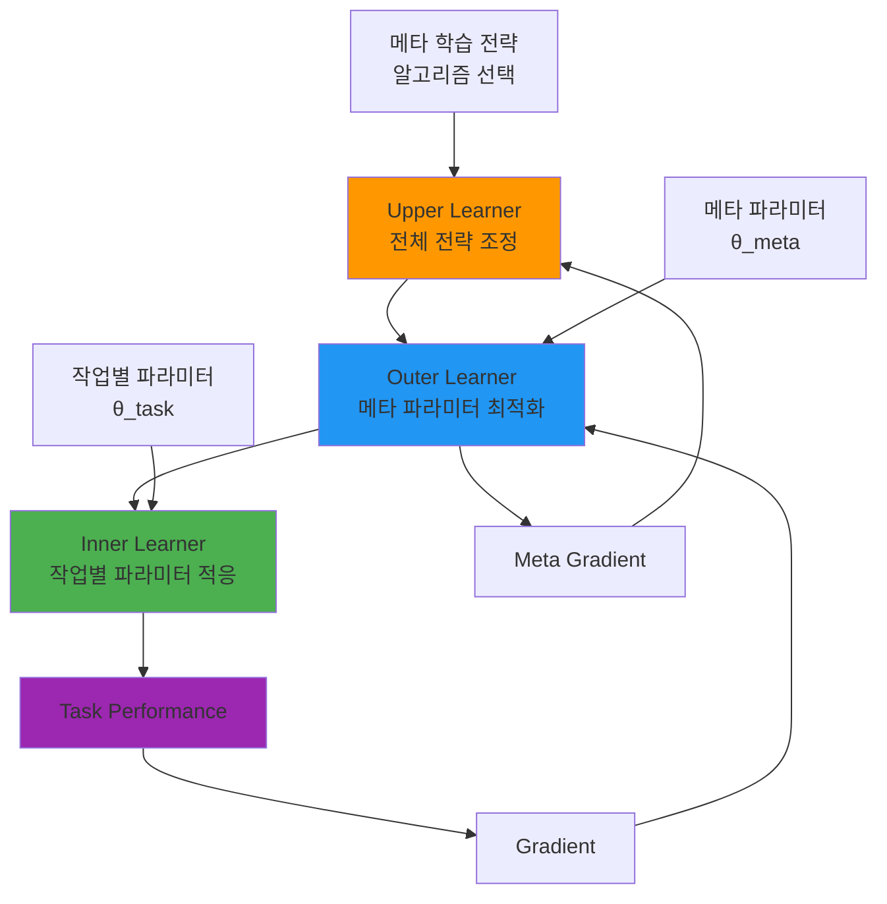
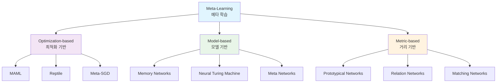
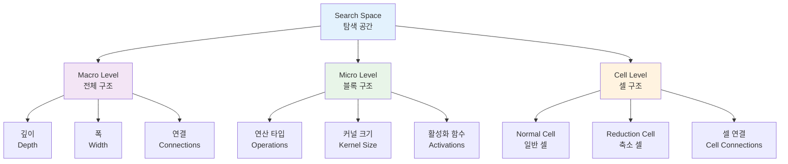
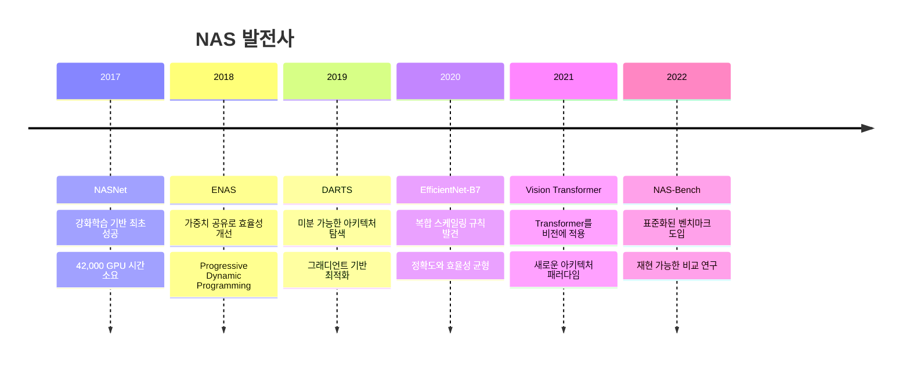

# 인공지능의 역사와 현재: 지능에 대한 이해와 기술 발전

## 서론: 지능의 새로운 시대

> "No. I think we're moving into a period when for the first time ever we may have things more intelligent than us."  
> — Geoffrey Hinton

---

## 1. 지능이란 무엇인가?

### 1.1 지능의 정의 문제

**인류는 아직 지능에 대한 합의된 정의가 없다.**

지능에 대한 관점이 너무 다양하고 많기 때문에 단일한 정의에 도달하기 어렵다. 심리학, 인지과학, 신경과학, 철학 등 각 분야마다 서로 다른 접근 방식을 취하고 있다.

### 1.2 AI 연구자들의 지능 관점

**인공지능을 연구하는 사람들은 지능을 어떻게 볼 것인가?**

특히 **AGI(Artificial General Intelligence)를 연구하는 연구자들의 입장**에서 보면:

> "Our definition has been really consistent all the way through: this idea of having all the cognitive capabilities humans have."  
> — Demis Hassabis

이는 인간이 가진 모든 인지적 능력을 포괄하는 것을 AGI의 목표로 설정하고 있음을 보여준다.

---

## 2. 자연지능과 인공지능

### 2.1 인간 지능의 구조

**Human Intelligence**의 기본 구조는 다음과 같이 순환적 과정으로 이해할 수 있다:

```text
Thinking → Decision → Action
↑                           ↓
└---------- Learning --------┘
```

이 구조에서 핵심은:

- **사고(Thinking)**: 정보 처리와 추론
- **결정(Decision)**: 선택과 판단
- **행동(Action)**: 실행과 결과
- **학습(Learning)**: 경험을 통한 개선

### 2.2 인공지능의 도전

인공지능은 이러한 인간 지능의 순환 구조를 기계적으로 구현하려는 시도라고 볼 수 있다. 각 단계를 어떻게 모델링하고 구현할 것인가가 AI 연구의 핵심 과제다.

---

## 3. 인공지능의 역사: 지능의 이정표들


1936년 튜링의 계산가능성 이론에서 2023년 GPT-4까지, 인공지능(AI)은 **이론 → 하드웨어 → 기호추론 → 통계학습 → 딥러닝 → 거대 기반모델**이라는 다섯 차례의 물결을 거치며 발전해왔다.

### 3.1 계산 이론과 초기 하드웨어 시대 (1936-1955)

#### 3.1.1 이론적 기초

**McCulloch-Pitts 뉴런 (1943)**

- AND·OR·NOT를 조합해 임의의 불 대수식을 계산할 수 있음을 증명
- **심볼릭 조작 능력**과 신경 메커니즘을 연결
- 튜링이 증명한 "연산은 기호 재배열"과 호응해 **생물학적 지능도 계산으로 환원 가능**하다는 수학적 토대 제공

#### 3.1.2 초기 컴퓨터 하드웨어

**Z3 (1941)**

- 릴레이 2,600개로 22-bit 부동 연산 수행
- 천공필름에 명령을 저장 → **프로그램 가능한 기계**가 기호 조작을 전기-기계적으로 실현

**Colossus (1944)**

- 진공관 2,400개로 Lorenz 암호를 해독
- 패치보드로 논리 함수를 변경 → **전자식 + 재배선**으로 Boolean 연산 가속

#### 3.1.3 역사적 의의

**시사점:**

1. 추상 논리 → 물리적 회로 매핑이 가능함을 증명
2. 이후 폰 노이만 EDVAC 보고서가 **저장-프로그램 구조**를 정립하여 범용 컴퓨터 시대를 여는 촉매가 됨

**핵심 개념**: 계산 가능성 = 기호조작을 물리적 컴퓨터로 구현

---
### 3.2 기호주의와 단층 신경망 시대 (1956-1969)

#### 3.2.1 다트머스 회의 (1956)

**AI 학문의 출발점**

- 다트머스 회의(1956)가 "AI라는 학문영역"을 선포
- 심볼릭 접근(추론·검색)을 중심 어젠다로 확립
- "언젠가 기계가 인간의 모든 학습 능력을 시뮬레이션할 것"이라 선언

#### 3.2.2 퍼셉트론의 등장과 한계

동시기에 **Perceptron 하드웨어**가 '학습 가능한 기계'의 실증 데이터를 제공해, 연구 초점이 **인지 재현 vs. 학습 메커니즘**으로 양분됨.

|용어|한국어|설명|
|---|---|---|
|**Perceptron**|퍼셉트론|TLU에 학습 규칙(가중치 갱신) 추가한 단층 신경망|
|**Linear separability**|선형 분리|데이터 집합을 **단일 초평면**으로 완벽히 양분할 수 있는 성질|
|**한계**|—|XOR 등 비선형 패턴은 단층이 분리 불가 → Minsky-Papert가 1969년 증명, AI 회의 열기 급속 냉각|
|**다층 학습 연구**|—|오류 역전파(back-prop)·사전학습 등 '딥' 구조 탐색 모티브 제공|

퍼셉트론의 성공은 곧 한계(선형 분리 한정) 노출로 이어졌고, 이는 이후 다층 학습 연구의 동기를 제공했다.

---
### 3.3 붐-버스트와 통계적 기계학습 시대 (1970-1999)

#### 3.3.1 AI 겨울의 도래

**AI 겨울의 원인들:**

- 1973년 Lighthill 보고서와 1969년 기계번역 실패로 **첫 번째 겨울**
- 1987년 Lisp 머신 붕괴로 **두 번째 겨울** 도래

#### 3.3.2 통계적 학습의 대안

통계학·패턴인식계가 확률·커널 기반 '머신러닝'을 독자적으로 진화시켰다.

**XCON (Expert-Configurator) 시스템:**

- DEC VAX 서버 부품 5,000여개 규칙을 체계화
- 주문 오류 31% → 0.5%로 축소
- 연 2천만 달러 절감으로 **AI 실용 부활**을 이끔

#### 3.3.3 통계적 학습의 핵심 개념

|개념|설명|
|---|---|
|**Statistical learning (통계적 학습)**|경험 데이터 → 확률 모델 추정; 소음·불확실성을 수학적 모형에 내재화해 **일반화**를 강조|
|**SVM**|고차원 내에서 **최대-마진** 초평면을 찾는 커널 기반 분류기, 작은 샘플에서도 오버피팅 억제|
|**High-dimensional (고차원)**|특징 공간 d≫n 시나리오; 커널 트릭으로 **무한 차원**까지 확대|
|**Generalization (일반화)**|학습 외 데이터로도 낮은 오류를 유지하는 성질; SVM 이론은 VC 차원·마진을 통해 이를 정량화|

#### 3.3.4 Deep Blue의 성공 — 검색과 휴리스틱의 결합

**Deep Blue의 핵심 기술:**

- **검색(search)**: 200 million 노드/s Alpha-Beta 탐색
- **휴리스틱(heuristic) 평가**: 체스 말 가치·위치 점수를 손수 설계해 **가지치기 효율**을 극대화
- **위력**: 1997년 세계 챔프 카스파로프 격파 → 대중이 AI 잠재력을 재인식

---

### 3.4 딥러닝 르네상스 (2000-2016)

#### 3.4.1 딥러닝의 기술적 돌파구

|주제|해설|
|---|---|
|**Layer-wise pre-training (층별 사전학습)**|RBM or AE를 한 층씩 학습해 초기 가중치를 좋은 영역에 배치, 이후 미세조정; **기울기 소실** 완화|
|**Vanishing gradient (기울기 소실)**|역전파 시 깊은 층의 ∂E/∂W가 0에 수렴해 학습 정체되는 현상|
|**GPU acceleration**|대규모 행렬곱(Conv·GEMM)을 CUDA로 병렬 실행, **GTX580 2장**이 CPU 2,000개 성능 → 이미지·음성 빅데이터 학습 '실시간'화|
|**Google Brain 'Cat' 실험**|16,000 CPU(1B 매개변수) 비지도 학습으로 _cat concept_ 출현 → **컴퓨트 확대만으로 고수준(high-level) 특징** 자동 학습 가능함을 입증|
|**AlphaGo 정책-가치망 + 탐색**|① Policy Network(정책망): 다음 수 분포, ② Value Network(가치망): 승률 예측, ③ MCTS 탐색과 결합 → '**직관(신경망) + 계산(트리)**' 하이브리드 패러다임|

---

### 3.5 기반모델과 계획 강화 단계 (2017-현재)

#### 3.5.1 트랜스포머 혁명

|용어 (영)|한국어|설명|
|---|---|---|
|**Transformer**|트랜스포머|Self-attention으로 **장기 의존(long-range dependency)**를 O(1)-경로로 캡처, GPU/TPU 대규모 병렬화에 최적|
|**Vision·Speech & Multimodal**|비전·음성·멀티모달|동일 아키텍처를 **이미지·음향·텍스트**로 확장해 단일 모델이 복합 자극을 처리|
|**MuZero**|뮤제로|보드·아타리에서 **라틴트(latent) 동역학** f_θ를 자가 학습, 규칙 모름에도 계획 성공 → **범용 계획 AI** 시사|

#### 3.5.2 인간 피드백과 지시 튜닝

|용어 (영)|한국어|설명|
|---|---|---|
|**RLHF**|인간-피드백 강화학습|모델 출력에 인간 선호 점수를 부여해 정책을 fine-tune; ChatGPT 안전·품질 핵심 기술|
|**Instruction tuning**|인스트럭션 튜닝|"[Prompt, Ideal-Answer]" 쌍으로 지도 미세조정해 **지시 수행 능력**을 범용 향상|
|**Foundation Model**|기반 모델|초거대 사전학습 → **Downstream few-shot**으로 범용 전이; GPT-4는 멀티모달·API 생태계로 확장|

---

## 4. 추론과 유추: 새로운 패러다임

### 4.1 전통적 추론 방식

**기존 접근법:**

```
지식/경험/사실/법칙 → 가설/유추
```

이는 주로 사람의 지식과 경험을 **Rule Base**로 만들어온 **Symbolic AI**의 영역이었다.

### 4.2 AI의 두 가지 패러다임

**AI를 나눌 때의 기본 구분:**

|접근법|특징|주요 메커니즘|
|---|---|---|
|**Symbolic AI**|규칙을 만드는 방식|명시적 지식 표현, 논리적 추론|
|**Machine Learning**|학습을 하는 방식|데이터로부터 패턴 학습, 통계적 추론|

### 4.3 새로운 가설: 학습을 통한 논리력 획득

**핵심 질문:**

> 논리력도 사실은 학습을 통해서 얻을 수 있지 않을까?

**현재 상황:**

- 학습을 통해서 논리력을 만드는 모델을 개발하는 단계
- OpenAI의 o1, o3 시리즈 등이 이를 실증하고 있음
- Neuro-Symbolic AI가 이 두 접근법을 융합하는 새로운 패러다임으로 부상

---

## 5. 자연어 처리: 언어와 기계의 만남

### 5.1 자연어 처리의 정의

> 사람이 쓰는 언어를 컴퓨터가 사용하는 언어로 바꾸는 것.

### 5.2 NLP 처리 파이프라인

자연어 처리는 다음과 같은 논리적 계단을 따른다:

1. **텍스트 정규화·토큰화**로 _문자를 이산 심볼_로 만들고,
2. **벡터화/임베딩**으로 _실수 공간_에 매핑해 연산 효율을 확보한 뒤,
3. **연관성(relevance) 분석**으로 토큰·문장 간 관계를 수량화하며,
4. **어텐션 기반 Transformer**로 문맥적 의존을 학습하고,
5. **자기회귀(autoregressive) 언어모델**로 다음 토큰을 순차 예측해 텍스트를 생성

> 이 순서는 "이산 → 연속 → 관계 → 추론 → 생성"이라는 논리적 계단으로 이어진다.

### 5.3 텍스트 정규화와 토큰화

#### 5.3.1 필요성

컴퓨터는 바이트 단위로만 연산하므로 "**단어·형태소·부분단어**" 같은 의미 단위를 **정수 ID**로 치환해야 통계·신경망이 입력을 다룰 수 있다.

#### 5.3.2 토큰화 방법론

|방식|장점|한계|
|---|---|---|
|**Word-level** (단어)|구현 단순|희귀어(OOV) 폭증, 한국어·독일어 등 교착·복합어 처리가 불리|
|**Character-level** (문자)|OOV 없음|시퀀스 길이 ↑, 의미 단위 손실|
|**Sub-word** (BPE, Unigram, **SentencePiece**)|OOV↓·길이↓ 균형|사전 학습 필요, 분할 결과가 모델 품질 의존|

**예시:**

```
"기계학습" → 기계@@ 학@@ 습 (BPE) → ID [421, 1562, 98]
```

### 5.4 벡터화와 임베딩

#### 5.4.1 One-hot에서 밀집 임베딩으로

**발전 과정:**

- **초기**: One-hot 벡터 (차원 방대, 의미 유사도 반영 못함)
- **Word2Vec**: CBOW·Skip-gram으로 밀집 벡터 학습
    - "왕-남 + 여 ≈ 여왕"과 같은 산술적 의미 조합 가능

#### 5.4.2 정적에서 문맥적 임베딩으로

**패러다임 전환:**

- **Static Embedding**: 단어마다 고정된 벡터
- **Contextual Embedding**: ELMo·BERT·GPT가 도입
    - 동일 단어라도 위치별 벡터를 달리해 다의성 해결

#### 5.4.3 위치 임베딩

**Position Embedding:**

- Transformer는 순서를 직접 다루지 않음
- 사인·코사인 함수나 학습 가능 벡터로 **Positional Encoding** 추가
- "토큰 i의 위치정보"를 전달

### 5.5 연관성 분석

#### 5.5.1 통계적 접근

**TF-IDF / BM25:**

- 문서 내 빈도와 길이를 보정해 단어·문서 간 유사도를 산출
- 정보검색·RAG 시스템의 1차 스코어러로 널리 사용

**PMI·KL Divergence:**

- 단어 공존 확률이 기대치보다 높을 때 연관성을 수치화

#### 5.5.2 신경망적 접근 — Self-Attention

**Self-Attention 메커니즘:**

- **Query·Key·Value(Q/K/V)** 삼중 연산
- 모든 토큰 쌍의 유사도를 실시간 계산해 _soft alignment_ 획득
- 연관성이 높을수록 가중치가 커져 정보가 더 많이 전달됨

### 5.6 Transformer와 어텐션

#### 5.6.1 핵심 구성요소

|개념(영)|한국어|역할|
|---|---|---|
|**Multi-Head Self-Attention**|다중 헤드 자기어텐션|서로 다른 표현 공간에서 Q/K/V를 병렬 계산해 복수 관계 패턴 포착|
|**Feed-Forward Network**|전결합 계층|어텐션 출력에 비선형 변환(GeLU·ReLU) 적용|
|**Residual & LayerNorm**|잔차·정규화|안정적 역전파와 학습 속도 개선|

#### 5.6.2 어텐션의 핵심 원리

어텐션이 "**관련성(weight) × 값(Value)**"의 합으로 출력을 만들기 때문에, **문맥적 중요도**를 학습 중에 자동 조정할 수 있다.

### 5.7 자기회귀 생성

#### 5.7.1 학습 목표

**Language Modeling Objective:**

- 조건부 확률 P(wₜ | w<ₜ)를 최대화해 '다음 토큰'을 예측
- GPT 류는 완전 **자기회귀(decoder-only)** 구조로 훈련

#### 5.7.2 추론(디코딩) 방법

**디코딩 전략들:**

1. **Greedy / Beam Search**
    
    - 확률 최대 토큰을 직행 혹은 상위 k 경로 탐색
2. **Sampling**
    
    - Top-k, Top-p(Nucleus)로 창의성·다양성 제어
3. **Temperature**
    
    - 분포 평탄화로 무작위성 조절

#### 5.7.3 장점과 제약

**장점:**

- 텍스트 순차 생성·코드 자동완성 등 **실시간 인터랙션** 가능

**제약:**

- 긴 의존 관계에서 _exposure bias_
- 계산량 O(T²) 등 과제가 남아있음
- **Mixture-of-Experts·Flash-Attention** 같은 최적화를 연구 중

---

## 6. 현재 인공지능 트렌드

### 6.1 주요 기술 트렌드

#### 6.1.1 신경망 기반 딥러닝 모델

- 딥러닝이 AI 연구의 주류로 완전히 자리잡음
- CNN, RNN에서 Transformer로의 아키텍처 진화

#### 6.1.2 트랜스포머 형태의 모델 구조

- Self-attention 메커니즘의 우수성이 입증됨
- Vision Transformer(ViT), Audio Transformer 등 다양한 도메인으로 확장

#### 6.1.3 학습모델의 거대화

- 매개변수 수의 폭발적 증가 (GPT-3: 175B → GPT-4: 추정 1.76T)
- Scaling Law에 따른 성능 향상 패턴 발견

#### 6.1.4 생성모델의 확산

- **언어 생성**: GPT 시리즈, Claude, Gemini
- **이미지 생성**: DALL-E, Midjourney, Stable Diffusion
- **코드 생성**: GitHub Copilot, CodeT5
- **멀티모달 생성**: GPT-4V, Gemini Pro

#### 6.1.5 강화학습과 메타학습의 성과

- **RLHF(Reinforcement Learning from Human Feedback)**: ChatGPT의 핵심 기술
- **Meta-learning**: Few-shot learning, In-context learning
- **Multi-agent systems**: 복수 AI 에이전트 협력


### Extra Meta learning

> 메타 학습(Meta-Learning): 학습하는 방법을 학습하기

### 1. 메타 학습의 개념과 정의

#### 1.1 메타 학습이란?

**메타 학습(Meta-Learning)**은 "학습하는 방법을 학습하는" 기계학습 패러다임이다. 일반적인 기계학습이 특정 작업을 위해 모델을 훈련시키는 것이라면, 메타 학습은 새로운 작업에 빠르게 적응할 수 있는 학습 능력 자체를 획득하는 것을 목표로 한다.

```
일반 기계학습: 데이터 → 모델 → 예측
메타 학습: 여러 작업들 → 학습 알고리즘 → 새로운 작업에 빠른 적응
```

### 1.2 핵심 아이디어: "Learning to Learn"

메타 학습의 핵심은 **"Learning to Learn"** 개념이다:

- **Inner Learning**: 개별 작업을 학습하는 과정
- **Outer Learning**: 학습 방법 자체를 최적화하는 과정
- **Upper Learning**: 전체적인 메타 학습 전략을 조정하는 과정



---

### 2. Multi-Task Learning vs Meta-Learning

#### 2.1 Multi-Task Learning (다중 작업 학습)

**정의**: 여러 관련된 작업을 동시에 학습하여 각 작업의 성능을 향상시키는 방법

**특징**:

- 모든 작업이 동시에 훈련됨
- 공유된 표현(shared representation)을 학습
- 작업 간 지식 전이를 통한 성능 향상

### 2.2 Meta-Learning (메타 학습)

**정의**: 새로운 작업에 빠르게 적응할 수 있는 학습 알고리즘 자체를 학습하는 방법

**특징**:

- 훈련 시점에는 보지 못한 새로운 작업에 적응 가능
- Few-shot learning 능력 획득
- 학습 속도와 효율성에 중점

### 2.3 핵심 차이점 비교

|측면|Multi-Task Learning|Meta-Learning|
|---|---|---|
|**목표**|동시에 여러 작업 잘하기|새로운 작업에 빠르게 적응하기|
|**훈련 방식**|모든 작업 동시 훈련|작업들로부터 학습 방법 추출|
|**일반화**|훈련된 작업들에서 성능 향상|미지의 새로운 작업에 적응|
|**데이터 요구량**|각 작업마다 충분한 데이터|적은 데이터로도 빠른 적응|
|**핵심 능력**|지식 공유|빠른 학습|

---

## 3. MuZero: 메타 학습의 대표적 사례

### 3.1 MuZero 개요

**MuZero**는 DeepMind에서 개발한 model-based 강화학습 알고리즘으로, 환경의 규칙을 모르는 상태에서도 계획(planning)을 수행할 수 있는 메타 학습의 대표적 사례다.

### 3.2 MuZero의 메타 학습 측면



**MuZero의 메타 학습 특성**:

1. **환경 모델 학습**: 게임 규칙을 모르는 상태에서 환경의 동역학을 학습
2. **표현 학습**: 원시 관찰을 유용한 잠재 표현으로 변환하는 방법 학습
3. **계획 능력**: 학습된 모델을 이용한 Monte Carlo Tree Search

---

## 4. 메타 학습의 한계와 현실

### 4.1 이론과 실제의 간극

> **"논문에 개념을 증명하는 논문은 많이 나오나 Meta-learning은 경험할 수 있는 application은 아직 없음"**

이는 메타 학습 분야의 현실적 한계를 정확히 지적한다:

#### 4.1.1 이론적 성과

- **MAML (Model-Agnostic Meta-Learning)**: 범용적 메타 학습 프레임워크
- **Reptile**: 1차 미분만 사용하는 간단한 메타 학습
- **Meta-SGD**: 학습률도 학습하는 메타 최적화

#### 4.1.2 실용화의 어려움

**기술적 한계**:

1. **계산 복잡도**: 이중 최적화(bi-level optimization)의 높은 비용
2. **메타 오버피팅**: 메타 훈련 작업에만 특화되는 문제
3. **스케일링 문제**: 실제 규모의 문제에 적용 시 성능 저하

**실용적 한계**:

1. **데이터 요구량**: 충분히 다양한 메타 훈련 작업 필요
2. **도메인 특수성**: 일반적인 메타 학습기 구현의 어려움
3. **엔지니어링 복잡성**: 기존 시스템 대비 구현 복잡도 증가

### 4.2 현재 적용 가능한 영역

**제한적 성공 사례**:

- **Few-shot image classification**: Omniglot, miniImageNet
- **Neural Architecture Search**: AutoML 파이프라인
- **Hyperparameter optimization**: 자동 하이퍼파라미터 튜닝
- **Robotics**: 로봇의 새로운 작업 빠른 적응

---

## 5. 메타 학습의 구조적 이해

### 5.1 Three-Level Learning Hierarchy



#### 5.1.1 Upper Learner (상위 학습기)

- **역할**: 전체적인 메타 학습 전략 조정
- **기능**:
    - 메타 학습 알고리즘 선택
    - 전체 학습 스케줄 관리
    - 하이퍼파라미터 조정

#### 5.1.2 Outer Learner (외부 학습기)

- **역할**: 메타 파라미터 최적화
- **기능**:
    - 다양한 작업에서의 성능을 바탕으로 메타 파라미터 업데이트
    - 일반화 능력 최적화
    - 메타 그래디언트 계산

#### 5.1.3 Inner Learner (내부 학습기)

- **역할**: 개별 작업에 대한 빠른 적응
- **기능**:
    - 작업별 파라미터 조정
    - Few-shot 학습 수행
    - 작업 특화 최적화

### 5.2 메타 학습 알고리즘 분류



---

## 6. Neural Architecture Search (NAS)

### 6.1 NAS의 개념

**Neural Architecture Search (NAS)**는 메타 학습의 실용적 적용 사례 중 하나로, 주어진 작업에 최적인 신경망 아키텍처를 자동으로 탐색하는 기술이다.

### 6.2 NAS의 핵심 구성요소

#### 6.2.1 탐색 공간 (Search Space)

**정의**: 탐색 가능한 모든 아키텍처의 집합

**구성 요소**:

```python
class SearchSpace:
    def __init__(self):
        self.operations = [
            'conv3x3', 'conv1x1', 'max_pool', 'avg_pool',
            'skip_connect', 'dilated_conv', 'depthwise_conv'
        ]
        self.depth_range = (8, 50)        # 레이어 수 범위
        self.width_range = (16, 512)      # 채널 수 범위
        self.connection_types = [
            'sequential', 'residual', 'dense'
        ]
```

**탐색 공간 설계 전략**:

1. **Macro Search Space**: 전체 네트워크 구조
    
    - 블록 수, 블록 유형, 연결 방식
2. **Micro Search Space**: 개별 블록 내부 구조
    
    - 연산 종류, 커널 크기, 채널 수
3. **Cell-based Search Space**: 반복 가능한 셀 구조
    
    - NASNet, ENAS에서 사용



#### 6.2.2 탐색 전략 (Search Strategy)

**1. 강화학습 기반**:

```python
class RLSearchStrategy:
    def __init__(self):
        self.controller = LSTMController()  # 아키텍처 생성기
        self.baseline = None                # 분산 감소용
    
    def search(self):
        for epoch in range(max_epochs):
            # 아키텍처 샘플링
            architectures = self.controller.sample(batch_size)
            
            # 성능 평가
            rewards = []
            for arch in architectures:
                accuracy = self.evaluate_architecture(arch)
                rewards.append(accuracy)
            
            # 컨트롤러 업데이트
            self.update_controller(architectures, rewards)
```

**2. 진화 알고리즘 기반**:

```python
class EvolutionarySearch:
    def __init__(self, population_size=50):
        self.population = self.initialize_population(population_size)
        self.mutation_rate = 0.1
    
    def evolve(self):
        for generation in range(max_generations):
            # 성능 평가
            fitness = [self.evaluate(arch) for arch in self.population]
            
            # 선택
            parents = self.selection(self.population, fitness)
            
            # 교차와 변이
            offspring = self.crossover_and_mutation(parents)
            
            # 다음 세대
            self.population = self.select_survivors(parents + offspring)
```

**3. 미분 가능 탐색 (DARTS)**:

```python
class DifferentiableSearch:
    def __init__(self):
        self.alpha = nn.Parameter(torch.randn(num_ops, num_edges))  # 아키텍처 가중치
        self.model = SuperNet()  # 슈퍼넷
    
    def search_step(self, train_data, valid_data):
        # 아키텍처 파라미터 업데이트
        with torch.no_grad():
            # 검증 데이터로 아키텍처 그래디언트 계산
            arch_grad = self.compute_arch_gradient(valid_data)
            self.alpha.grad = arch_grad
            self.arch_optimizer.step()
        
        # 모델 가중치 업데이트
        loss = self.model(train_data, self.alpha)
        loss.backward()
        self.model_optimizer.step()
```

#### 6.2.3 성능 평가 전략 (Performance Evaluation)

**1. 완전 훈련 (Full Training)**:

- 각 아키텍처를 처음부터 끝까지 훈련
- 가장 정확하지만 계산 비용이 매우 높음

**2. 조기 중단 (Early Stopping)**:

- 몇 에포크만 훈련 후 성능 추정
- 빠르지만 부정확할 수 있음

**3. 가중치 공유 (Weight Sharing)**:

```python
class WeightSharingEvaluator:
    def __init__(self):
        self.supernet = SuperNet()  # 모든 가능한 연산을 포함하는 슈퍼넷
        self.trained = False
    
    def evaluate(self, architecture):
        if not self.trained:
            self.train_supernet()  # 슈퍼넷 사전 훈련
            self.trained = True
        
        # 아키텍처에 해당하는 부분망 추출
        subnet = self.extract_subnet(architecture)
        return self.validate(subnet)
```

**4. 성능 예측 모델**:

```python
class PerformancePredictor:
    def __init__(self):
        self.predictor = nn.Sequential(
            nn.Linear(arch_encoding_dim, 128),
            nn.ReLU(),
            nn.Linear(128, 64),
            nn.ReLU(),
            nn.Linear(64, 1)  # 예측 성능
        )
    
    def predict_performance(self, architecture_encoding):
        return self.predictor(architecture_encoding)
```

### 6.3 NAS의 발전 과정



