# AWS: 인증 및 권한 관리 아키텍처 분석

### **Authentication (인증)**

AWS는 자체 인프라 자원에 대한 인증과 애플리케이션 사용자 인증을 모두 제공합니다. 

AWS 계정 및 리소스 접근은 주로 AWS IAM(Identity and Access Management)을 통해 관리되며, API 호출 시에는 액세스 키/시크릿 키를 이용한 서명 방식으로 인증합니다. 

반면 애플리케이션 사용자를 위한 인증 서비스로 **Amazon Cognito**를 제공하며, **사용자 풀(User Pool)** 을 통해 사용자 계정을 관리합니다. 

Cognito 사용자 풀은 “웹/모바일 앱을 위한 사용자 디렉터리” 역할을 하며, 애플리케이션 관점에서는 **OpenID Connect(OIDC)** 규격의 Identity Provider(IdP)로 동작합니다 ([Amazon Cognito user pools - Amazon Cognito](https://docs.aws.amazon.com/cognito/latest/developerguide/cognito-user-pools.html#:~:text=An%20Amazon%20Cognito%20user%20pool,customization%20of%20the%20user%20experience)). 

즉, Cognito가 OIDC 표준에 따라 사용자 인증을 수행하고 OIDC 토큰(ID/액세스 토큰)을 발급합니다. 

Cognito는 자체 호스팅된 로그인 화면 혹은 SDK를 통해 사용자가 **이메일/비밀번호**, **MFA** 등을 사용하여 인증하도록 하며, 소셜 로그인이나 SAML 연동과 같은 **신원 연동(Federation)**도 지원하여 외부 IdP와 통합할 수 있습니다 ([Amazon Cognito user pools - Amazon Cognito](https://docs.aws.amazon.com/cognito/latest/developerguide/cognito-user-pools.html#:~:text=An%20Amazon%20Cognito%20user%20pool,customization%20of%20the%20user%20experience)). 

인증 성공 시 Cognito는 **세션을 생성**하고 **ID 토큰**, **액세스 토큰**, **리프레시 토큰**을 발급합니다 ([Understanding user pool JSON web tokens (JWTs) - Amazon Cognito](https://docs.aws.amazon.com/cognito/latest/developerguide/amazon-cognito-user-pools-using-tokens-with-identity-providers.html#:~:text=When%20a%20user%20signs%20into,to%20access%20other%20AWS%20services)). 

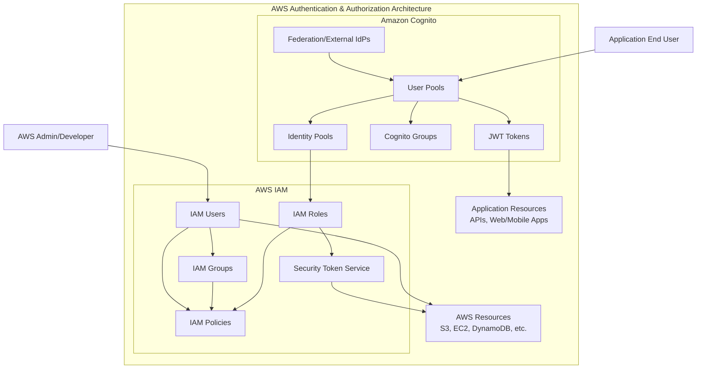
```mermaid
graph TB
    subgraph "AWS Authentication & Authorization Architecture"
        subgraph "AWS IAM" 
            IAMUsers[IAM Users]
            IAMGroups[IAM Groups]
            IAMRoles[IAM Roles]
            IAMPolicies[IAM Policies]
            STS[Security Token Service]
        end
        
        subgraph "Amazon Cognito"
            UserPool[User Pools]
            IdentityPool[Identity Pools]
            Federation[Federation/External IdPs]
            CognitoGroups[Cognito Groups]
            CognitoTokens[JWT Tokens]
        end
        
        AWSResources[AWS Resources<br/>S3, EC2, DynamoDB, etc.]
        AppResources[Application Resources<br/>APIs, Web/Mobile Apps]
        
        IAMUsers --> IAMGroups
        IAMUsers & IAMGroups & IAMRoles --> IAMPolicies
        IAMRoles --> STS
        STS --> AWSResources
        IAMUsers --> AWSResources
        
        UserPool --> CognitoGroups
        UserPool --> CognitoTokens
        Federation --> UserPool
        CognitoTokens --> AppResources
        UserPool --> IdentityPool
        IdentityPool --> IAMRoles
    end
    
    User1[AWS Admin/Developer] --> IAMUsers
    User2[Application End User] --> UserPool
```

AWS Cognito는 Lambda Trigger를 활용한 **이벤트 기반 확장**도 가능한데, 예를 들어 *Pre Authentication*, *Post Confirmation* 등의 훅을 통해 로그인 전후 커스텀 검증이나 후처리를 수행할 수 있습니다.

### **Authorization (권한 부여)** 

AWS IAM은 매우 정교한 권한 부여 모델을 제공합니다. 

기본적으로 **정책(Policy)** 문서를 통해 자원(Resource)에 대한 **허가(Allow)/거부(Deny)** 규칙을 정의하고 이를 **사용자(User)**, **그룹(Group)** 또는 **역할(Role)**에 연결하는 방식으로 **RBAC(Role-Based Access Control)**를 구현합니다 ([Define permissions based on attributes with ABAC authorization - AWS Identity and Access Management](https://docs.aws.amazon.com/IAM/latest/UserGuide/introduction_attribute-based-access-control.html#:~:text=The%20traditional%20authorization%20model%20used,function%20in%20an%20RBAC%20model)). 

IAM의 **역할(role)**은 AWS 리소스에 접근하기 위한 신원으로, 세부 권한은 정책에 따라 결정됩니다. 

AWS는 또한 **ABAC(Attribute-Based Access Control)**를 지원하는데, IAM 리소스에 태그(tag) 형태의 속성을 붙이고 정책에서 해당 속성을 조건으로 사용함으로써 **속성에 기반한 동적 권한 판단**이 가능합니다 ([Define permissions based on attributes with ABAC authorization - AWS Identity and Access Management](https://docs.aws.amazon.com/IAM/latest/UserGuide/introduction_attribute-based-access-control.html#:~:text=Attribute,helpful%20in%20environments%20that%20are)). 

예를 들어 사용자나 역할에 부여된 태그와 리소스의 태그가 일치하면 액세스를 허용하는 식으로, 조직/부서별로 일괄적인 권한 관리가 가능합니다 ([Define permissions based on attributes with ABAC authorization - AWS Identity and Access Management](https://docs.aws.amazon.com/IAM/latest/UserGuide/introduction_attribute-based-access-control.html#:~:text=For%20example%2C%20you%20can%20create,support%20ABAC%2C%20see%20%205)). 

이러한 ABAC 방식은 환경이 커지고 복잡해져 역할만으로 권한 구성이 어려울 때 유용하며, **대규모 시스템에서 실시간으로 세분화된 권한 결정**을 지원합니다 ([Define permissions based on attributes with ABAC authorization - AWS Identity and Access Management](https://docs.aws.amazon.com/IAM/latest/UserGuide/introduction_attribute-based-access-control.html#:~:text=Attribute,helpful%20in%20environments%20that%20are)). 

AWS IAM의 권한 모델은 기본적으로 **최소 권한 원칙(least privilege)**을 지향하며, IAM 관리자는 역할/정책 구성을 통해 사용자가 자신의 업무에 필요한 리소스만 접근하도록 설계합니다 ([Define permissions based on attributes with ABAC authorization - AWS Identity and Access Management](https://docs.aws.amazon.com/IAM/latest/UserGuide/introduction_attribute-based-access-control.html#:~:text=The%20traditional%20authorization%20model%20used,function%20in%20an%20RBAC%20model)). 

한편, Amazon Cognito 사용자 풀을 사용하는 애플리케이션의 경우 Cognito 그룹(Group) 단위로 사용자를 묶고 그룹별로 **액세스 토큰의 클레임**에 권한 정보를 포함시켜 애플리케이션 레벨에서 RBAC를 구현할 수 있습니다. 

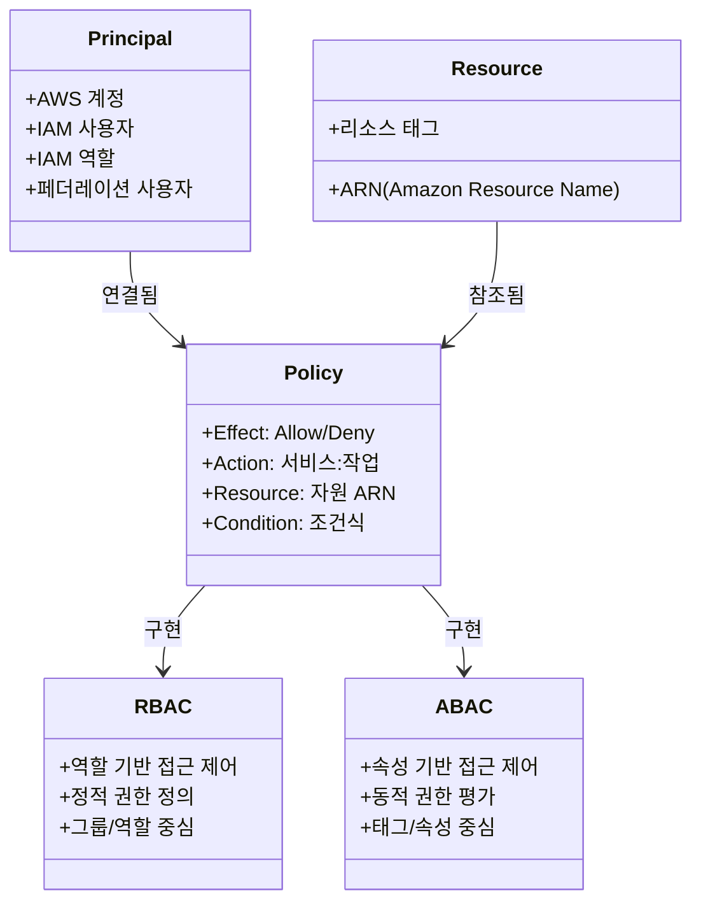
```mermaid
classDiagram
    class Principal {
        +AWS 계정
        +IAM 사용자
        +IAM 역할
        +페더레이션 사용자
    }
    
    class Resource {
        +ARN(Amazon Resource Name)
        +리소스 태그
    }
    
    class Policy {
        +Effect: Allow/Deny
        +Action: 서비스:작업
        +Resource: 자원 ARN
        +Condition: 조건식
    }
    
    class RBAC {
        +역할 기반 접근 제어
        +정적 권한 정의
        +그룹/역할 중심
    }
    
    class ABAC {
        +속성 기반 접근 제어
        +동적 권한 평가
        +태그/속성 중심
    }
    
    Principal --> Policy: 연결됨
    Resource --> Policy: 참조됨
    Policy --> RBAC: 구현
    Policy --> ABAC: 구현
```

예컨대 Cognito에서 특정 그룹에 속한 사용자에게만 API 호출을 허용하려면, Cognito 액세스 토큰의 `cognito:groups` 클레임을 확인하여 인가 여부를 결정하면 됩니다 ([Understanding user pool JSON web tokens (JWTs) - Amazon Cognito](https://docs.aws.amazon.com/cognito/latest/developerguide/amazon-cognito-user-pools-using-tokens-with-identity-providers.html#:~:text=Tokens%20authenticate%20users%20and%20grant,pool%20groups%2C%20see%20%204)). 

AWS는 자사 인프라 접근을 위해 **STS(Security Token Service)**를 통한 임시 토큰도 활용하는데, 예를 들어 IAM Role을 어썸(assume)하면 제한된 수명(time-bound)의 임시 자격증명(Access Key, Secret, Session Token)이 발급되어 AWS 서비스에 권한있는 요청을 할 수 있습니다. 이런 STS 토큰 역시 IAM 정책으로 제한되며, 만료 시 자동으로 권한이 소멸됩니다. 정리하면 AWS는 **정책 기반 정적 RBAC**와 **태그 기반 동적 ABAC**를 모두 지원하여, 기업 환경의 다양한 권한 요구사항을 충족합니다 ([Define permissions based on attributes with ABAC authorization - AWS Identity and Access Management](https://docs.aws.amazon.com/IAM/latest/UserGuide/introduction_attribute-based-access-control.html#:~:text=Attribute,helpful%20in%20environments%20that%20are)) ([Define permissions based on attributes with ABAC authorization - AWS Identity and Access Management](https://docs.aws.amazon.com/IAM/latest/UserGuide/introduction_attribute-based-access-control.html#:~:text=The%20traditional%20authorization%20model%20used,function%20in%20an%20RBAC%20model)).

### **Token Management (토큰 관리)** 

AWS 환경에서 토큰은 여러 종류가 있습니다. 

**AWS IAM** 자체는 OAuth2를 직접 쓰진 않지만, STS에서 발급하는 임시 **세션 토큰**(AWS 세션 키)은 일정 기간 유효하며 자동 만료됩니다. 

한편 **Amazon Cognito** 사용자 풀은 **OIDC 표준의 JWT(JSON Web Token)** 를 사용합니다. 

Cognito는 인증에 성공한 사용자에게 **ID 토큰**, **액세스 토큰**, **리프레시 토큰**을 발급하며, 토큰은 **base64url 인코딩된 문자열**로 구성된 JWT입니다 ([Understanding user pool JSON web tokens (JWTs) - Amazon Cognito](https://docs.aws.amazon.com/cognito/latest/developerguide/amazon-cognito-user-pools-using-tokens-with-identity-providers.html#:~:text=Amazon%20Cognito%20issues%20tokens%20as,read%20by%20your%20user%20pool)). 

ID 토큰에는 사용자의 식별 정보(예: 사용자명, 이메일 등)가 **Claims** 형태로 포함되고, 액세스 토큰에는 **권한 범위(Scope)**와 Cognito 사용자 풀에서의 그룹 정보 등이 들어있어 애플리케이션이 토큰만 보고도 사용자 권한을 판단할 수 있게 합니다 ([Understanding user pool JSON web tokens (JWTs) - Amazon Cognito](https://docs.aws.amazon.com/cognito/latest/developerguide/amazon-cognito-user-pools-using-tokens-with-identity-providers.html#:~:text=Tokens%20authenticate%20users%20and%20grant,pool%20groups%2C%20see%20%204)). 

예를 들어 Cognito 액세스 토큰에는 `cognito:groups` 클레임에 해당 사용자가 속한 그룹 목록이 들어가며, 이를 활용해 애플리케이션에서 역할 기반 권한체크를 수행할 수 있습니다 ([Understanding user pool JSON web tokens (JWTs) - Amazon Cognito](https://docs.aws.amazon.com/cognito/latest/developerguide/amazon-cognito-user-pools-using-tokens-with-identity-providers.html#:~:text=Tokens%20authenticate%20users%20and%20grant,pool%20groups%2C%20see%20%204)). 

**리프레시 토큰**은 만료 전의 액세스/ID 토큰과 교환하여 새로운 토큰을 발급받는 데 사용하거나, 필요 시 서버 측에서 해당 세션을 강제로 만료시킬 때(Token Revocation) 사용됩니다 ([Understanding user pool JSON web tokens (JWTs) - Amazon Cognito](https://docs.aws.amazon.com/cognito/latest/developerguide/amazon-cognito-user-pools-using-tokens-with-identity-providers.html#:~:text=Amazon%20Cognito%20also%20has%20refresh,is%20allowed%20by%20refresh%20tokens)). 

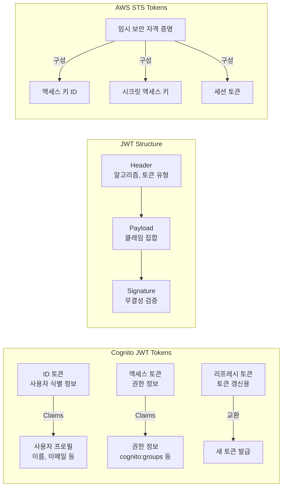
```mermaid
graph LR
    subgraph "Cognito JWT Tokens"
        IDToken[ID 토큰<br/>사용자 식별 정보]
        AccessToken[액세스 토큰<br/>권한 정보]
        RefreshToken[리프레시 토큰<br/>토큰 갱신용]
        
        IDToken -->|Claims| UserProfile[사용자 프로필<br/>이름, 이메일 등]
        AccessToken -->|Claims| Permissions[권한 정보<br/>cognito:groups 등]
        RefreshToken -->|교환| NewTokens[새 토큰 발급]
    end
    
    subgraph "JWT Structure"
        Header[Header<br/>알고리즘, 토큰 유형]
        Payload[Payload<br/>클레임 집합]
        Signature[Signature<br/>무결성 검증]
        
        Header --> Payload --> Signature
    end
    
    subgraph "AWS STS Tokens"
        STSToken[임시 보안 자격 증명]
        STSToken -->|구성| AccessKey[액세스 키 ID]
        STSToken -->|구성| SecretKey[시크릿 액세스 키]
        STSToken -->|구성| SessionToken[세션 토큰]
    end
```

Cognito에서 리프레시 토큰은 암호화되어 저장되며 토큰 자체를 관리자가 볼 수는 없지만, 만료 시간을 조정하거나 강제 철회가 가능합니다 ([Understanding user pool JSON web tokens (JWTs) - Amazon Cognito](https://docs.aws.amazon.com/cognito/latest/developerguide/amazon-cognito-user-pools-using-tokens-with-identity-providers.html#:~:text=Amazon%20Cognito%20issues%20tokens%20as,read%20by%20your%20user%20pool)). 

**토큰 수명 관리**는 보안에 중요하기 때문에 Cognito는 기본 수명(예: 액세스 토큰 1시간 등)을 제공하고 개발자가 애플리케이션 요구에 따라 조정합니다. 

또한 **토큰 무효화(Revocation)** 기능을 통해 리프레시 토큰을 철회하면 연쇄적으로 해당 세션의 액세스/ID 토큰도 더 이상 수락되지 않도록 할 수 있습니다. 

AWS Cognito는 2021년 이후 토큰 철회 및 **jti (토큰 ID)** 클레임 등을 지원하여 토큰 블랙리스트 운용이 가능해졌습니다 ([Understanding user pool JSON web tokens (JWTs) - Amazon Cognito](https://docs.aws.amazon.com/cognito/latest/developerguide/amazon-cognito-user-pools-using-tokens-with-identity-providers.html#:~:text=)). 

전반적으로 AWS Cognito의 토큰 관리 전략은 OAuth2/OIDC 모범 사례를 따르고 있으며, **JWT 서명 검증**을 통해 토큰 무결성을 보장하고, **단일 로그인 세션 종료** 시 리프레시 토큰을 철회함으로써 토큰 남용을 방지합니다.

### **User Management (사용자 계정 관리)** 

AWS에서는 **내부 사용자(운영자/직원)**와 **외부 애플리케이션 사용자** 관리를 구분해서 볼 필요가 있습니다. 

내부적으로 AWS 자원에 접근하는 사용자는 AWS IAM에서 관리되는데, IAM은 사용자 생성, 비밀번호 설정, MFA 설정, 액세스 키 발급, 그룹에 대한 사용자 추가 등을 제공합니다. 

IAM 사용자는 주로 AWS 콘솔이나 API에 로그인하고, 권한은 연결된 IAM 정책에 따라 결정됩니다. 

IAM에서는 사용자를 조직별 또는 역할별로 **그룹**으로 묶어 일괄 권한을 부여할 수 있고, 사용자의 상태 활성/비활성화, 암호 강도 정책, 암호 주기적 갱신 등의 계정 정책을 설정할 수 있습니다. 

반면, 애플리케이션 자체의 고객이나 회원을 관리하려는 경우 **Amazon Cognito 사용자 풀**을 사용합니다. 

Cognito 사용자 풀은 어플리케이션별로 격리된 사용자 디렉터리를 제공하며, 자체 **회원 가입/탈퇴, 프로필 속성 관리, 이메일 검증, 전화번호 인증, 계정 상태(미확인, 활성, 비활성 등) 관리** 기능을 내장하고 있습니다 ([Amazon Cognito user pools - Amazon Cognito](https://docs.aws.amazon.com/cognito/latest/developerguide/cognito-user-pools.html#:~:text=An%20Amazon%20Cognito%20user%20pool,customization%20of%20the%20user%20experience)) ([Amazon Cognito user pools - Amazon Cognito](https://docs.aws.amazon.com/cognito/latest/developerguide/cognito-user-pools.html#:~:text=Amazon%20Cognito%20user%20pools%20have,the%20following%20features)). 

**관리형 UI**나 **API**를 통해 사용자 생성, 삭제, 속성 수정, 비밀번호 초기화, 임시 비밀번호 발급 등의 작업을 할 수 있고, **관리자에 의한 생성(AdminCreateUser)**과 **사용자 자가 가입(Self-signup)** 방식을 모두 지원합니다 ([Amazon Cognito user pools - Amazon Cognito](https://docs.aws.amazon.com/cognito/latest/developerguide/cognito-user-pools.html#:~:text=Sign)) ([Amazon Cognito user pools - Amazon Cognito](https://docs.aws.amazon.com/cognito/latest/developerguide/cognito-user-pools.html#:~:text=1,client%20secret%20or%20AWS%20credentials)). 

Cognito는 또 **다중 디렉터리 연동**을 지원하여, 기업의 기존 **Active Directory/LDAP** 사용자 저장소와 연계하거나 **소셜 로그인 사용자**를 Cognito 디렉터리에 통합하는 기능도 제공합니다 ([Amazon Cognito user pools - Amazon Cognito](https://docs.aws.amazon.com/cognito/latest/developerguide/cognito-user-pools.html#:~:text=Cognito%20user%20pool%20is%20an,customization%20of%20the%20user%20experience)). 

요약하면, AWS 환경에서 **사용자 계정 관리**는 AWS IAM(주로 내부 시스템/클라우드 리소스 접근용)과 Amazon Cognito(애플리케이션 고객 계정용)로 양분되며, 각 시스템은 대규모 사용자를 안정적으로 다룰 수 있도록 이벤트(trigger) 기반 확장성과 보안 정책(비밀번호 정책, MFA 등) 설정 기능을 제공합니다. 

예를 들어 Cognito의 *Post Confirmation* Lambda Trigger는 사용자가 회원가입을 확인했을 때 후속 처리를 수행할 수 있어, **이벤트 스토밍** 관점에서 *UserConfirmed* 같은 도메인 이벤트 발생 시 다른 바운디드 컨텍스트(예: 환영 이메일 발송 컨텍스트)를 호출하는 식의 확장이 가능합니다.

## **Domain Model & Bounded Contexts** 

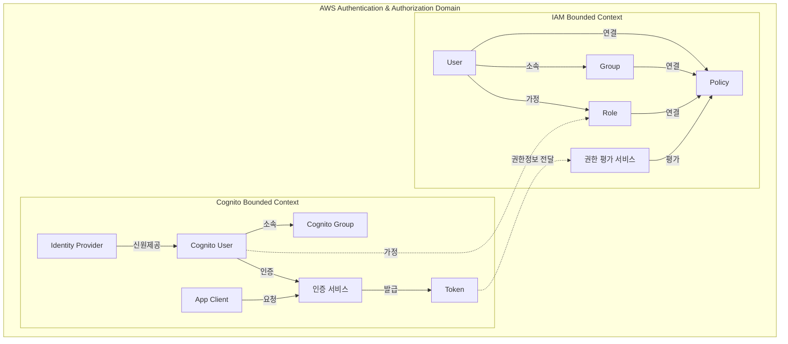
```mermaid
graph TB
    subgraph "AWS Authentication & Authorization Domain"
        subgraph "IAM Bounded Context"
            IAM_User[User]
            IAM_Group[Group]
            IAM_Role[Role]
            IAM_Policy[Policy]
            IAM_Service[권한 평가 서비스]
            
            IAM_User -->|소속| IAM_Group
            IAM_User & IAM_Group & IAM_Role -->|연결| IAM_Policy
            IAM_User -->|가정| IAM_Role
            IAM_Service -->|평가| IAM_Policy
        end
        
        subgraph "Cognito Bounded Context"
            Cog_User[Cognito User]
            Cog_Group[Cognito Group]
            Cog_Token[Token]
            Cog_Client[App Client]
            Cog_IdP[Identity Provider]
            Cog_Auth[인증 서비스]
            
            Cog_User -->|소속| Cog_Group
            Cog_User -->|인증| Cog_Auth
            Cog_Auth -->|발급| Cog_Token
            Cog_IdP -->|신원제공| Cog_User
            Cog_Client -->|요청| Cog_Auth
        end
        
        %% 컨텍스트 간 관계
        Cog_Token -.->|권한정보 전달| IAM_Service
        Cog_User -.->|가정| IAM_Role
    end

```

AWS의 인증/권한 도메인은 거대하지만, 개념적으로 핵심 **엔티티(Entity)**들을 식별하면 다음과 같습니다. 

AWS IAM 영역에서는 **User**, **Group**, **Role**, **Policy** 등이 주요 엔티티입니다. 

User는 사람 또는 서비스 계정 식별을 나타내고, Group은 사용자들의 집합(단순 레이블링)에 가깝습니다. 

Role은 신원을 위임받아 행동하는 주체(principal)로서, EC2 인스턴스나 Lambda 함수가 IAM Role을 통해 권한을 가장하여 AWS 자원을 접근하는 식입니다. 

Policy는 JSON으로 정의된 권한 규칙의 모음으로, 독립된 엔티티이지만 그것만으로는 의미가 없고 반드시 User/Group/Role에 연결되어야 합니다. 

Amazon Cognito 영역에서는 **Cognito User**(애플리케이션 사용자), **User Group**(Cognito 그룹), **App Client**(애플리케이션 클라이언트, OIDC 클라이언트ID에 해당), **Identity Provider**(연동된 외부 IdP 정보) 등이 도메인 객체입니다. 

이 밖에 **Token** 자체도 중요한 도메인 객체로 간주할 수 있는데, Cognito에서는 JWT 토큰 데이터가 주로 외부로 전달되고 저장은 하지 않으므로 토큰은 **값 객체(Value Object)** 성격이 강합니다. 토큰 발급 기록이나 리프레시 토큰 리스트 정도가 상태로 관리될 수 있습니다.

AWS 도메인을 **바운디드 컨텍스트**로 구분해보면, IAM과 Cognito는 서로 다른 하위 도메인으로 볼 수 있습니다.

### **IAM 컨텍스트**

AWS 리소스 접근을 위한 **권한 도메인**으로, 권한정책 평가엔진, 사용자/역할 디렉터리, 인증요소(액세스 키, MFA 시리얼 등)를 포함합니다. 

이 컨텍스트의 **도메인 모델**은 “정책에 따른 권한검사”가 중심이며, `User –<attached>– Policy`, `Role –<assumed by>– User` 등의 관계를 가집니다. 

**애그리거트(Aggregate)** 관점에서 보면 User 자체가 하나의 애그리거트 루트가 되어 자신의 Credential(암호 혹은 키 등 인증수단) 값 객체를 관리하고, 연결된 Policy 참조를 가질 수 있습니다. 

Policy는 내용이 복잡하지만 불변의 규칙 데이터로서 독립 애그리거트로 보고, Policy 자체는 식별자와 정책내용(표현식/문)으로 구성됩니다. 

Role 애그리거트는 자신에게 연결된 Policy들의 식별자 모음을 가지고, Role이 가질 수 있는 신원태그나 세션제한 등이 속성으로 포함될 수 있습니다. 

**이벤트 스토밍**을 해보면 IAM 컨텍스트에서는 “UserCreated”, “UserPasswordChanged”, “RoleAssumed”, “PolicyAttachedToUser” 등의 **도메인 이벤트**가 나올 수 있습니다. 

실제 AWS에서는 이러한 이벤트를 CloudTrail 로그로 남기지만, 시스템 내부적으로는 User 생성 시 관련 리소스 초기화, Role에 Policy 연결 시 캐시 갱신 등의 처리가 일어날 것입니다.

### **Cognito 컨텍스트**

애플리케이션 사용자의 **인증 도메인**으로, 사용자 가입/인증, 프로필, 세션을 다룹니다. 

여기서는 User(회원) 애그리거트가 중심이며, 사용자 프로필 정보, 인증 수단(비밀번호 해시, MFA 시크릿 등) 및 상태(예: VERIFIED, UNCONFIRMED 등)를 관리합니다. 

Group은 여러 User와 연관되지만, Group 내 회원 목록은 규모가 클 수 있으므로 Group을 애그리거트 루트로 보고 그룹에 속한 사용자 ID 리스트를 가질 수도 있습니다 (혹은 관계형 DB라면 조인테이블로 관리). 

**토큰 발급**은 `AuthenticationService`와 같은 도메인 서비스가 담당하여, User 자격증명 확인 후 Token 엔티티(또는 값 객체)를 생성하는 프로세스입니다. 

이벤트로는 “UserSignedUp”, “UserConfirmed”, “UserLoggedIn”, “TokenIssued”, “TokenRevoked” 등이 도출될 수 있고, Cognito의 Lambda Trigger는 이러한 이벤트 발생 시 연결된 Lambda 함수를 호출함으로써 확장 포인트로 활용됩니다.

AWS 전반에서 **컨텍스트 맵(Context Map)**을 그려보면, IAM 컨텍스트와 Cognito 컨텍스트는 비교적 느슨하게 결합되어 있습니다. 별개 제품처럼 보이지만, 예를 들어 Cognito에서 발급된 **OIDC 액세스 토큰을 API Gateway/IAM과 연계**하는 경우 IAM 쪽 **리소스 정책**에서 Cognito 사용자 그룹 클레임을 인식하여 권한을 부여할 수 있습니다 ([Understanding user pool JSON web tokens (JWTs) - Amazon Cognito](https://docs.aws.amazon.com/cognito/latest/developerguide/amazon-cognito-user-pools-using-tokens-with-identity-providers.html#:~:text=When%20a%20user%20signs%20into,to%20access%20other%20AWS%20services)). 

이는 **컨텍스트 통합**의 한 예로, Cognito (Authentication BC)에서 부여한 권한 정보(그룹)가 IAM (Authorization BC)의 정책 조건으로 쓰이는 형태입니다. 

따라서 컨텍스트 맵 상으로 **공유 커널(Shared Kernel)**이나 **컨텍스트 통합** 패턴이 일부 존재합니다. 하지만 대체로 AWS IAM은 AWS 리소스 보호에 특화되고, Cognito는 응용 서비스의 사용자 관리에 특화되어 **기능상의 경계**를 이룹니다.

요약하면 AWS는 자체 시스템을 **DDD 용어로 설계했다고 명시적으로 밝히진 않지만**, 결과적으로 인증/권한 도메인을 IAM, Cognito 등 **하위 도메인**으로 나누어 운영하고 있습니다. 

주요 애그리거트인 User, Role, Policy 등이 각 컨텍스트 안에서 불변식을 지키도록 설계되어 있으며, **이벤트** 중심의 확장성 (Cognito Triggers, CloudTrail Events 등)을 통해 다른 시스템과 통합을 지원합니다. 

AWS의 접근 방식은 **정책 기반 접근제어**와 **표준 프로토콜 준수(OIDC 등)**라는 점에서 업계 레퍼런스로 가치가 있습니다. 

특히 **ABAC 태그 기반 정책**이나 **임시 세션 토큰** 활용 등은 권한 관리 영역에서 AWS가 선도적으로 제공하는 개념들입니다.

# Google: 인증 및 권한 관리 아키텍처 분석

### **Authentication (인증)** 

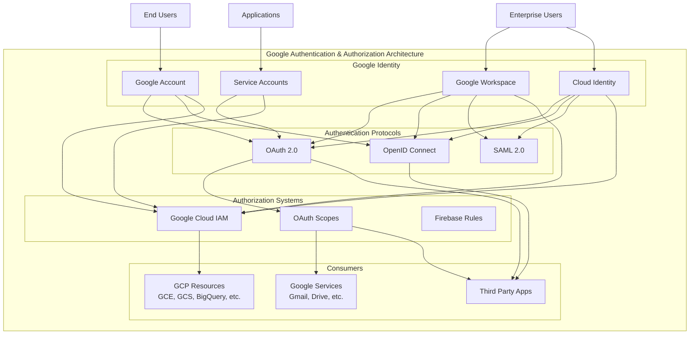
```mermaid
graph TB
    subgraph "Google Authentication & Authorization Architecture"
        subgraph "Google Identity" 
            GA[Google Account]
            GW[Google Workspace]
            CI[Cloud Identity]
            SA[Service Accounts]
        end
        
        subgraph "Authentication Protocols"
            OAuth2[OAuth 2.0]
            OIDC[OpenID Connect]
            SAML[SAML 2.0]
        end
        
        subgraph "Authorization Systems"
            GCP_IAM[Google Cloud IAM]
            OAuth_Scopes[OAuth Scopes]
            Firebase_Rules[Firebase Rules]
        end
        
        subgraph "Consumers"
            Google_Services[Google Services<br/>Gmail, Drive, etc.]
            GCP_Resources[GCP Resources<br/>GCE, GCS, BigQuery, etc.]
            Third_Party[Third Party Apps]
        end
        
        GA --> OAuth2 & OIDC
        GW & CI --> OAuth2 & OIDC & SAML
        SA --> OAuth2
        
        OAuth2 --> OAuth_Scopes
        OAuth2 & OIDC --> Third_Party
        OAuth_Scopes --> Google_Services & Third_Party
        
        GA & GW & CI & SA --> GCP_IAM
        GCP_IAM --> GCP_Resources
    end
    
    Users[End Users] --> GA
    Enterprise[Enterprise Users] --> GW & CI
    Applications[Applications] --> SA
```

Google의 인증 체계는 전세계 수십억 사용자를 커버하는 **Google Account** 시스템을 기반으로 합니다. 

일반 사용자는 구글 계정(Gmail 등)으로 Google 서비스에 로그인하며, Google은 OAuth 2.0 + OpenID Connect를 통해 서드파티 애플리케이션에도 **“구글 로그인”** 기능을 제공합니다. 

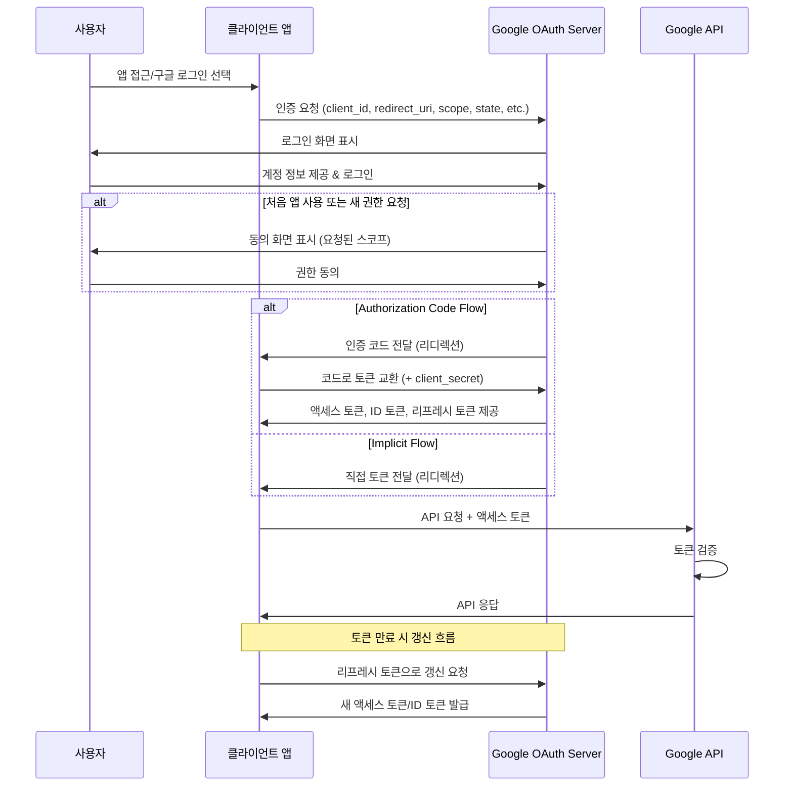
```mermaid
sequenceDiagram
    participant User as 사용자
    participant Client as 클라이언트 앱
    participant Google as Google OAuth Server
    participant API as Google API
    
    User->>Client: 앱 접근/구글 로그인 선택
    Client->>Google: 인증 요청 (client_id, redirect_uri, scope, state, etc.)
    Google->>User: 로그인 화면 표시 
    User->>Google: 계정 정보 제공 & 로그인
    
    alt 처음 앱 사용 또는 새 권한 요청
        Google->>User: 동의 화면 표시 (요청된 스코프)
        User->>Google: 권한 동의
    end
    
    alt Authorization Code Flow
        Google->>Client: 인증 코드 전달 (리디렉션)
        Client->>Google: 코드로 토큰 교환 (+ client_secret)
        Google->>Client: 액세스 토큰, ID 토큰, 리프레시 토큰 제공
    else Implicit Flow
        Google->>Client: 직접 토큰 전달 (리디렉션)
    end
    
    Client->>API: API 요청 + 액세스 토큰
    API->>API: 토큰 검증
    API->>Client: API 응답
    
    Note over Client,Google: 토큰 만료 시 갱신 흐름
    Client->>Google: 리프레시 토큰으로 갱신 요청
    Google->>Client: 새 액세스 토큰/ID 토큰 발급
```

실제로 Google의 OAuth2 구현은 OpenID Connect 인증 규격을 완전히 준수하여 OpenID 재단으로부터 공식 **OpenID Certified** 인증을 받은 형태입니다 ([OpenID Connect | Authentication - Google for Developers](https://developers.google.com/identity/openid-connect/openid-connect#:~:text=OpenID%20Connect%20%7C%20Authentication%20,specification%2C%20and%20is%20OpenID%20Certified)). 

이는 개발자들이 OIDC 클라이언트를 이용해 구글 사용자 인증을 표준 방식으로 통합할 수 있음을 의미합니다. 

간단히 말해, **Google ID 토큰**은 OIDC 표준 claims (sub, iss, aud, exp 등)를 포함하고 서명되어 있어, 애플리케이션은 구글 공개 키로 이를 검증하고 신원 확인을 합니다. 

Google은 **웹, 모바일, TV 등 다양한 환경**에 맞춰 OAuth2 인증 흐름 (Authorization Code, Implicit, PKCE, Device Code 등)을 지원하며, 사용자 동의 화면에서 OpenID **프로필 정보(이름, 이메일 등) 제공에 대한 동의**를 구하면 애플리케이션은 해당 사용자 정보를 ID 토큰이나 UserInfo API로 받을 수 있습니다. 

또한 기업을 위한 SSO 시나리오에서 Google은 **SAML IdP**로도 동작하여, Google Workspace 계정을 기업 애플리케이션(SaaS 등)에 SAML로 연동시키는 것도 일반적입니다. 

Google 인증의 또 다른 측면은 **서비스 계정(Service Account)** 인증인데, 이는 인간 사용자 대신 애플리케이션이나 VM 등이 구글 API를 호출할 때 사용하는 특별한 계정입니다. 

서비스 계정은 키 쌍을 통해 JWT를 만들어 OAuth2 Client Credentials 플로우와 유사하게 인증할 수 있고, Google Cloud의 리소스 접근에 활용됩니다. 

정리하면, Google의 인증은 **대고객용 OIDC 인증 (구글 로그인)**과 **기업용 SAML/Google Workspace 인증**, **서비스 계정 인증** 등으로 구분되며, 모두 **OAuth2/OIDC 표준**을 기반으로 확장성 있고 안전하게 설계되어 있습니다.

### **Authorization (권한 부여)** 

Google의 권한 관리는 크게 두 부분으로 나눌 수 있습니다. **(1) 구글 사용자 계정 차원의 권한**과 **(2) Google Cloud Platform(GCP) 리소스 차원의 권한**입니다. 

(1) 일반적인 구글 계정은 개인용 서비스(Gmail, Drive 등) 이용에 있어서 구글이 내부적으로 정한 권한으로 동작하고, 서드파티 애플리케이션에 대한 권한 부여는 OAuth2의 **스코프(Scope)** 개념으로 이루어집니다. 

예를 들어 어떤 앱이 사용자 Gmail 읽기 권한을 요청하면, 구글 계정이 해당 앱에 `gmail.read` 스코프를 허가했다는 기록을 가지고, 나중에 그 앱이 API를 호출할 때 토큰에 그 스코프가 포함되도록 합니다. 

사용자는 Google 계정의 보안 설정에서 어떤 앱에 어떤 권한(스코프)을 주었는지 관리할 수 있습니다. 이러한 방식은 **사용자-애플리케이션 간 권한 동의(Consent)** 모델로, OAuth2의 기본 권한 부여 메커니즘입니다. 

(2) GCP 리소스에 대한 권한 관리는 **Google Cloud IAM**이라는 별도 도메인으로 운영됩니다. Google Cloud IAM은 프로젝트, 폴더, 조직과 같은 **리소스 계층 구조**를 기반으로 **정책 바인딩(Policy Binding)**을 정의하는 **RBAC 모델**입니다. 

관리자나 리소스 소유자는 특정 리소스(예: 프로젝트)에 대해 **역할(Role)**을 정의하고, 그 역할을 **주체(Principal)**에게 할당하는 형식으로 권한을 부여합니다. 

여기서 주체는 **Google ID(이메일)**일 수도 있고, **Google 그룹**, **서비스 계정**, 혹은 **도메인**(앱스 도메인 전체 사용자) 등이 될 수 있습니다. 

역할(Role)은 GCP 서비스들이 제공하는 세부 **권한(permission)**의 집합으로, Google이 제공하는 **프리디파인드(predefined) 역할**과 사용자가 만드는 **커스텀 역할**이 있습니다. 

예를 들어 *Storage Object Viewer*라는 역할은 스토리지 객체 읽기 권한을 포함하며, 어떤 사용자에게 이 역할을 프로젝트 수준에서 부여하면 그 프로젝트 내 모든 GCS 버킷의 객체를 읽을 수 있게 됩니다. 

Google IAM 정책은 JSON으로 표현되고, 각 리소스(예: 프로젝트)에 **정책 하나**가 존재하며 거기에 여러 “(principal → role)” 바인딩이 나열되는 구조입니다. 

Google Cloud IAM은 전형적인 RBAC 모델이지만, 여기에 **조건부 접근 정책(Conditional IAM)** 기능을 추가하여 **ABAC적인 요소**도 도입했습니다. 

관리자는 정책 바인딩에 조건문을 넣어 “만약 요청자가 오후 6시 이후 또는 미국 외 지역에서 요청하면 거부”와 같이 **맥락 기반(Contextual)** 인가를 구현할 수 있습니다. 

예를 들어 IP 주소나 요청 시간, 리소스의 태그 등을 조건으로 삼을 수 있어 보다 세밀한 통제가 가능합니다. 이러한 ABAC 스타일 조건부 정책은 AWS의 태그 기반 ABAC와 유사하며, **동적 정책** 수립에 활용됩니다. 

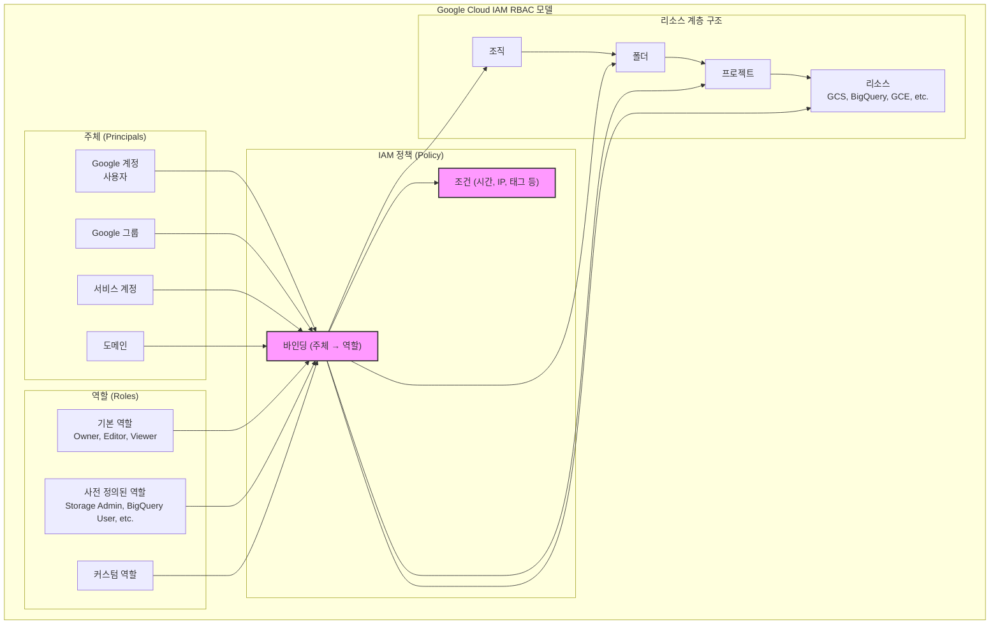
```mermaid
graph TB
    subgraph "Google Cloud IAM RBAC 모델"
        subgraph "리소스 계층 구조"
            Org[조직]
            Folders[폴더]
            Projects[프로젝트]
            Resources[리소스<br/>GCS, BigQuery, GCE, etc.]
            
            Org --> Folders
            Folders --> Projects
            Projects --> Resources
        end
        
        subgraph "주체 (Principals)"
            Users[Google 계정<br/>사용자]
            Groups[Google 그룹]
            SvcAccounts[서비스 계정]
            Domain[도메인]
        end
        
        subgraph "역할 (Roles)"
            BasicRoles[기본 역할<br/>Owner, Editor, Viewer]
            PredefinedRoles[사전 정의된 역할<br/>Storage Admin, BigQuery User, etc.]
            CustomRoles[커스텀 역할]
        end
        
        subgraph "IAM 정책 (Policy)"
            Bindings["바인딩 (주체 → 역할)"]
            Conditions["조건 (시간, IP, 태그 등)"]
        end
        
        Users & Groups & SvcAccounts & Domain --> Bindings
        BasicRoles & PredefinedRoles & CustomRoles --> Bindings
        Bindings --> Conditions
        Bindings --> Org & Folders & Projects & Resources
    end
    
    class Conditions,Bindings emphasis;
    classDef emphasis fill:#f9f,stroke:#333,stroke-width:2px;
```

요약하면, Google의 권한 부여는 **OAuth 스코프 기반 애플리케이션 권한**과 **Cloud IAM 역할 기반 리소스 권한**의 두 축으로 이루어져 있으며, 후자는 구글 클라우드 상에서 **아주 세분화된 권한 제어**를 가능하게 하는 강력한 서비스입니다 ([Google Cloud IAM: An Overview of Identity and Access Management ...](https://medium.com/@luigicerone/google-cloud-iam-an-overview-of-identity-and-access-management-in-gcp-5024ef6015e5#:~:text=Google%20Cloud%20IAM%3A%20An%20Overview,grained%20control)).

### **Token Management (토큰 관리)** 

Google의 토큰 관리는 표준 OAuth2 토큰과 자체 인증 쿠키 등을 병행합니다. 

사용자 로그인을 하면 브라우저 세션에서는 보안 쿠키로 세션을 유지하지만, 서드파티 애플리케이션에는 **OAuth2 액세스 토큰**과 **ID 토큰**을 발급하여 전달합니다. 

Google의 OAuth2 **액세스 토큰**은 보통 길고 복잡한 문자열(구글 자체 발행 형식)로, JWT일 때도 있지만 종종 불투명 토큰으로 간주됩니다 (구글 API 호출 시 이 액세스 토큰을 Authorization 헤더에 보내면 구글 서버가 토큰을 검사). 

개발자가 구글 OAuth2 서버로부터 액세스 토큰을 받으면, 필요 시 **OpenID Connect ID 토큰**도 함께 요청할 수 있습니다. 

ID 토큰은 JWT 형식이며 `accounts.google.com` 또는 `https://securetoken.google.com` (Firebase 사용 시) 등의 issuer로 서명되며, 앱이 직접 디코드해 사용자 정보를 얻거나 서명 검증을 할 수 있습니다. 

액세스 토큰은 일반적으로 약 **1시간** 유효하고, **리프레시 토큰**은 사용자가 오프로 접근 권한을 허용한 경우 앱에 제공됩니다. 

리프레시 토큰을 통해 사용자는 재로그인하지 않고도 장기간 앱에서 새 액세스 토큰을 받을 수 있지만, 보안상 구글은 이상 징후 시 리프레시 토큰을 취소하기도 합니다. 

예를 들어 사용자가 비밀번호를 변경하거나 2단계 인증을 추가하면 기존 발급된 리프레시 토큰들이 무효화되어, 모든 연동 앱에서 재인증을 요구하게 합니다. 한편, Google Cloud IAM의 권한으로 발급되는 **단기 인증 토큰**들도 있습니다. 

예를 들어 서비스 계정 키를 통해 OAuth2 **JWT Bearer** assertion을 구글 STS에 제출하면 **단기 액세스 토큰**을 발급해주는데, 이는 GCP 리소스 접근에 사용되고 3600초(1시간) 등으로 만료됩니다. 

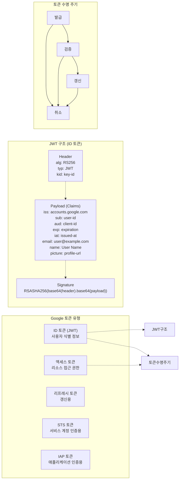
```mermaid
graph LR
    subgraph "Google 토큰 유형"
        IDToken["ID 토큰 (JWT)<br/>사용자 식별 정보"]
        AccessToken["액세스 토큰<br/>리소스 접근 권한"]
        RefreshToken["리프레시 토큰<br/>갱신용"]
        STSToken["STS 토큰<br/>서비스 계정 인증용"]
        IAPToken["IAP 토큰<br/>애플리케이션 인증용"]
    end
    
    subgraph "JWT 구조 (ID 토큰)"
        Header["Header<br/>alg: RS256<br/>typ: JWT<br/>kid: key-id"]
        
        Payload["Payload (Claims)<br/>iss: accounts.google.com<br/>sub: user-id<br/>aud: client-id<br/>exp: expiration<br/>iat: issued-at<br/>email: user@example.com<br/>name: User Name<br/>picture: profile-url"]
        
        Signature["Signature<br/>RSASHA256(base64(header).base64(payload))"]
        
        Header -.-> Payload -.-> Signature
    end
    
    subgraph "토큰 수명 주기"
        Issue["발급"]
        Validate["검증"]
        Refresh["갱신"]
        Revoke["취소"]
        
        Issue --> Validate --> Refresh
        Issue & Validate & Refresh --> Revoke
    end
    
    IDToken -.-> JWT구조
    AccessToken & IDToken -.-> 토큰수명주기
```

또한 Google은 **Cloud Identity-Aware Proxy(IAP)** 등의 서비스에서 애플리케이션 세션 토큰을 관리하기도 합니다. 

IAP를 쓰는 경우 백엔드 애플리케이션에는 IAP가 서명한 JWT가 전달되고, 이 JWT의 sub가 실제 사용자 이메일로 맵핑되어 애플리케이션은 구글이 인증한 사용자 정보를 신뢰할 수 있습니다. 

요컨대 구글의 토큰 전략은 **OAuth2/OIDC 토큰**을 기본으로 하되, **안전한 만료와 갱신 정책**을 운영함으로써 보안과 편의의 균형을 맞추고 있습니다. 

또한 구글은 **토큰 검사 엔드포인트**와 **공개 키 제공(JWKS)**를 통해 외부 서비스가 구글 토큰을 검증하거나 ID 정보에 접근할 수 있도록 하여 상호운용성을 높였습니다.

### **User Management (사용자 계정 관리)** 

일반 사용자 측면에서 구글 계정 생성/관리는 구글이 일원화하여 제공합니다. 

전 세계인이 하나의 시스템(구글 계정 시스템)에 계정을 가지고, 거기에 **프로필, 보안설정(이중인증, 복구이메일 등), 연결된 앱 권한, 결제정보** 등을 통합 관리합니다. 

구글 계정 포털을 통해 사용자는 자신의 정보와 앱 접근 권한, 로그인 기록 등을 볼 수 있고, 계정 삭제도 진행할 수 있습니다. 이처럼 **개인 사용자 관리**는 구글 내부적으로 강력한 확장성으로 설계되어 하루 수억 건의 로그인/가입을 처리합니다. 

반면 **기업용 계정 관리**는 **Google Workspace (과거 G Suite)**나 **Cloud Identity**를 통해 이루어집니다. 

기업이나 조직은 Cloud Identity를 통해 자체 **도메인 디렉터리**를 만들고 그 안에 **사용자 계정, 그룹**을 생성하여 관리합니다. 

이는 Azure AD나 Okta와 유사한 IDaaS 서비스로 볼 수 있습니다. 관리자(Admin 콘솔)는 조직 내 사용자 추가/삭제, 그룹 조직, 별명(alias) 설정, 비밀번호 초기화, SSO 설정 등을 수행할 수 있습니다. 

또한 회사 보안정책에 따라 비밀번호 요건이나 2단계 인증 강제, 특정 OAuth 앱 사용 제한 등의 정책도 적용합니다. 

Google Workspace 계정은 회사 도메인(예: *@company.com*)으로 되어 있고, 이 사용자들은 구글 클라우드 리소스(IAM) 주체로서도 활용될 수 있습니다. 

즉, Cloud IAM에서 어떤 Google Workspace 사용자에게 GCP 프로젝트 역할을 부여하면, 해당 사용자는 자신의 구글 계정으로 GCP 리소스에 접근할 수 있습니다. 

**그룹** 관리는 Google Groups 서비스와 통합되어 있어 메일링 리스트와 IAM 권한 그룹으로 동시에 쓰이는 형태입니다. 

최근 Google은 **구성원 프로비저닝 표준인 SCIM**도 지원하여, 타 시스템과 사용자 목록을 자동 동기화할 수 있도록 했습니다. 

한편 개발자 측면에서 **Firebase Authentication** (Google Identity Platform)을 통해 구글의 사용자 관리 엔진을 직접 활용할 수도 있습니다. 

Firebase Auth를 사용하면 이메일/비번 기반 사용자 풀, 소셜 로그인, 익명 계정 등을 통합 지원하며, 이는 사실상 구글 클라우드가 제공하는 **Auth0 대안**으로 볼 수 있습니다. 

이 서비스도 내부적으로 구글 인프라를 사용하므로 안정성과 확장성이 뛰어나며, 개발자는 Firebase SDK로 손쉽게 사용자 관리 기능을 적용할 수 있습니다.

## **Domain Model & Bounded Contexts** 

Google의 인증/권한 도메인을 몇 가지 **서브도메인**으로 나눠볼 수 있습니다.

### **Google Account 컨텍스트**

전 세계 사용자 계정을 다루는 **아이덴티티 관리 컨텍스트**입니다. 

여기서의 **주요 엔티티**는 사용자(User)이며, 속성으로 이메일, 이름, 프로필 사진 URL, 보안 설정들이 있습니다. 

비밀번호 자격증명이나 2FA 시크릿 같은 민감 정보는 별도 안전한 저장소에 있지만, 논리적으로 User 엔티티의 하위 개념으로 볼 수 있습니다. 

이 컨텍스트에서는 “사용자 등록됨”, “사용자 비밀번호 변경됨”, “사용자 계정 비활성화됨” 등의 **이벤트**가 존재합니다. 

Google 계정 시스템은 가입/로그인/계정복구 등의 **시나리오별 워크플로**가 있으며, 이는 상태 전이로 모델링 가능합니다 (예: USER 상태: Pending -> Active -> Suspended -> Deleted). 

**애그리거트**로는 User가 단연 중심이며, 자체 고유 id (Google은 모든 계정에 고유한 GAIA ID를 부여)를 가지며, 이메일 주소 등은 고유 제약을 갖습니다.

### **OAuth Consent & Token 컨텍스트**

이는 구글 계정 사용자가 타 애플리케이션에 권한을 부여하는 과정을 다룹니다. 

**주요 엔티티**로 “애플리케이션(App)”과 사용자와 앱 간의 “승인(Consent)” 기록이 있습니다. 

App 엔티티에는 클라이언트ID, 이름, 소유자, 허용된 리디렉트 URI, 요청 가능한 OAuth 스코프 목록 등이 있고, Consent 엔티티(또는 Grant)는 “어떤 사용자(User)가 어떤 App에 어떤 스코프들을 언제 승인했는지”를 나타냅니다. 

이 컨텍스트에서 중요한 **도메인 이벤트**는 “ConsentGranted”, “ConsentRevoked” 등으로, 사용자가 앱 권한을 승인하거나 철회할 때 발생합니다. 

토큰 발급은 이 승인을 전제로 OAuth 서버가 수행하므로, **Token**은 이 컨텍스트의 산출물(output)이지만 자체 저장은 안 하고 바로 발급후 폐기하는, **값 객체** 형태로 간주합니다. 

토큰 자체는 외부에 전달되며, 내부적으로는 유효성 검사를 위해 (일부 정보는 캐시나 저장될 수 있으나) 주로 stateless하게 운영됩니다.

### **Google Cloud IAM 컨텍스트**

GCP 리소스에 대한 **접근 관리 컨텍스트**입니다. **주요 엔티티**는 “리소스(Resource)”와 “정책(Policy)”. 

리소스는 프로젝트, 버킷, VM 등 계층 구조로 조직되는 대상이고, Policy는 해당 리소스에 붙은 역할할당 목록입니다. 

Policy는 애그리거트로 볼 수 있으며 내부에 다수의 “바인딩(binding)”(주체→역할 매핑)을 포함합니다. 

각 Binding은 주체(사용자 이메일 혹은 그룹, 도메인 등)와 Role의 쌍이고 선택적으로 조건(condition)을 가질 수 있습니다. 

주체로 들어오는 Google Account 사용자나 그룹은 외부 컨텍스트(Google Account 컨텍스트)의 엔티티지만, Cloud IAM에서는 단순 식별자(string)로 간주되어 **외부 컨텍스트와의 공유 커널**은 없습니다. 

대신 **컨텍스트 간 통합**은 “신원 federation” 형태로, Cloud IAM은 Google Account 디렉터리를 **인증 소스**로 신뢰하고, 권한 부여 결정을 할 때 그 ID를 사용합니다. 

이 컨텍스트의 **도메인 이벤트**로는 “RoleGrantedToUser”, “RoleRevokedFromUser”, “PolicyUpdated” 등이 있을 수 있고, 실체로서 GCP Audit Log에 남습니다.

### **Google Workspace(Cloud Identity) 컨텍스트**

이는 기업용 디렉터리 관리 서브도메인입니다. Google Account 컨텍스트와 유사하지만, 조직(tenant) 별로 격리된 **Org Unit**을 가지고 그 아래에 User와 Group이 속합니다. 

User, Group 엔티티 구조는 개인 구글계정과 비슷하나, Group은 메일링 리스트 주소와 구성원 목록을 속성으로 가집니다. 

이벤트로는 “EnterpriseUserProvisioned”, “UserAddedToGroup” 등이 있고, Google Workspace Admin 로그에서 확인됩니다. 

이 컨텍스트는 IdP로서 SAML을 제공하기도 하고, SCIM API로 외부 HR 시스템과 연동되어 **프로비저닝 이벤트**를 주고받습니다.

Google의 전체 **컨텍스트 맵**을 보면, Google Account/Consent는 전세계 공용 **Consumer Identity** 도메인, Cloud IAM은 **Cloud Resource 권한** 도메인, Workspace는 **Enterprise Identity** 도메인으로 구분됩니다. 

Consumer Identity와 Enterprise Identity는 필요에 따라 연결되는데 (예: Google 계정을 기업 계정으로 전환하거나, 반대로 기업 계정에 개인 구글 계정 초대 등의 시나리오), 대체로 멀티테넌트 SaaS인 Workspace가 기업 영역을 담당하고 일반 개인 계정 시스템과 분리되어 있습니다. 

Cloud IAM은 Account/Workspace 양쪽의 사용자 주체를 모두 받아들여 권한 결정을 하는 **컨슈머**로서, Identity 제공자와 Authorization 서비스 간 **공개 호스트 서비스(Open Host Service)** 관계로 볼 수 있습니다 – Identity 측은 OAuth2, SAML, Google Sign-In 등의 API/프로토콜을 통해 신원을 제공하고, Cloud IAM은 이를 토대로 인가를 수행합니다.

요약하면, Google의 인증/권한 모델은 **전 지구적 범용 Identity 플랫폼**과 **클라우드 리소스 전용 IAM 서비스**로 이원화되어 있으며, 각 부분은 그 역할에 특화된 모델과 이벤트를 가지고 발전해왔습니다. 

**OAuth2/OIDC의 창시자 중 하나가 Google**일 만큼 표준 기술 스택을 적극 활용하고 있고, **Fine-grained RBAC** 구현인 Cloud IAM은 AWS IAM에 대응하는 업계 표준 레퍼런스로 평가됩니다 ([Google Cloud IAM: An Overview of Identity and Access Management ...](https://medium.com/@luigicerone/google-cloud-iam-an-overview-of-identity-and-access-management-in-gcp-5024ef6015e5#:~:text=Google%20Cloud%20IAM%3A%20An%20Overview,grained%20control)). 

Domain-Driven Design 측면에서 구글의 아이덴티티 시스템은 명시적으로 DDD 용어를 쓰진 않지만, 서브도메인 경계를 명확히 하고 (계정/권한/리소스 등) 각 부분이 엄청난 스케일에서도 견고히 동작하도록 분산 아키텍처를 취하고 있어 참고할 점이 많습니다.

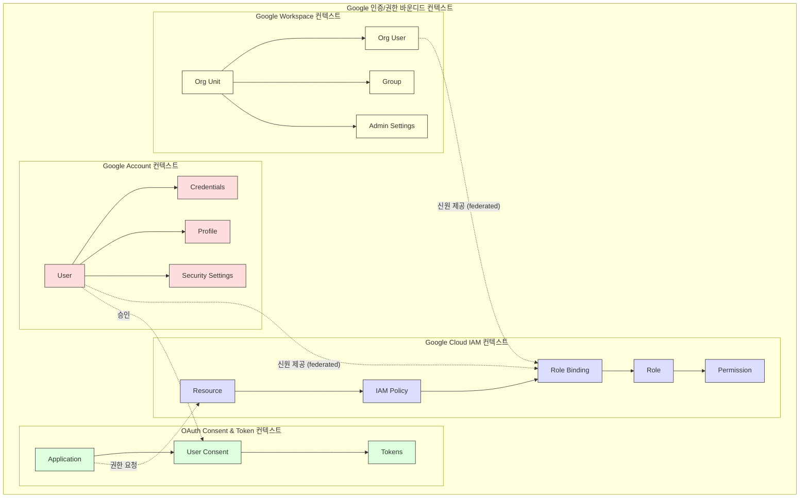
```mermaid

graph TB
    subgraph "Google 인증/권한 바운디드 컨텍스트"
        subgraph "Google Account 컨텍스트"
            User[User]
            Credentials[Credentials]
            Profile[Profile]
            Security[Security Settings]
            
            User --> Credentials
            User --> Profile
            User --> Security
        end
        
        subgraph "OAuth Consent & Token 컨텍스트"
            App[Application]
            Consent[User Consent]
            Token[Tokens]
            
            App --> Consent
            Consent --> Token
        end
        
        subgraph "Google Cloud IAM 컨텍스트"
            Resource[Resource]
            Policy[IAM Policy]
            Binding[Role Binding]
            Role[Role]
            Permission[Permission]
            
            Resource --> Policy
            Policy --> Binding
            Binding --> Role
            Role --> Permission
        end
        
        subgraph "Google Workspace 컨텍스트"
            OrgUser[Org User]
            Group[Group]
            OrgUnit[Org Unit]
            AdminSetting[Admin Settings]
            
            OrgUnit --> OrgUser
            OrgUnit --> Group
            OrgUnit --> AdminSetting
        end
        
        %% 컨텍스트 간 관계
        User -.->|"신원 제공 (federated)"| Binding
        OrgUser -.->|"신원 제공 (federated)"| Binding
        User -.->|"승인"| Consent
        App -.->|"권한 요청"| Resource
    end
    
    classDef accountContext fill:#ffdddd,stroke:#333,stroke-width:1px;
    classDef oauthContext fill:#ddffdd,stroke:#333,stroke-width:1px;
    classDef iamContext fill:#ddddff,stroke:#333,stroke-width:1px;
    classDef workspaceContext fill:#ffffdd,stroke:#333,stroke-width:1px;
    
    class User,Credentials,Profile,Security accountContext;
    class App,Consent,Token oauthContext;
    class Resource,Policy,Binding,Role,Permission iamContext;
    class OrgUser,Group,OrgUnit,AdminSetting workspaceContext;
```

# Okta: 인증 및 권한 관리 아키텍처 분석

## **Authentication (인증)** 

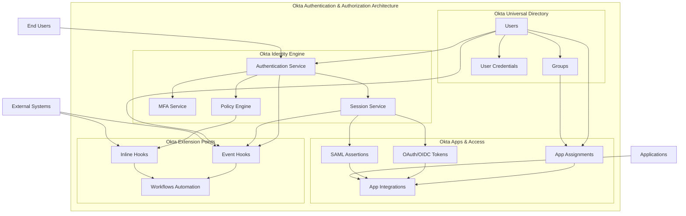
```mermaid
graph TB
    subgraph "Okta Authentication & Authorization Architecture"
        subgraph "Okta Universal Directory" 
            Users[Users]
            Groups[Groups]
            UserCredentials[User Credentials]
        end
        
        subgraph "Okta Identity Engine"
            AuthnService[Authentication Service]
            MFAService[MFA Service]
            SessionService[Session Service]
            PolicyEngine[Policy Engine]
        end
        
        subgraph "Okta Apps & Access"
            AppIntegrations[App Integrations]
            AppAssignments[App Assignments]
            SAML[SAML Assertions]
            OAuth[OAuth/OIDC Tokens]
        end
        
        subgraph "Okta Extension Points"
            EventHooks[Event Hooks]
            InlineHooks[Inline Hooks]
            WorkflowsAutomation[Workflows Automation]
        end
        
        Users --> UserCredentials
        Users --> Groups
        
        Users --> AuthnService
        AuthnService --> PolicyEngine
        AuthnService --> MFAService
        AuthnService --> SessionService
        
        Users & Groups --> AppAssignments
        AppAssignments --> AppIntegrations
        
        SessionService --> SAML & OAuth
        
        OAuth --> AppIntegrations
        SAML --> AppIntegrations
        
        AuthnService & SessionService & Users --> EventHooks
        PolicyEngine --> InlineHooks
        EventHooks & InlineHooks --> WorkflowsAutomation
    end
    
    EndUsers[End Users] --> AuthnService
    Applications[Applications] --> AppIntegrations
    ExternalSystems[External Systems] --> EventHooks & InlineHooks
```

**Okta**는 대표적인 IDaaS(Identity as a Service) 업체로서, **싱글 사인온(SSO)**과 **멀티팩터 인증(MFA)**, **소셜 로그인** 등 **다양한 인증 시나리오**를 지원하는 클라우드 서비스입니다. 

Okta에 애플리케이션을 연동하면, 최종 사용자는 Okta에서 제공하는 통합 로그인 페이지에서 인증을 거친 후 SSO로 각 애플리케이션에 접근할 수 있습니다. 

Okta는 **사용자 이름/비밀번호** 인증을 기본으로 하며, 추가로 Google Authenticator 등의 OTP, FIDO2(WebAuthn) 기반 지문/보안키, SMS/Email OTP 같은 **2차 인증 수단**을 정책에 따라 적용할 수 있습니다. 

기술적으로 Okta는 **OAuth 2.0 / OpenID Connect(OIDC)**를 완벽히 구현한 **Authorization Server** 기능을 갖추고 있어, OpenID Provider로 동작하며 **ID 토큰과 액세스 토큰 발급**을 수행합니다 ([Okta Data Model | Okta Developer](https://developer.okta.com/docs/concepts/okta-data-model/#:~:text=An%20authorization%20server%20,0%2C%20OpenID%20Connect%2C%20and%20SAML)). 

또한 Okta는 **SAML 2.0 IdP**로 동작하여 SAML을 사용하는 옛 애플리케이션들과도 연동할 수 있고, WS-Federation, SCIM 등 기업 표준 프로토콜도 지원합니다.

**Okta Identity Engine**이라는 최신 플랫폼에서는 인증 흐름을 세밀히 제어할 수 있는 **폴리스타일 정책 엔진**이 도입되어, 예를 들어 특정 상황(새 디바이스, 위험 IP 등)에서 추가 MFA를 요구하거나, 비즈니스 로직에 따라 인증 단계를 커스터마이즈하는 것이 가능합니다. 

Okta 인증 파이프라인은 **이벤트 기반 훅(Hook)**도 제공하여, 로그인 성공/실패, 비밀번호 변경, MFA 등록 등의 이벤트 발생 시 외부 엔드포인트를 호출해 필요한 작업을 수행할 수 있습니다 ([Event hooks concepts | Okta Developer](https://developer.okta.com/docs/concepts/event-hooks/#:~:text=Event%20types%20include%20user%20lifecycle,or%20generating%20an%20email%20message)). 

예를 들어 **사용자 로그인 성공** 이벤트마다 외부 감사 로깅 시스템에 기록을 남긴다거나, **계정 잠금** 이벤트 때 관리자에게 알림을 보내는 등의 확장이 가능합니다. 

이러한 기능들은 Okta가 **인증**을 단순히 사용자 확인 단계로 한정하지 않고, **Adaptive MFA**, **Risk-Based Authentication** 등 맥락 정보를 활용한 고급 인증 시나리오까지 아우르는 플랫폼임을 보여줍니다.

````mermaid
sequenceDiagram
    participant User as 사용자
    participant App as 애플리케이션
    participant Okta as Okta 인증 서비스
    participant Policy as Okta 정책 엔진
    participant MFA as MFA 서비스
    participant Directory as Universal Directory
    
    User->>App: 앱 접근
    App->>Okta: 인증 요청 리디렉션
    
    alt 이미 Okta 세션 있음
        Okta->>Okta: 세션 쿠키 확인
    else 신규 로그인 필요
        Okta->>User: 로그인 페이지 표시
        User->>Okta: 사용자명/비밀번호 제공
        Okta->>Directory: 사용자 검증
        Directory-->>Okta: 사용자 확인
        
        Okta->>Policy: 정책 평가 요청
        Policy-->>Okta: MFA 필요 여부 등 결정
        
        alt MFA 필요
            Okta->>MFA: MFA 챌린지 생성
            MFA->>User: MFA 확인 요청
            User->>MFA: MFA 코드/응답 제공
            MFA-->>Okta: MFA 검증 결과
        end
    end
    
    Okta->>Okta: 세션 생성
    
    alt SAML 앱
        Okta->>App: SAML Assertion 생성 및 POST
    else OIDC 앱
        Okta->>User: Authorization Code 제공 (리디렉션)
        User->>App: Code 전달
        App->>Okta: Code로 토큰 교환
        Okta-->>App: ID/액세스 토큰 발급
    end
    
    App->>User: 앱 접근 허용
    
    Note over User,Okta: 사용자가 다른 앱에 접근할 때 SSO 활용
````

## **Authorization (권한 부여)** 

okta 자체는 주로 **인증과 SSO**에 중점을 둔 서비스이지만, 일정 수준의 **권한 관리**도 제공합니다. 

Okta에서 말하는 권한은 두 가지 층위가 있습니다. 

**(1)** Okta에 연동된 **애플리케이션에 대한 접근 권한**과 **(2)** Okta 관리 콘솔/API에 대한 **관리자 권한(Role)**입니다. 

(1) 애플리케이션 접근 권한은 Okta에서 **어떤 사용자가 어떤 애플리케이션을 사용할 수 있는지**를 제어하는 것을 의미합니다. 

이는 Okta의 **Assignments** 개념으로, **사용자** 혹은 **그룹**을 애플리케이션에 할당함으로써 이루어집니다 ([Okta Data Model | Okta Developer](https://developer.okta.com/docs/concepts/okta-data-model/#:~:text=A%20Group%20,be%20used%20for%20subscription%20tiers)). 

예를 들어, Salesforce 애플리케이션을 Okta에 등록하고 마케팅 부서 그룹을 할당하면, 그 그룹의 사용자들만 Okta 포털에서 Salesforce 아이콘이 보이고 SSO로 접근할 수 있습니다. 

애플리케이션 연동 유형에 따라 SAML Assertion에 **사용자 그룹 정보를 담아 보내** 애플리케이션 측에서 RBAC를 이어가도록 하거나, OIDC **액세스 토큰의 클레임**에 사용자 권한을 넣는 식으로 활용 가능합니다. 

Okta 자체에도 **Authorization Server** 기능이 있어, 개발자가 Okta를 OAuth2 서버로 활용하여 API 보호에 쓸 수 있습니다. 

이 경우 Okta에 **스코프(scope)**와 **정책**을 정의하고 사용자 또는 그룹별로 그 스코프를 허용할지 제어할 수 있습니다 (Okta API Access Management 기능). 

(2) Okta 관리자 권한은 Okta 테넌트(org) 내에서 **관리자 역할**(Admin Roles)을 통해 관리됩니다. 예컨대 User 관리 권한만 가진 관리자, 애플리케이션 연동을 다루는 관리자, 모든 권한을 가진 Super Admin 등이 있으며, 이는 Okta가 사전에 정의한 역할들을 특정 사용자에게 부여하는 방식입니다. 

각 역할은 Okta **백엔드 권한**에 해당하므로 Okta 외부로 전달되지는 않습니다.

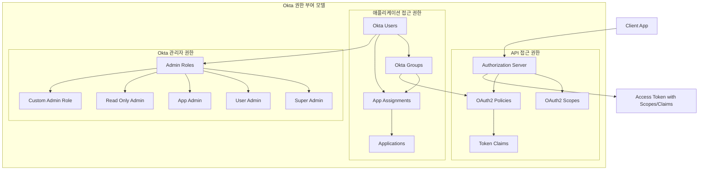
```mermaid
graph TB
    subgraph "Okta 권한 부여 모델"
        subgraph "애플리케이션 접근 권한"
            Users[Okta Users]
            Groups[Okta Groups]
            Apps[Applications]
            AppAssignment[App Assignments]
            
            Users --> Groups
            Users & Groups --> AppAssignment
            AppAssignment --> Apps
        end
        
        subgraph "API 접근 권한"
            AuthServer[Authorization Server]
            Scopes[OAuth2 Scopes]
            Policies[OAuth2 Policies]
            Claims[Token Claims]
            
            AuthServer --> Scopes
            AuthServer --> Policies
            Policies --> Claims
            Groups --> Policies
        end
        
        subgraph "Okta 관리자 권한"
            AdminRoles[Admin Roles]
            SuperAdmin[Super Admin]
            UserAdmin[User Admin]
            AppAdmin[App Admin]
            ReadOnly[Read Only Admin]
            CustomRole[Custom Admin Role]
            
            AdminRoles --> SuperAdmin & UserAdmin & AppAdmin & ReadOnly & CustomRole
            Users --> AdminRoles
        end
    end
    
    Client[Client App] --> AuthServer
    AuthServer --> AccessToken[Access Token with Scopes/Claims]
```

흥미로운 점은 Okta가 최근 **파인 그레인드 어쓰라이제이션(Fine-Grained Authorization)** 기능도 도입하고 있다는 것입니다 ([A Look at Auth0 Cloud Architecture: 5 Years In](https://auth0.com/blog/auth0-architecture-running-in-multiple-cloud-providers-and-regions/#:~:text=The%20core%20service%20is%20composed,of%20different%20layers)). 

이는 전통적으로 Okta가 담당하지 않던 애플리케이션 내부의 세부 권한(예: 리소스 별 CRUD 권한)을 정책으로 관리하도록 지원하는 기능으로, 개발자가 Okta에서 중앙 관리하는 정책에 따라 애플리케이션이 권한 결정을 하도록 하는 개념입니다. 

이러한 기능은 아직 널리 사용되는 것은 아니지만, Okta가 **권한 도메인**까지 아우르는 방향으로 발전하고 있음을 시사합니다. 

하지만 일반적으로 Okta 사용 시 세부 애플리케이션 권한은 여전히 애플리케이션 자체의 책임이고, Okta는 **“이 사용자에게 이 애플리케이션 접속을 허용할 것인가”** 정도의 접근제어와, **OAuth2 스코프** 기반의 API 권한 관리 정도를 제공한다고 볼 수 있습니다.

## **Token Management (토큰 관리)** 

Okta는 **OIDC 프로바이더**로서 동작하므로, 토큰 관리 측면에서 **Authorization Code Flow**, **Implicit Flow**, **Client Credentials Flow** 등 OAuth2 전반을 지원합니다. 

일반적인 웹 SSO의 경우 Okta는 Authorization Code + PKCE 흐름을 통해 **ID 토큰**과 **액세스 토큰**을 클라이언트에게 발급합니다. 

ID 토큰은 Okta 테넌트의 공개 키로 서명된 JWT이며, 기본적으로 Okta User의 프로필 정보(claims)를 포함합니다. 

프로필에는 사용자 ID, 이름, 이메일, 그룹 등 필요한 정보가 맵핑되며, Okta **프로필 매핑 규칙**을 통해 토큰 클레임 구성을 커스터마이즈할 수 있습니다 (예: AD에서 온 직책 정보를 토큰에 포함 등). 

액세스 토큰 역시 JWT (혹은 오페이크 토큰)로 발급되며, 클라이언트가 Okta에 등록된 리소스 서버(API)를 호출할 때 검증에 사용됩니다. 

Okta의 OAuth2 토큰은 기본 만료시간(ID 토큰 1시간, 액세스 토큰 1시간 등)이 있으며, **리프레시 토큰**을 통해 연장 가능합니다. 리프레시 토큰 정책(수명, 로테이션 여부 등)은 관리자가 설정할 수 있고, 필요시 특정 사용자 세션이나 전체 테넌트 수준에서 리프레시 토큰을 **취소(revoke)**할 수 있습니다. 

Okta는 **/revoke** 엔드포인트를 제공하여 OAuth2 표준 방식으로 토큰 철회를 지원하며, **/introspect** 엔드포인트로 액세스 토큰 유효성 및 스코프 정보를 확인할 수도 있습니다. 

또한 Okta는 **서명 키 롤오버**를 주기적으로 수행하여 (JWKS URI로 노출) 보안을 유지합니다.

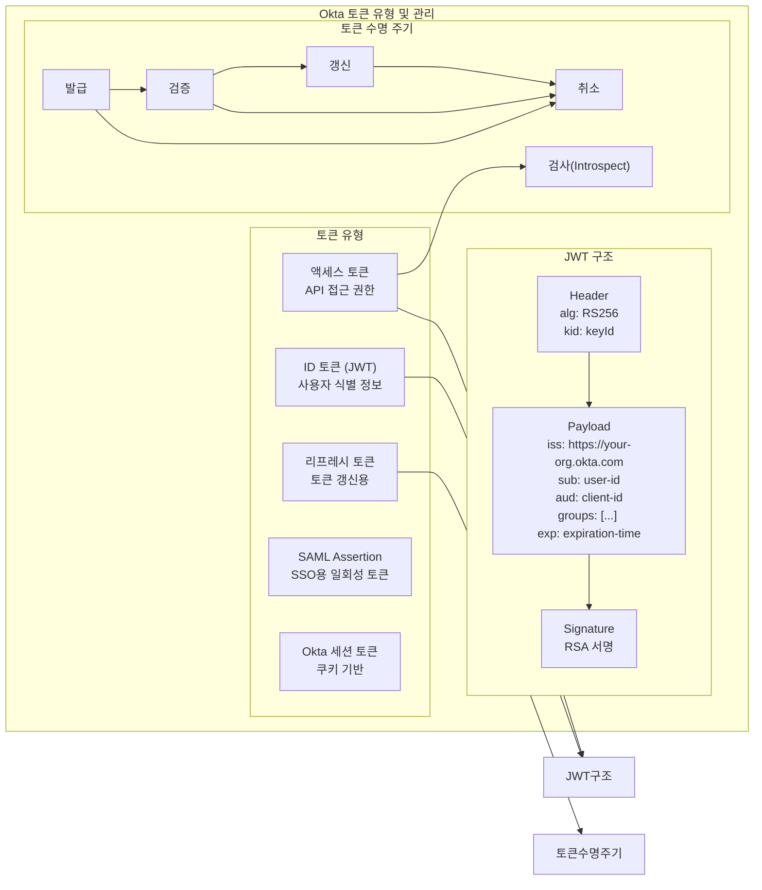
```mermaid
graph LR
    subgraph "Okta 토큰 유형 및 관리"
        subgraph "토큰 유형"
            IDToken["ID 토큰 (JWT)<br/>사용자 식별 정보"]
            AccessToken["액세스 토큰<br/>API 접근 권한"]
            RefreshToken["리프레시 토큰<br/>토큰 갱신용"]
            SAMLAssertion["SAML Assertion<br/>SSO용 일회성 토큰"]
            SessionToken["Okta 세션 토큰<br/>쿠키 기반"]
        end
        
        subgraph "JWT 구조"
            Header["Header<br/>alg: RS256<br/>kid: keyId"]
            Payload["Payload<br/>iss: https://your-org.okta.com<br/>sub: user-id<br/>aud: client-id<br/>groups: [...] <br/>exp: expiration-time"]
            Signature["Signature<br/>RSA 서명"]
            
            Header --> Payload --> Signature
        end
        
        subgraph "토큰 수명 주기"
            Issue["발급"]
            Validate["검증"]
            Refresh["갱신"]
            Revoke["취소"]
            Introspect["검사(Introspect)"]
            
            Issue --> Validate
            Validate --> Refresh
            Issue & Validate & Refresh --> Revoke
            AccessToken --> Introspect
        end
    end
    
    IDToken & AccessToken --> JWT구조
    RefreshToken --> 토큰수명주기
```

SAML을 사용하는 경우 Okta는 **SAML Assertions**를 생성하여 브라우저 리다이렉트 POST로 전달합니다. 

SAML 토큰에는 사용자 속성과 Okta에서 생성한 서명이 포함되고, 대상 서비스 프로바이더가 이를 검증하여 SSO를 완수합니다. 

SAML assertion의 수명은 아주 짧게 (수십 초 내) 유효하며 일회성으로 취급됩니다.

Okta는 **세션 관리**도 중요한 부분인데, Okta에 로그인하면 **Okta Session Cookie**가 발급되어 해당 사용자 브라우저 세션을 식별합니다. 

이 세션 쿠키는 Okta 도메인에 HttpOnly로 설정되어, 사용자가 SSO 대상 애플리케이션에 접근할 때 매번 Okta로 리다이렉트되어 재인증하지 않고도 이 세션 쿠키로 로그인 상태를 확인합니다. 

세션 자체 만료 시간과 **유휴 타임아웃** 역시 정책으로 관리 가능합니다. 사용자가 Okta에서 로그아웃하면 세션 쿠키를 폐기하고, OIDC RP들에는 OIDC 표준의 **Logout (SID 기반)** 통지를 보내 연동 애플리케이션들도 세션을 정리할 수 있습니다.

요약하면 Okta의 토큰 관리는 **JWT/OAuth2**에 입각하여 ID/액세스/리프레시 토큰의 **발급-검증-갱신-폐기** 사이클을 제공하고, SSO를 위해 세션 쿠키와 SAML 토큰도 병행 사용하는 구조입니다. 

각 토큰에는 **정책에 따른 부가 정보**(예: 그룹, 역할, MFA 여부 등)를 클레임으로 포함시켜 다운스트림 시스템들이 권한 판단에 활용할 수 있게 하는 등, 토큰을 **보안 컨텍스트 운반체**로 적극 활용하고 있습니다.

## **User Management (사용자 계정 관리)** 

Okta의 핵심은 **Universal Directory**라고 부르는 **클라우드 디렉터리**입니다 ([Okta Universal Directory Hub - Okta Identity Engine](https://support.okta.com/help/s/product-hub/oie/universal-directory?language=en_US#:~:text=Engine)). 

Okta에 가입(테넌트 개설)하면 조직만의 **독립적인 데이터 공간(org)**이 할당되고, 그 안에 **사용자, 그룹, 애플리케이션, 정책** 등의 리소스를 생성하여 관리하게 됩니다 ([Okta Data Model | Okta Developer](https://developer.okta.com/docs/concepts/okta-data-model/#:~:text=When%20you%20sign%20up%20for,groups%2C%20policies%2C%20and%20so%20on)). 

각 조직 테넌트는 다른 테넌트와 격리되므로, 서로 다른 회사의 데이터가 섞이지 않습니다. 

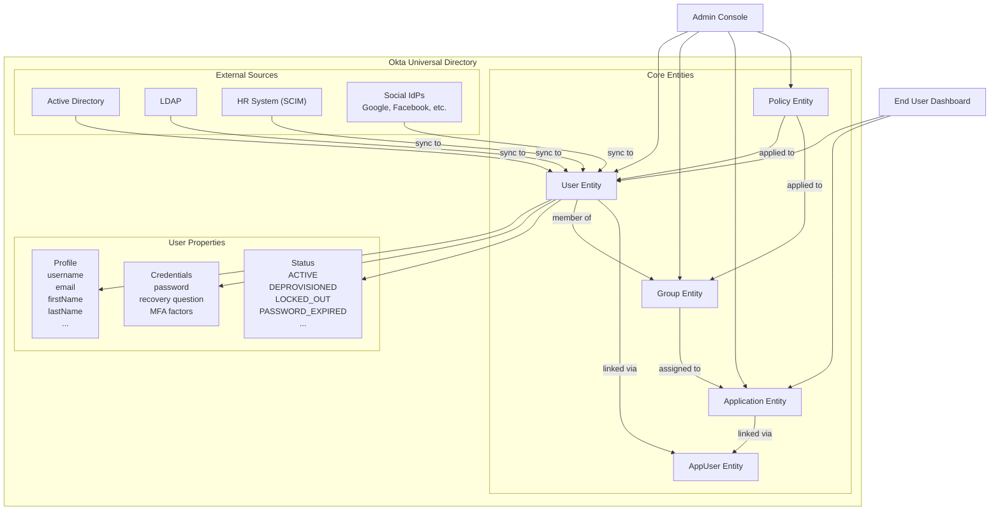
```mermaid
graph TB
    subgraph "Okta Universal Directory"
        subgraph "Core Entities"
            User[User Entity]
            Group[Group Entity]
            App[Application Entity]
            AppUser[AppUser Entity]
            Policy[Policy Entity]
        end
        
        subgraph "User Properties"
            Profile["Profile<br/>username<br/>email<br/>firstName<br/>lastName<br/>..."]
            Credentials["Credentials<br/>password<br/>recovery question<br/>MFA factors"]
            Status["Status<br/>ACTIVE<br/>DEPROVISIONED<br/>LOCKED_OUT<br/>PASSWORD_EXPIRED<br/>..."]
            
            User --> Profile
            User --> Credentials
            User --> Status
        end
        
        User -->|"member of"| Group
        User & App -->|"linked via"| AppUser
        Group -->|"assigned to"| App
        Policy -->|"applied to"| User & Group
        
        subgraph "External Sources"
            AD["Active Directory"]
            LDAP["LDAP"]
            HR["HR System (SCIM)"]
            SocialIDP["Social IdPs<br/>Google, Facebook, etc."]
        end
        
        AD & LDAP & HR & SocialIDP -->|"sync to"| User
    end
    
    Admin["Admin Console"] --> User & Group & App & Policy
    EndUserPortal["End User Dashboard"] --> User & App
```

**사용자(User)**는 Okta에서 하나의 객체로 관리되며, 기본 속성으로 username(로그인ID)과 이메일, 이름, 등 프로필 필드를 갖습니다 ([Okta Data Model | Okta Developer](https://developer.okta.com/docs/concepts/okta-data-model/#:~:text=Your%20end%20users%20are%20modeled,the%20uniqueness%20for%20a%20user)). 

Username은 테넌트 내 고유해야 하며 (대개 이메일을 사용), 이메일은 고유하지 않을 수 있습니다. 

Okta User는 생성 후 **활성화(Activation)** 단계를 거쳐야 로그인이 가능하며, **패스워드 셋업/초대** 등의 흐름이 존재합니다. **그룹(Group)**은 사용자들의 모음으로, Okta 내 다수의 그룹을 만들 수 있고 사용자들을 멤버로 추가합니다. 

그룹은 **역할**처럼 활용되어, 특정 애플리케이션 할당이나 보안정책 적용 대상을 지정하는데 쓰입니다 ([Okta Data Model | Okta Developer](https://developer.okta.com/docs/concepts/okta-data-model/#:~:text=A%20Group%20,be%20used%20for%20subscription%20tiers)). 

한 사용자는 여러 그룹에 속할 수 있고, 그룹 간 계층 구조는 없으며 (Flat), 주로 **부서, 직무, 지역, 애플리케이션 팀** 단위로 그룹을 운영합니다. 

**애플리케이션(App)**은 Okta에 등록된 외부 서비스 혹은 사용자 정의 OAuth 클라이언트를 말합니다 ([Okta Data Model | Okta Developer](https://developer.okta.com/docs/concepts/okta-data-model/#:~:text=An%20app%20,the%20app%20after%20identifying%20themselves)). 

앱 객체에는 SAML, OIDC 등 **통합 방법(protocol)**과 **싱글사인온 정책**, 그리고 **할당된 사용자/그룹 목록**이 매핑됩니다. 

Okta는 **AppUser**라는 객체를 두어, 특정 사용자와 특정 애플리케이션 간의 상태/속성을 저장합니다 ([Okta Data Model | Okta Developer](https://developer.okta.com/docs/concepts/okta-data-model/#:~:text=The%20relationship%20between%20an%20app,as%20necessary%20for%20the%20app)). 

예를 들어 A라는 사용자가 Salesforce 앱에 할당되면, A와 Salesforce를 연결하는 AppUser가 생기고 여기에 “Salesforce상의 사용자명” 등 외부 앱 계정 정보를 저장할 수 있습니다. 

이를 통해 Okta에서 **프로비저닝** 기능도 구현되는데, Okta가 타겟 앱의 SCIM API 등을 호출하여 사용자 계정을 자동으로 만들어주는 경우 이 AppUser 정보를 참조합니다. 

**정책(Policy)**은 Okta 환경의 보안 동작을 정의하는 규칙 모음입니다 ([Okta Data Model | Okta Developer](https://developer.okta.com/docs/concepts/okta-data-model/#:~:text=A%20Policy%20,into%20multifactor%20authentication%2C%20for%20example)). 

대표적으로 **Authentication Policy**(로그인 시 MFA 요구 등), **Password Policy**(암호 규칙), **MFA Enrollment Policy**(어떤 그룹에게 MFA 필수화) 등이 있으며, Okta는 기본 정책을 제공하지만 관리자가 세부 규칙을 조정할 수 있습니다. 

**Authorization Server Policy**를 사용하면 OAuth 클라이언트별로 어떤 사용자/그룹에게 어떤 Scope를 허용할지 세밀히 제어할 수도 있습니다.

Okta 사용자 관리의 강점은 다양한 **디렉터리 통합**입니다. 

기업은 흔히 사내 Active Directory(AD)를 가지고 있는데, Okta **AD 에이전트**를 통해 AD와 Okta 간 사용자를 **동기화**할 수 있습니다 ([Centralize Identity management with Universal Directory - Okta](https://www.okta.com/products/universal-directory/#:~:text=Centralize%20Identity%20management%20with%20Universal,scale%20with%20Okta%20Universal%20Directory)) ([Okta Universal Directory Hub - Okta Identity Engine](https://support.okta.com/help/s/product-hub/oie/universal-directory?language=en_US#:~:text=Engine)). 

이렇게 하면 사내에서 계정 생성/삭제 시 Okta에 반영되고, 비밀번호도 동기화하여 사용자가 동일한 자격증명으로 클라우드 앱을 사용할 수 있습니다. 

LDAP, 데이터베이스 등 다른 소스와의 통합도 Okta API나 커넥터로 가능합니다. 

또한 **소셜 로그인 연동**도 하여, Okta를 **OAuth RP**로 써서 Google, Facebook 등으로 로그인한 사용자를 Okta User로 자동 등록시키는 것도 가능합니다. 

Okta는 **라이프사이클 관리(Lifecycle Management)** 기능으로 사용자 계정의 입사부터 퇴사(deprovision)까지 일련의 과정(그룹 할당, 권한 부여, 계정 비활성화)을 자동화하도록 돕고 있습니다.

## **Domain Model & Bounded Contexts** 

Okta의 도메인 모델은 비교적 명확히 **Identity 관리 서브도메인**으로 한정됩니다. 

주요 **엔티티**는 앞서 설명한 User, Group, App, Policy 등이며, 이들은 Okta에서 **Resource**라는 용어로 불립니다 ([Okta Data Model | Okta Developer](https://developer.okta.com/docs/concepts/okta-data-model/#:~:text=Entities%20inside%20Okta%20are%20referred,Each%20Okta%20resource%20contains)).

각 리소스는 속성(Attribute)과 연결(Link), 프로파일(Profile)을 가지는 REST 리소스로 표현됩니다 ([Okta Data Model | Okta Developer](https://developer.okta.com/docs/concepts/okta-data-model/#:~:text=Entities%20inside%20Okta%20are%20referred,Each%20Okta%20resource%20contains)). 

도메인 간 경계를 생각해 보면, Okta는 자체가 IDaaS **한 개의 bounded context**처럼 보일 수 있으나, 내부적으로 몇 가지 하위 **바운디드 컨텍스트**로 나눠볼 수 있습니다.

### **Directory Context**

사용자와 그룹을 관리하는 컨텍스트입니다. 

여기서 User 애그리거트가 중심이며, 

User는 생성→활성화→비활성화 등의 라이프사이클을 갖고 Group과의 연관을 맺습니다. 

**애그리거트**로서 User는 자신의 Credential (비밀번호 해시, MFA 목록 등) 값 객체를 품고, Profile 정보 (이름, 이메일 등) 및 상태를 속성으로 가집니다. 

Group 애그리거트는 그룹 자체의 속성(이름, 유형)과 **멤버 목록**을 갖습니다. 멤버는 수천~수만일 수 있어서, Group 애그리거트는 멤버를 참조로 들고 실제 추가/제거는 도메인 서비스를 통해 수행될 것입니다. 

이 컨텍스트의 주요 **도메인 이벤트**는 “UserCreated”, “UserActivated”, “UserDeactivated”, “PasswordChanged”, “GroupCreated”, “UserAddedToGroup” 등이 있을 수 있습니다. 

실제 Okta는 이러한 이벤트를 System Log에 남기고 있으며, 예를 들어 **user.lifecycle.create** 이벤트와 **user.lifecycle.activate** 이벤트가 새로운 사용자 등록 시 발생합니다 ([Event Type for New User Creation - Okta Developer Community](https://devforum.okta.com/t/event-type-for-new-user-creation/13423#:~:text=Community%20devforum,activate)) ([Event Type for New User Creation - Okta Developer Community](https://devforum.okta.com/t/event-type-for-new-user-creation/13423#:~:text=Event%20Type%20for%20New%20User,activate)). 

이러한 이벤트들은 Okta **Event Hooks**를 통해 외부로도 발행되어, 다른 시스템과 통합할 때 활용됩니다 ([Event hooks concepts | Okta Developer](https://developer.okta.com/docs/concepts/event-hooks/#:~:text=Event%20types%20include%20user%20lifecycle,or%20generating%20an%20email%20message)).

### **Authentication Context**

인증 시퀀스에 관련된 컨텍스트입니다. 

Directory가 신원 데이터를 제공한다면, Authentication 컨텍스트는 **로그인 시도, 세션 관리, MFA 처리** 등을 맡습니다. 

주요 엔티티는 **Authentication Transaction**이나 **Session**입니다. 

Authentication Transaction은 사용자의 로그인 시도 1회를 나타내며, 상태로 MFA 요구 중, 성공, 실패 등을 가질 수 있습니다. 

Session은 로그인 완료 후의 사용자 세션으로, 세션ID, 만료시간, 연결된 사용자ID 등을 갖습니다. 

이 컨텍스트의 이벤트로는 “UserLoggedIn”, “UserLoggedOut”, “MfaChallengeSent”, “MfaVerified”, “SessionExpired” 등이 있습니다. Okta System Log에도 **user.session.start**, **user.session.end** 이벤트 타입으로 로그인/로그아웃이 기록되고 있습니다. 

Authentication 컨텍스트는 Directory 컨텍스트와 긴밀하게 상호작용하는데, Directory에서 제공한 Credential로 사용자 신원을 검증하고 Session을 생성합니다. 

이는 **컨텍스트 간 협력** 관계로, Authentication은 Directory의 Open Host Service (예: 사용자 조회 API)를 사용한다고 볼 수 있습니다 ([There is a Cowboy in my Domain! - Implementing Domain Driven Design Review and Interview - InfoQ](https://www.infoq.com/articles/implmenting-domain-driven-design-vaughn-vernon/#:~:text=,Open%20Host%20Service%20to%20allow)).

### **Application Access Context**

애플리케이션 할당과 SSO를 담당하는 컨텍스트입니다. 여기서는 App과 AppUser 엔티티가 중요합니다. 

App 애그리거트는 애플리케이션 설정(프로토콜, SSO URL, 필요 프로비저닝 정보 등)을 가지고 있고, AppUser는 특정 사용자-앱 간 연결 정보를 저장합니다. 

이벤트로는 “AppAssignedToUser”, “AppProvisioned”, “AppDeprovisioned” 등이 있을 수 있습니다. 

예를 들어 직원 퇴사로 “UserDeactivated” 이벤트가 Directory에서 발생하면, Application Access 컨텍스트는 이를 구독하여 해당 사용자의 AppUser들을 찾아 “AppDeprovisioned” 처리를 하고, 필요 시 외부 SaaS에 계정 비활성화를 API 호출로 실행합니다. 

Okta의 워크플로우에서 실제로 **계정 끄기 -> 앱 계정 비활성화** 자동화가 이런 이벤트 흐름으로 이뤄집니다.

### **Policy/Config Context**

보안정책과 시스템 설정을 다루는 컨텍스트입니다. 

Password Policy, MFA Policy, Sign-on Policy 등 다양한 정책(Entity)을 갖으며, 각 Policy는 적용 대상(Group 등)과 규칙을 속성으로 가집니다 ([Okta Data Model | Okta Developer](https://developer.okta.com/docs/concepts/okta-data-model/#:~:text=A%20Policy%20,into%20multifactor%20authentication%2C%20for%20example)). 

애그리거트로 Policy는 자신과 하위 Rule 목록으로 구성될 수 있습니다. 이벤트로는 “PolicyCreated”, “PolicyUpdated”, “PolicyViolated” 등이 있고, “PolicyViolated”는 인증 시 어떤 정책 조건에 걸렸음을 의미합니다 (예: IP 접근 제한 정책 위반). 

이 컨텍스트는 Authentication 컨텍스트와 연계되어, 로그인 시 Policy를 평가하고 필요한 추가 절차(MFA 등)를 요구합니다.

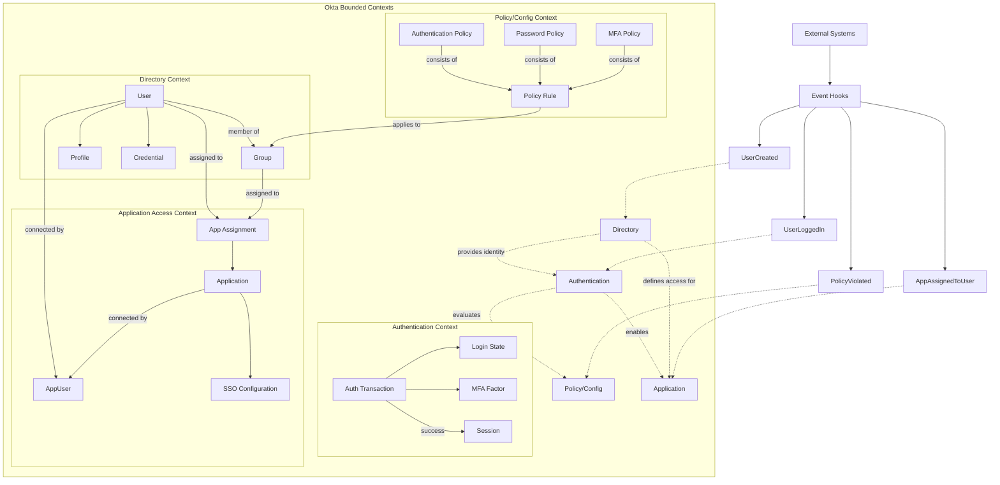
```mermaid
graph TB
    subgraph "Okta Bounded Contexts"
        subgraph "Directory Context"
            User[User]
            Group[Group]
            Profile[Profile]
            Credential[Credential]
            
            User --> Profile
            User --> Credential
            User -->|"member of"| Group
        end
        
        subgraph "Authentication Context"
            AuthTransaction[Auth Transaction]
            Session[Session]
            MFAFactor[MFA Factor]
            LoginState[Login State]
            
            AuthTransaction --> LoginState
            AuthTransaction --> MFAFactor
            AuthTransaction -->|"success"| Session
        end
        
        subgraph "Application Access Context"
            App[Application]
            AppUser[AppUser]
            SSO[SSO Configuration]
            AppAssignment[App Assignment]
            
            App --> SSO
            User & App -->|"connected by"| AppUser
            User & Group -->|"assigned to"| AppAssignment
            AppAssignment --> App
        end
        
        subgraph "Policy/Config Context"
            AuthPolicy[Authentication Policy]
            PasswordPolicy[Password Policy]
            MFAPolicy[MFA Policy]
            Rule[Policy Rule]
            
            AuthPolicy & PasswordPolicy & MFAPolicy -->|"consists of"| Rule
            Rule -->|"applies to"| Group
        end
        
        %% Context interactions
        Directory -.->|"provides identity"| Authentication
        Authentication -.->|"evaluates"| Policy/Config
        Authentication -.->|"enables"| Application
        Directory -.->|"defines access for"| Application
    end
    
    %% Domain Events
    UserCreated["UserCreated"] -.-> Directory
    UserLoggedIn["UserLoggedIn"] -.-> Authentication
    AppAssigned["AppAssignedToUser"] -.-> Application
    PolicyViolated["PolicyViolated"] -.-> Policy/Config
    
    %% External integration
    EventHook["Event Hooks"] --> UserCreated & UserLoggedIn & AppAssigned & PolicyViolated
    ExternalSystems["External Systems"] --> EventHook

```

이처럼 Okta 내부를 DDD 관점에서 보면 여러 하위 도메인이 유기적으로 동작합니다. 

**컨텍스트 맵** 측면에서 Directory, Auth, AppAccess, Policy 컨텍스트는 모두 동일한 Okta 테넌트 범위 내에서 작동하며, 공유 커널(공통 용어: 사용자, 그룹 등)을 가지면서도 각자 책임이 분리되어 있습니다. 

특히 Okta는 **마이크로서비스 아키텍처**로도 유명한데, 30개 이상의 마이크로서비스로 이루어져 있다고 밝힌 바 있습니다 ([A Look at Auth0 Cloud Architecture: 5 Years In](https://auth0.com/blog/auth0-architecture-running-in-multiple-cloud-providers-and-regions/#:~:text=,10%20to%20over%2030%20services)). 

이 서비스들은 인증 서비스, 사용자 관리 서비스, MFA 서비스, 감사 로깅 서비스 등으로 나뉘어 확장성을 높이고 있습니다. 

Okta는 전 세계 수억 명의 사용자와 수십억 건의 로그인 요청을 처리하기 위해 **수평 확장(cell architecture)** 구조를 도입했습니다 ([](https://www.okta.com/sites/default/files/2020-10/Okta%27s-Architecture-eBook.pdf#:~:text=Services%20for%20redundancy%20and%20high,of%20the%20entire%20Okta%20service)). 

전세계 여러 리전(미국, 유럽 등)에 “Cell”이라 불리는 독립 클러스터를 두고, 각 Cell 안에 로드밸런서, 앱 서버, 작업 서버, 캐시(ElastiCache), DB가 모두 포함된 **멀티 테넌트 스택**을 운영합니다 ([](https://www.okta.com/sites/default/files/2020-10/Okta%27s-Architecture-eBook.pdf#:~:text=Services%20for%20redundancy%20and%20high,of%20the%20entire%20Okta%20service)). 

이 설계를 통해 Okta는 특정 Cell에 장애가 나도 다른 Cell이 영향받지 않고, 필요 시 새로운 Cell을 추가하여 **무한 확장(limitless scale)**에 대비합니다 ([](https://www.okta.com/sites/default/files/2020-10/Okta%27s-Architecture-eBook.pdf#:~:text=the%20onus%20for%20scaling%20them,Scalability)) ([](https://www.okta.com/sites/default/files/2020-10/Okta%27s-Architecture-eBook.pdf#:~:text=Services%20for%20redundancy%20and%20high,of%20the%20entire%20Okta%20service)). 

이러한 운영 아키텍처 측면까지 고려하면, Okta의 도메인 모델은 멀티테넌트 환경에서 **tenant isolation**을 철저히 지키도록 설계되어 있음을 알 수 있습니다 (모든 User, Group 등은 Org ID로 스코핑됨). DDD에서 말하는 **하나의 바운디드 컨텍스트 = 하나의 데이터 모델 범위**라는 개념을 Okta는 멀티테넌트 구조로 실현했다고 볼 수 있습니다.

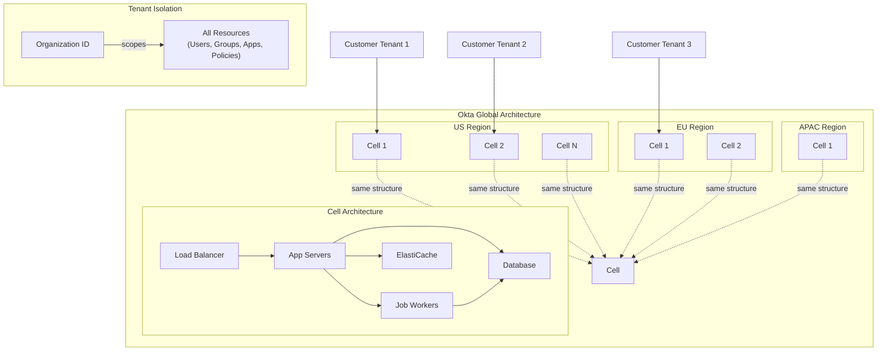
```mermaid
graph TB
    subgraph "Okta Global Architecture"
        subgraph "US Region"
            US_Cell1["Cell 1"]
            US_Cell2["Cell 2"]
            US_Cell3["Cell N"]
        end
        
        subgraph "EU Region"
            EU_Cell1["Cell 1"]
            EU_Cell2["Cell 2"]
        end
        
        subgraph "APAC Region"
            AP_Cell1["Cell 1"]
        end
        
        subgraph "Cell Architecture"
            LoadBalancer["Load Balancer"]
            AppServers["App Servers"]
            JobWorkers["Job Workers"]
            Cache["ElastiCache"]
            Database["Database"]
            
            LoadBalancer --> AppServers
            AppServers --> JobWorkers & Cache
            AppServers & JobWorkers --> Database
        end
        
        US_Cell1 & US_Cell2 & US_Cell3 & EU_Cell1 & EU_Cell2 & AP_Cell1 -.->|"same structure"| Cell
    end
    
    Customer1["Customer Tenant 1"] --> US_Cell1
    Customer2["Customer Tenant 2"] --> US_Cell2
    Customer3["Customer Tenant 3"] --> EU_Cell1
    
    subgraph "Tenant Isolation"
        OrgID["Organization ID"]
        Resources["All Resources<br/>(Users, Groups, Apps, Policies)"]
        
        OrgID -->|"scopes"| Resources
    end
```

마지막으로, Okta의 이벤트 전략도 주목할 만합니다. 

Okta **시스템 로그**에는 수백 가지 이벤트 타입이 정의되어 있으며 ([Event Types | Okta Developer](https://developer.okta.com/docs/reference/api/event-types/#:~:text=Event%20Types)), 이는 Admin 콘솔이나 API로 조회 가능하고 필요시 SIEM으로도 전송됩니다. 

또한 **Event Hook** 기능을 통해 특정 이벤트를 실시간으로 외부 전송하여 다른 도메인과의 연계를 돕습니다 ([Event hooks concepts | Okta Developer](https://developer.okta.com/docs/concepts/event-hooks/#:~:text=Event%20hooks%20are%20outbound%20calls,within%20your%20own%20software%20systems)) ([Event hooks concepts | Okta Developer](https://developer.okta.com/docs/concepts/event-hooks/#:~:text=Event%20types%20include%20user%20lifecycle,or%20generating%20an%20email%20message)). 

예를 들어, Okta에서 “user.account.lock” 이벤트 훅을 받아 내부 ITSM 티켓을 생성하거나, “group.user_added” 훅을 받아 권한승인 워크플로를 돌리는 등 다양한 응용이 가능합니다. 

이처럼 **도메인 이벤트를 적극적으로 외부 노출**하는 정책은 Okta가 Identity 도메인의 **Open Host Service** 역할을 한다는 것을 잘 보여줍니다 ([There is a Cowboy in my Domain! - Implementing Domain Driven Design Review and Interview - InfoQ](https://www.infoq.com/articles/implmenting-domain-driven-design-vaughn-vernon/#:~:text=,Open%20Host%20Service%20to%20allow)).

# Microsoft Azure AD: 인증 및 권한 관리 아키텍처 분석

## **Authentication (인증)** 

**Azure AD** (이제는 Microsoft Entra ID로 명명)는 Microsoft의 클라우드 아이덴티티 플랫폼으로, Microsoft 365, Azure, Dynamics 등의 MS 클라우드 서비스와 수많은 외부 애플리케이션의 인증을 맡고 있습니다. 


```mermaid
graph TB
    subgraph "Microsoft Identity Platform"
        subgraph "Azure AD / Microsoft Entra ID"
            Directory[Directory Objects]
            Authentication[Authentication Services]
            Authorization[Authorization Services]
            Federation[Federation Services]
        end
        
        subgraph "Directory Objects"
            Users[Users]
            Groups[Groups]
            Apps[Applications]
            ServicePrincipals[Service Principals]
            Devices[Devices]
        end
        
        subgraph "Authentication Protocols"
            OIDC[OpenID Connect]
            OAuth2[OAuth 2.0]
            SAML[SAML 2.0]
            WS_Fed[WS-Federation]
        end
        
        subgraph "Authorization Systems"
            AAD_Roles[Azure AD Roles]
            Azure_RBAC[Azure RBAC]
            App_Roles[App Roles]
            CA_Policies[Conditional Access]
        end
    end
    
    subgraph "Integration Points"
        AD_Connect[AD Connect]
        Graph_API[Microsoft Graph API]
        External_IdP[External IdPs]
    end
    
    subgraph "Microsoft Services"
        M365[Microsoft 365]
        Azure[Azure Resources]
        Dynamics[Dynamics 365]
    end
    
    subgraph "Custom Applications"
        Web_Apps[Web Applications]
        Mobile_Apps[Mobile Applications]
        APIs[Custom APIs]
    end
    
    Directory --> Users & Groups & Apps & ServicePrincipals & Devices
    
    Authentication --> OIDC & OAuth2 & SAML & WS_Fed
    Authorization --> AAD_Roles & Azure_RBAC & App_Roles & CA_Policies
    
    AD_Connect --> Directory
    External_IdP --> Authentication
    
    Directory & Authentication & Authorization --> Graph_API
    
    Authentication & Authorization --> M365 & Azure & Dynamics
    Authentication & Authorization --> Web_Apps & Mobile_Apps & APIs
    
    Federation --> External_IdP
```

Azure AD는 **조직(테넌트)** 단위로 디렉터리를 제공하며, 해당 디렉터리의 사용자 계정이나 연동 계정을 통해 **OAuth 2.0 / OpenID Connect** 기반의 현대적 인증을 수행합니다. 

예를 들어 Azure AD에 애플리케이션을 등록하고 OIDC를 설정하면, 사용자는 Microsoft의 공통 로그인 페이지에서 이메일과 암호(또는 Windows 통합 인증, MFA 등)를 입력해 인증하고, Azure AD가 **ID 토큰**과 **액세스 토큰**을 앱에 전달하여 로그인 상태를 공유합니다. 

Microsoft의 OIDC 구현은 OIDC 표준에 맞게 **/authorize**, **/token** 등의 엔드포인트를 제공하며, Authorization Code, Implicit, Client Credential, Device Code, On-behalf-of 등 **모든 OAuth2 플로우**를 지원합니다 ([OAuth 2.0 and OpenID Connect protocols - Microsoft identity platform](https://learn.microsoft.com/en-us/entra/identity-platform/v2-protocols#:~:text=OAuth%202,and%20OIDC%20endpoints%20for)). 

Azure AD는 **조합 인증(combined auth)**을 지원하여, 사용자가 패스워드 + MFA를 한 화면에서 처리하거나 **비밀번호 없는 인증**(예: Microsoft Authenticator 승인, FIDO2 보안키, Windows Hello)도 가능하게 합니다. 

또한 외부 IdP 연동도 지원하여, Azure AD를 **페더레이션 허브**로 쓰는 경우 Google, OKTA, SAML IdP 등을 신뢰 파티로 추가하고 사용자 로그인 시 해당 IdP로 리디렉션시키는 구성이 가능합니다. 

이렇듯 Azure AD는 **ID연합(Federation)**과 **패스워드 인증** 모두 아우르는 유연한 인증 서비스를 제공합니다. 

특히 **하이브리드 환경**을 위해, 기업 온프레미스 AD와 Azure AD를 연결하는 **AAD Connect**를 제공하며, 온프레미스 AD의 패스워드 해시를 동기화(PHS)하거나, AD로 직접 인증을 위임(PTA)하는 옵션도 있습니다. 

이를 통해 온프레미스 계정으로도 클라우드 인증이 가능해집니다.

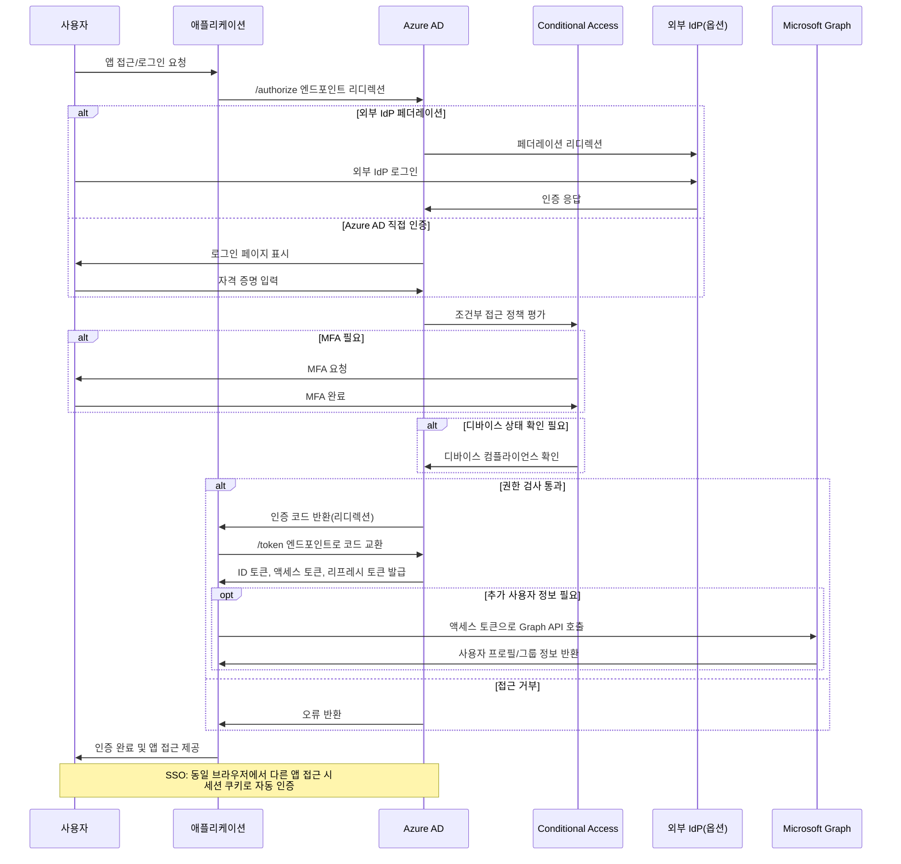
```mermaid
sequenceDiagram
    participant User as 사용자
    participant App as 애플리케이션
    participant AAD as Azure AD
    participant CA as Conditional Access
    participant IdP as 외부 IdP(옵션)
    participant Graph as Microsoft Graph
    
    User->>App: 앱 접근/로그인 요청
    App->>AAD: /authorize 엔드포인트 리디렉션
    
    alt 외부 IdP 페더레이션
        AAD->>IdP: 페더레이션 리디렉션
        User->>IdP: 외부 IdP 로그인
        IdP->>AAD: 인증 응답
    else Azure AD 직접 인증
        AAD->>User: 로그인 페이지 표시
        User->>AAD: 자격 증명 입력
    end
    
    AAD->>CA: 조건부 접근 정책 평가
    
    alt MFA 필요
        CA->>User: MFA 요청
        User->>CA: MFA 완료
    end
    
    alt 디바이스 상태 확인 필요
        CA->>AAD: 디바이스 컴플라이언스 확인
    end
    
    alt 권한 검사 통과
        AAD->>App: 인증 코드 반환(리디렉션)
        App->>AAD: /token 엔드포인트로 코드 교환
        AAD->>App: ID 토큰, 액세스 토큰, 리프레시 토큰 발급
        
        opt 추가 사용자 정보 필요
            App->>Graph: 액세스 토큰으로 Graph API 호출
            Graph->>App: 사용자 프로필/그룹 정보 반환
        end
    else 접근 거부
        AAD->>App: 오류 반환
    end
    
    App->>User: 인증 완료 및 앱 접근 제공
    
    Note over User,AAD: SSO: 동일 브라우저에서 다른 앱 접근 시<br/>세션 쿠키로 자동 인증
```

## **Authorization (권한 부여)** 

Azure AD의 권한 관리는 **두 갈래**로 생각할 수 있습니다. 

**(1)** Azure AD 자체의 **디렉터리 객체에 대한 권한**과 **(2)** Azure RBAC를 통한 **Azure 리소스 접근 권한**입니다. 

(1) Azure AD 디렉터리는 사용자, 그룹, 애플리케이션 등 **디렉터리 객체**를 가지며, Azure AD 내부에서 이들을 조작하거나 관리포털에 접근하는 행위는 **Azure AD 관리자 역할(Admin Role)**을 통해 통제됩니다. 

예를 들어 “사용자 관리자” 역할이 부여된 계정만 다른 사용자 생성/삭제를 할 수 있고, “응용 프로그램 관리자”만 앱을 등록/구성할 수 있습니다. 

이러한 관리자 역할은 Azure AD에 내장된 RBAC로서, 수십 가지 내장 역할(Global Admin, User Admin, SharePoint Admin 등)이 있고 커스텀 역할도 정의할 수 있습니다. 

이 Admin RBAC는 Azure AD **디렉터리 데이터**에 대한 권한이라고 볼 수 있습니다. 

한편, (2) Azure 리소스 권한은 Azure Subscription 내 VM, Storage, DB 등의 자원 접근을 제어하는 것으로, **Azure RBAC**라 불리는 시스템이 별도로 존재합니다. 

Azure RBAC는 Azure AD를 **아이덴티티 스토어**로 사용합니다. 

즉, Azure의 리소스 관리 계층(ARM)에서 “이 리소스에 대해 X 역할을 사용자 U에게 부여”라고 하면, 그 사용자 U는 Azure AD의 User 객체를 가리킵니다. 

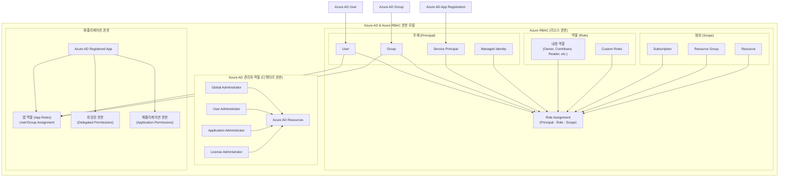
```mermaid
graph TB
    subgraph "Azure AD & Azure RBAC 권한 모델"
        subgraph "Azure AD 관리자 역할 (디렉터리 권한)"
            GlobalAdmin[Global Administrator]
            UserAdmin[User Administrator]
            AppAdmin[Application Administrator]
            LicenseAdmin[License Administrator]
            
            AADResources[Azure AD Resources]
            
            GlobalAdmin & UserAdmin & AppAdmin & LicenseAdmin --> AADResources
        end
        
        subgraph "Azure RBAC (리소스 권한)"
            RoleAssignment["Role Assignment<br/>(Principal - Role - Scope)"]
            
            subgraph "주체 (Principal)"
                RBACUser[User]
                RBACGroup[Group]
                ServicePrincipal[Service Principal]
                ManagedIdentity[Managed Identity]
            end
            
            subgraph "역할 (Role)"
                BuiltInRoles["내장 역할<br/>(Owner, Contributor, Reader, etc.)"]
                CustomRoles[Custom Roles]
            end
            
            subgraph "범위 (Scope)"
                Subscription[Subscription]
                ResourceGroup[Resource Group]
                Resource[Resource]
            end
            
            RBACUser & RBACGroup & ServicePrincipal & ManagedIdentity --> RoleAssignment
            BuiltInRoles & CustomRoles --> RoleAssignment
            Subscription & ResourceGroup & Resource --> RoleAssignment
        end
        
        subgraph "애플리케이션 권한"
            App[Azure AD Registered App]
            
            AppRoles["앱 역할 (App Roles)<br/>User/Group Assignment"]
            DelegatedPerm["위임된 권한<br/>(Delegated Permissions)"]
            AppPerm["애플리케이션 권한<br/>(Application Permissions)"]
            
            App --> AppRoles & DelegatedPerm & AppPerm
            
            RBACUser & RBACGroup --> AppRoles
        end
    end
    
    AADUser[Azure AD User] --> RBACUser
    AADGroup[Azure AD Group] --> RBACGroup
    AADApp[Azure AD App Registration] --> ServicePrincipal
```

Azure RBAC의 모델은 **Role Assignment**로, **주체(Principal)** – **역할(Role)** – **범위(scope)** 삼자를 연결하는 형태입니다. 

주체(Principal)는 Azure AD의 보안 주체로, **사용자, 그룹, 서비스 주체(Service Principal), 매니지드 ID** 등이 될 수 있습니다. 

역할(Role)은 Azure 리소스 액션(permission)의 모음인데, Azure는 수백 가지 내장 역할(예: Virtual Machine Contributor, Reader, Owner 등)을 제공하며, 필요시 커스텀 역할도 JSON 정의로 만들 수 있습니다. 

범위(scope)는 권한이 적용될 Azure 자원의 범위로, 구독 전체, 리소스 그룹, 또는 특정 리소스까지 지정 가능합니다. 

Role Assignment 예를 들면: *User Alice*에게 *Storage Blob Contributor* 역할을 *StorageAccountX 리소스*에 할당 -> Alice는 해당 Storage 계정 내 Blob에 대해 쓰기 권한을 가짐. 

Azure RBAC는 Evaluation시 Azure AD에서 토큰의 정보를 보고, 해당 주체에게 부여된 Role Assignment를 확인하여 접근을 허용하거나 차단합니다. 

Azure RBAC도 **조건부 액세스**를 일부 지원하는데, 현재는 미리보기로 **리소스 속성 기반 조건** (예: 자원 태그 조건) 등을 검토 중입니다.

Azure AD를 통한 **응용 어플리케이션 권한**도 있습니다. 

예컨대, Azure AD에 등록한 API에 대해 **애플리케이션 권한(App Role)**과 **위임된 권한(Delegated Permission)**을 정의할 수 있습니다. 

전자는 클라이언트 크레덴셜 플로우 등에서 애플리케이션 자체가 받는 권한이고, 후자는 사용자가 로그인한 상태에서 해당 API를 호출할 때 쓰는 권한입니다. 

이러한 권한은 OAuth2 **스코프**로 표현되어, 토큰의 `scp` 클레임에 나타납니다. 관리자가 애플리케이션에 “이 API의 이러한 권한을 허용” 설정을 할 수 있고, 사용자 동의가 필요한 경우 첫 사용시 동의 화면을 거칩니다. 

또한, **앱 역할(App Roles)**을 정의하여 **토큰에 역할 클레임**을 포함시킬 수 있습니다 ([authentication - How to do role-based authorization with OAuth2 / OpenID Connect? - Information Security Stack Exchange](https://security.stackexchange.com/questions/122745/how-to-do-role-based-authorization-with-oauth2-openid-connect#:~:text=We%20struggled%20with%20this%20too%2C,I%20hope%20this%20is%20helpful)). 

앱 역할은 예를 들어 “Managers”라는 역할을 애플리케이션에 정의하고 Azure AD에서 특정 사용자/그룹을 그 역할에 할당하면, 사용자가 로그인하여 ID/Access 토큰을 받을 때 `roles` 클레임에 ["Managers"]가 포함되어 애플리케이션이 해당 사용자를 관리자로 인가할 수 있게 되는 식입니다 ([authentication - How to do role-based authorization with OAuth2 / OpenID Connect? - Information Security Stack Exchange](https://security.stackexchange.com/questions/122745/how-to-do-role-based-authorization-with-oauth2-openid-connect#:~:text=We%20struggled%20with%20this%20too%2C,I%20hope%20this%20is%20helpful)). 

이 방법은 OAuth 스코프보다는 애플리케이션 내부 권한에 가까운 개념으로, Azure AD를 통해 **중앙 집중식 사용자-역할 매핑**을 관리하도록 돕습니다.

## **Token Management (토큰 관리)** 

Azure AD의 토큰은 **JWT** 기반으로, Microsoft의 공개키로 서명됩니다.

Azure AD v1 Endpoint의 ID 토큰과 v2 Endpoint의 ID 토큰 구조에 약간 차이는 있지만, 기본적으로 OIDC 표준 클레임 (iss, aud, exp 등)과 사용자 정보(upn, email 등), 및 그룹 또는 역할 클레임이 들어갑니다. 

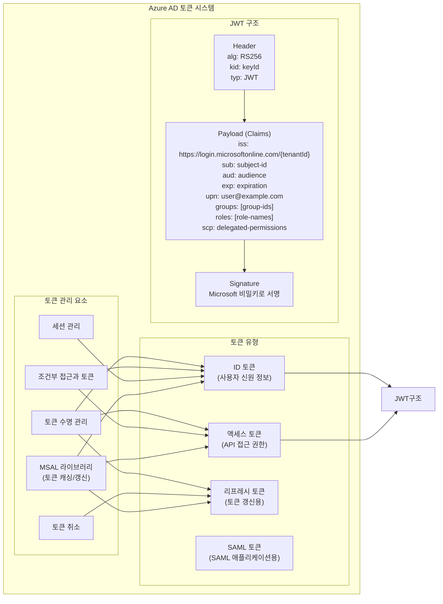
```mermaid
graph LR
    subgraph "Azure AD 토큰 시스템"
        subgraph "토큰 유형"
            IDToken["ID 토큰<br/>(사용자 신원 정보)"]
            AccessToken["액세스 토큰<br/>(API 접근 권한)"]
            RefreshToken["리프레시 토큰<br/>(토큰 갱신용)"]
            SAMLToken["SAML 토큰<br/>(SAML 애플리케이션용)"]
        end
        
        subgraph "JWT 구조"
            Header["Header<br/>alg: RS256<br/>kid: keyId<br/>typ: JWT"]
            
            Payload["Payload (Claims)<br/>iss: https://login.microsoftonline.com/{tenantId}<br/>sub: subject-id<br/>aud: audience<br/>exp: expiration<br/>upn: user@example.com<br/>groups: [group-ids]<br/>roles: [role-names]<br/>scp: delegated-permissions"]
            
            Signature["Signature<br/>Microsoft 비밀키로 서명"]
            
            Header --> Payload --> Signature
        end
        
        subgraph "토큰 관리 요소"
            TokenLifetime["토큰 수명 관리"]
            TokenRevocation["토큰 취소"]
            CAPolicy["조건부 접근과 토큰"]
            SessionManagement["세션 관리"]
            MSAL["MSAL 라이브러리<br/>(토큰 캐싱/갱신)"]
        end
    end
    
    IDToken & AccessToken --> JWT구조
    
    TokenLifetime --> IDToken & AccessToken & RefreshToken
    TokenRevocation --> RefreshToken
    CAPolicy --> IDToken & AccessToken
    SessionManagement --> IDToken
    MSAL --> IDToken & AccessToken & RefreshToken
```

Azure AD는 **그룹 수가 너무 많을 경우** 토큰에 다 담지 않고 별도로 Graph API 조회를 하도록 `hasGroups` 표시만 하는 최적화도 있습니다. 

Access 토큰은 **리소스(Audience)**마다 별도로 발급되어, 예컨대 Microsoft Graph용 액세스 토큰, Azure Management API용 액세스 토큰, 커스터姆 API용 액세스 토큰 등이 각각 발급됩니다. 

각 액세스 토큰의 `scp`(scope) 또는 `roles` 클레임을 통해 권한 범위를 나타내며, 애플리케이션은 그걸 검사하여 인가를 결정합니다. 토큰 수명은 기본 1시간이며, **리프레시 토큰**을 통해 재발급 받습니다. 

Azure AD는 **토큰 연속성** 기능으로 리프레시 토큰을 오래 사용할 수 있게 하지만, 보안 사건(비밀번호 변경, 계정 비활성화 등) 시 기존 리프레시 토큰을 모두 취소하여 잠재적 남용을 방지합니다. 

또한 **Azure AD Conditional Access** 정책에 따라 토큰 발급이 좌우되기도 하는데, 예를 들어 “신뢰할 수 없는 환경에서는 MFA가 완료되어야 Access 토큰 발급” 같은 정책이 있으면, 조건 충족 전까지 토큰이 발급되지 않습니다. 

Azure AD는 **디바이스 등록(장치 신뢰)** 개념도 있어서, Intune 등으로 관리되는 기기에서 온 요청인지 여부(`deviceid` 클레임)도 토큰에 담아 애플리케이션이 판단할 수 있게 합니다.

Azure AD 환경에서 애플리케이션은 보통 MSAL(Microsoft Authentication Library)을 이용해 토큰 캐싱과 갱신을 관리합니다. 

이를 통해 사용자가 한 번 로그인하면 백그라운드에서 리프레시 토큰을 사용해 액세스 토큰을 갱신해주어 사용자 경험을 향상시킵니다. 

로그아웃 시에는 OAuth2 **revocation** 엔드포인트로 리프레시 토큰을 취소하거나, 브라우저 세션 쿠키(ADAL cookie)를 제거하여 재인증을 요구합니다. 

Azure AD의 **세션 관리**도 Okta와 비슷하게 Azure AD 자체 세션이 있어 SSO를 가능케 합니다. 

브라우저에서 login.microsoftonline.com에 대한 세션 쿠키가 유지되는 한, 사용자는 다른 애플리케이션에 접근할 때 바로 SSO 됩니다. 

이 세션에 대한 유휴 제한이나 생명주기 제어는 Conditional Access의 “Sign-in Frequency” 정책으로 조절 가능합니다 (예: 24시간마다 재로그인 강제 등).

Azure AD 또한 **SAML** 토큰을 발급할 수 있습니다. 

오래된 SaaS나 온프레미스 앱이 SAML을 쓰는 경우, Azure AD에 애플리케이션을 SAML 모드로 등록하고, 사용자가 이 앱에 SSO 시 Azure AD는 SAML Assertion을 생성하여 브라우저로 POST 전달합니다. 

SAML Assertion에는 claims 규칙에 따라 사용자 정보와 그룹 등이 포함될 수 있습니다.

## **User Management (사용자 계정 관리)** 

Azure AD의 사용자 관리 대상은 **기업/조직의 직원, 파트너, 고객 계정** 등입니다. 

Azure AD 테넌트에는 **클라우드 전용 계정(예: user@mytenant.onmicrosoft.com)**이나 **연결된 계정(예: 기업 AD와 동기화된 계정)**이 존재할 수 있습니다. 

Azure AD에서 사용자는 **User 엔터티**로 표현되며, 로그인ID(UPN), 이메일, 이름, 부서, 직함 등의 속성과 **계정 상태**(활성/차단) 정보를 갖습니다. 

또한 **비밀번호 해시**나 **MFA 등록 정보** 등이 내부적으로 연결됩니다. Azure AD는 **Security Group**과 **Microsoft 365 Group**을 통해 그룹 관리도 합니다. 

Security Group은 접근 제어용 그룹으로, 각종 역할 할당이나 앱 공유 시 사용되며, M365 Group(예전 Office 365 Group)은 메일/팀즈와 연동된 그룹입니다. 

관리자나 승인된 사용자들은 그룹에 구성원을 추가/제거할 수 있고, **동적 그룹** 기능을 사용하면 사용자 속성(예: 부서 = ‘HR’)을 기준으로 멤버십을 자동 유지시킬 수도 있습니다 (이는 일종의 ABAC 적용이라고 볼 수 있습니다). 

Azure AD의 특이한 개념으로 **게스트 사용자(Guest)**가 있는데, B2B 협업을 위해 외부 도메인 사용자(다른 Azure AD나 Microsoft Account)를 초대해 자기 테넌트의 제한된 리소스에 접근하도록 할 수 있습니다. 

게스트 사용자는 일반 사용자와 거의 동일하게 관리되지만 `userType` 속성이 Guest로 표시되어 구분됩니다.

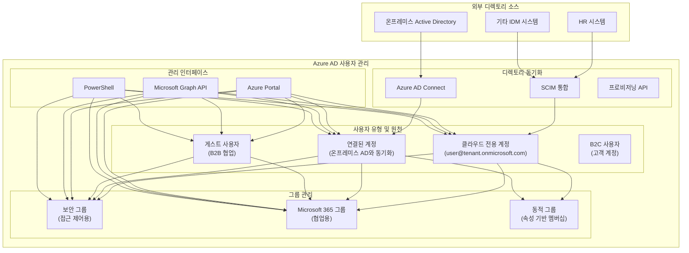
```mermaid
graph TB
    subgraph "Azure AD 사용자 관리"
        subgraph "사용자 유형 및 원천"
            CloudUsers["클라우드 전용 계정<br/>(user@tenant.onmicrosoft.com)"]
            SyncedUsers["연결된 계정<br/>(온프레미스 AD와 동기화)"]
            GuestUsers["게스트 사용자<br/>(B2B 협업)"]
            B2CUsers["B2C 사용자<br/>(고객 계정)"]
        end
        
        subgraph "그룹 관리"
            SecurityGroups["보안 그룹<br/>(접근 제어용)"]
            M365Groups["Microsoft 365 그룹<br/>(협업용)"]
            DynamicGroups["동적 그룹<br/>(속성 기반 멤버십)"]
        end
        
        subgraph "관리 인터페이스"
            AzurePortal["Azure Portal"]
            GraphAPI["Microsoft Graph API"]
            PowerShell["PowerShell"]
        end
        
        subgraph "디렉토리 동기화"
            AADConnect["Azure AD Connect"]
            SCIM["SCIM 통합"]
            APIs["프로비저닝 API"]
        end
    end
    
    subgraph "외부 디렉토리 소스"
        OnPremAD["온프레미스 Active Directory"]
        HR["HR 시스템"]
        OtherIDM["기타 IDM 시스템"]
    end
    
    OnPremAD --> AADConnect --> SyncedUsers
    HR & OtherIDM --> SCIM --> CloudUsers
    
    CloudUsers & SyncedUsers & GuestUsers --> SecurityGroups & M365Groups
    CloudUsers & SyncedUsers --> DynamicGroups
    
    AzurePortal & GraphAPI & PowerShell --> CloudUsers & SyncedUsers & GuestUsers & SecurityGroups & M365Groups
```

Azure AD 관리자는 **Azure Portal**이나 **Microsoft Graph API**를 통해 사용자 및 그룹을 프로비저닝합니다. 

Graph API는 CRUD 외에도 **Invite Guest**, **Reset Password**, **Assign License** 등 시맨틱한 기능을 제공하여 자동화에 활용됩니다. 

**라이선스 할당**은 상업적으로 중요하며 Azure AD의 User 객체에 SKU라이선스를 붙여줘야 해당 사용자가 Office나 EMS 등의 서비스를 쓸 수 있습니다.

Azure AD B2C라는 별도 서비스는 **고객용 Identity 관리**에 특화된 Azure AD의 변형입니다. 

B2C 테넌트에서는 사용자들이 이메일 등으로 직접 가입하고, 인증 과정에 커스터마이징된 **사용자 흐름(User Flow)**이나 완전한 **정책(Custom Policy)**을 정의할 수 있습니다. 

이는 사실상 Azure AD의 Domain-Specific Language를 사용자가 정의하여 OAuth2/OIDC 인증 파이프라인을 원하는 대로 구성하는 것으로, **신원 확인, 등록, 암호 재설정 등의 단계와 UI/UX**를 설계할 수 있습니다. 

B2C 사용자 관리도 Graph API로 가능하며, 일반 Azure AD와는 격리된 별개 컨텍스트로 이해하면 됩니다.

## **Domain Model & Bounded Contexts** 

Azure AD의 도메인 모델은 **Directory**라는 한 경계 내에 대부분 포함되어 있습니다. 

기본 **엔티티**는 **User**, **Group**, **Application**, **ServicePrincipal**, **Tenant**, **Device**, **Policy** 등입니다.

### **Tenant**

최상위 개념으로 하나의 Azure AD 디렉터리를 나타내며, 조직에 대응됩니다. Tenant 애그리거트는 디렉터리 도메인의 경계를 형성하고, 하위에 많은 객체들을 포함합니다.

### **User** 

애그리거트는 사용자 계정 한 명을 표현합니다. 

UPN(User Principal Name)과 Object ID (GUID)가 주 식별자이며, Mail, DisplayName 등 속성을 가집니다. 

User는 자신의 로그인 자격(패스워드 해시 또는 연동 정보)를 내부적으로 가지고 있고, 다수의 Group과 연관될 수 있습니다. 

User 애그리거트의 불변식은 UPN의 유일성, 필요한 속성의 존재 등입니다. 

이벤트로 “UserCreated”, “UserDisabled”, “UserLicenseAssigned” 등을 생각할 수 있습니다.

### **Group** 

애그리거트는 그룹 객체로, 멤버들의 Object ID 목록을 속성으로 갖습니다. 

그룹 멤버십 변경시 “MemberAddedToGroup”, “MemberRemovedFromGroup” 이벤트가 있을 수 있습니다. 

그룹은 Dynamic일 경우 쿼리 조건을 속성으로 가지며, 그 경우 멤버 목록은 쿼리에 따라 결정되므로 명시적 멤버 리스트는 없습니다.

### **Application** 애그리거트는 Azure AD에 등록된 애플리케이션 (OAuth 클라이언트 혹은 SAML SP)을 나타냅니다. 

앱에는 Client ID, Redirect URI, Permitted scopes, App roles, SAML metadata 등 구성이 저장됩니다. 

**ServicePrincipal**은 해당 Application이 테넌트에 구동되는 인스턴스 개념으로, App을 여러 테넌트에 멀티테넌트로 사용하면 각 테넌트에 ServicePrincipal이 생성됩니다. 

여기서는 App/ServicePrincipal을 합쳐 하나의 컨텍스트로 볼 수 있습니다. 이벤트로 “ApplicationRegistered”, “ServicePrincipalConsentGranted” 등이 있습니다.

### **Device** 애그리거트는 Azure AD에 조인된 기기를 나타내며, 디바이스 ID, 등록자, 신뢰 상태(Compliant or not) 등의 속성을 가집니다. 

이는 Conditional Access나 Intune과 연계되어 “DeviceCompliantStateChanged” 같은 이벤트가 생깁니다.

```mermaid
graph TB
    subgraph "Azure AD 바운디드 컨텍스트"
        subgraph "Identity Directory Context"
            Tenant[Tenant]
            User[User]
            Group[Group]
            Device[Device]
            Application[Application]
            ServicePrincipal[ServicePrincipal]
            
            Tenant --> User & Group & Device & Application & ServicePrincipal
            User -->|"member of"| Group
            Application -->|"instantiated as"| ServicePrincipal
        end
        
        subgraph "Access Management Context"
            AuthFlow[Authentication Flow]
            Token[Token]
            Session[Session]
            CAPolicy[Conditional Access Policy]
            AppConsent[Application Consent]
            
            AuthFlow -->|"produces"| Token & Session
            CAPolicy -->|"constrains"| AuthFlow
            AppConsent -->|"enables"| Token
        end
        
        subgraph "Azure RBAC Context"
            RoleAssignment[Role Assignment]
            RoleDefinition[Role Definition]
            ResourceScope[Resource Scope]
            Principal[Security Principal]
            
            Principal & RoleDefinition & ResourceScope -->|"forms"| RoleAssignment
        end
        
        %% 컨텍스트 간 관계
        Identity -->|"feeds principals to"| Azure
        User -->|"references"| Principal
        ServicePrincipal -->|"references"| Principal
        Identity -->|"authenticates for"| Access
    end
    
    %% 외부 이벤트
    UserCreated["UserCreated"] -.-> Identity
    UserLoggedIn["UserLoggedIn"] -.-> Access
    RoleAssigned["RoleAssigned"] -.-> Azure
    
    %% 이벤트 구독
    AuditLogs["Audit Logs"] --> UserCreated & UserLoggedIn & RoleAssigned
    SignInLogs["Sign-in Logs"] --> UserLoggedIn
    GraphChangeNotifications["Graph Change Notifications"] --> UserCreated

```

### **Policy** 

엔티티는 Conditional Access Policy 등이 해당되며, 위치 조건, 앱 조건, 제약(MFA 요구 등)을 포함합니다.

Azure AD를 바운디드 컨텍스트로 나눈다면, **Identity Directory Context**와 **Access Management Context**로 대략 구분해볼 수 있습니다. 

Identity Directory는 User, Group, Device 등 **디렉터리 객체 관리**에 초점을 둔 컨텍스트이고, Access Management는 **토큰 발급 및 인가** 쪽입니다. 

하지만 Azure AD의 경우 둘이 밀접하게 통합되어 있어서, 실질적으로 하나의 거대한 컨텍스트로 작동한다고 볼 수도 있습니다 (Vaughn Vernon이 언급했듯이 Identity & Access를 하나의 Generic Subdomain으로 간주하는 케이스 ([There is a Cowboy in my Domain! - Implementing Domain Driven Design Review and Interview - InfoQ](https://www.infoq.com/articles/implmenting-domain-driven-design-vaughn-vernon/#:~:text=,Open%20Host%20Service%20to%20allow))). 

다만 **Azure RBAC** (Azure Resource Manager와 연동된 권한 시스템)은 Azure AD와 분리된 별도 컨텍스트로 모델링됩니다. 

Azure RBAC 컨텍스트의 애그리거트는 Role Assignment이며, 그 안에 Principal, RoleDef, Scope를 가집니다. Azure RBAC는 Resource Manager 팀이 관장하는 도메인이고 Azure AD (Identity)와는 **컨텍스트 맵핑 관계**로 “Azure AD의 User/Group을 Principals로 참조”하는 방식입니다. 

이 관계를 Bounded Context 관점에서 보면 Azure RBAC는 Azure AD를 **Supplier (Identity Context)**로 취급하고, 둘 사이에 **항상 일치(Conformist)** 관계를 유지해야 합니다 – 즉 Azure AD의 Object ID, DisplayName 등을 Azure RBAC이 받아와 표시하거나 검증하는 식입니다.

Azure AD 도메인 이벤트로는 외부에 발행되는 것들도 있습니다. Azure AD는 **Audit Logs**와 **Sign-in Logs**를 통해 내부 이벤트를 기록하고, Graph API를 통해 구독(webhook)할 수 있는 **Graph Change Notification**을 제공하여 사용자 생성/업데이트 이벤트 등을 외부 시스템이 받을 수 있게 합니다. 

또 Azure Event Grid와 통합된 **Azure AD Activity Logs**도 있어 타 Azure 서비스로 연동이 가능합니다. 

이러한 이벤트들은 “UserAdded”, “AppConsentGranted”, “SignInSuccess” 등 다양하며, 조직에서 ID 변경에 따른 다운스트림 처리에 이용됩니다.

**기술 스택 요약:** Azure AD는 **OAuth2, OIDC, SAML, SCIM, Graph API, FIDO2, WS-Federation** 등 현대 인증/인가 표준 기술을 총망라하여 지원하며, **RBAC 모델**을 Azure 전반에 구현함과 동시에 **정책 기반 조건부 접근(ABAC 요소)**을 도입하여 세밀한 제어를 가능케 했습니다. 

Azure AD 역시 99.99% 가용성을 목표로 전세계 분산된 데이터센터에 서비스를 구성하고, 캐시/복제/고가용성 아키텍처를 취하고 있습니다.

Microsoft 역시 Okta와 유사하게 수천만 테넌트, 수억 사용자, 일일 수십억 인증 요청을 처리하기 위해 **셀 아키텍처**와 유사한 분할을 했다고 알려져 있습니다 (예: Azure AD은 여러 “스탬프”라는 독립 단위로 나뉘어 있음).

요컨대, Azure AD는 **엔터프라이즈 수준의 Identity 플랫폼**으로, 그 도메인 모델과 아키텍처는 AWS, Google, Okta와 더불어 업계 최고 수준의 모범 사례로 인정됩니다. 

특히 **앱 역할을 토큰에 포함하는 방식**이나 **동적 그룹에 의한 ABAC 구현**, **정교한 토큰수명 정책**, **온프레미스 디렉터리와의 통합** 등은 auth_center에 시사하는 바가 큽니다.

# 주요 기술 스택 비교 (OAuth2, OIDC, SAML, RBAC, ABAC 등)
위에서 분석한 4대 사례를 기술 스택 관점에서 비교하면 다음과 같습니다:

### **OAuth2 / OpenID Connect(OIDC)**

모든 사례에서 OAuth2, OIDC는 현대 인증/인가의 기본 프로토콜로 사용됩니다. 

Google과 Okta, Azure AD는 **공인된 OpenID Provider**로서 ID 토큰(OIDC) 및 액세스 토큰(OAuth2)을 발급하며, AWS Cognito도 OIDC IdP로 기능합니다 ([Amazon Cognito user pools - Amazon Cognito](https://docs.aws.amazon.com/cognito/latest/developerguide/cognito-user-pools.html#:~:text=An%20Amazon%20Cognito%20user%20pool,customization%20of%20the%20user%20experience)). 

이를 통해 **토큰 기반 인증**이 이루어지고, 토큰은 JWT 형식으로 서명되어 **무상태 인증** 및 **분산 검증**이 가능하도록 합니다. 

`authorization_code`, `implicit`, `client_credentials`, `refresh_token` 등 **OAuth2 Grant 타입**들도 공통적으로 지원됩니다.


### **SAML 2.0**

Okta와 Azure AD, 그리고 (필요시) Google은 SAML IdP로서 동작하여 레거시 애플리케이션과 연동합니다. 

AWS Cognito도 외부 IdP로 SAML을 연결하거나 자체 SAML SP 기능이 있습니다. S

AML은 새로운 개발에는 잘 쓰이지 않지만, **엔터프라이즈 SSO 호환성**을 위해 여전히 필수 요소입니다.


### **JWT & Token**

네 업체 모두 JWT를 사용하지만, Azure와 Okta는 토큰 payload에 **역할/그룹** 정보를 담는 등 **토큰을 통한 권한전달**을 적극 활용합니다 ([Understanding user pool JSON web tokens (JWTs) - Amazon Cognito](https://docs.aws.amazon.com/cognito/latest/developerguide/amazon-cognito-user-pools-using-tokens-with-identity-providers.html#:~:text=Tokens%20authenticate%20users%20and%20grant,pool%20groups%2C%20see%20%204)) ([authentication - How to do role-based authorization with OAuth2 / OpenID Connect? - Information Security Stack Exchange](https://security.stackexchange.com/questions/122745/how-to-do-role-based-authorization-with-oauth2-openid-connect#:~:text=We%20struggled%20with%20this%20too%2C,I%20hope%20this%20is%20helpful)). 

AWS Cognito 역시 그룹 정보를 액세스 토큰에 포함하고 ([Understanding user pool JSON web tokens (JWTs) - Amazon Cognito](https://docs.aws.amazon.com/cognito/latest/developerguide/amazon-cognito-user-pools-using-tokens-with-identity-providers.html#:~:text=Tokens%20authenticate%20users%20and%20grant,pool%20groups%2C%20see%20%204)), 

Google은 OAuth 스코프를 통해 권한 범위를 표현합니다. 

### **Refresh Token** 

운영과 **토큰 철회**/**만료 관리**도 공통적으로 중요하게 다루며, 각사 API로 토큰을 무효화하거나 만료시킬 수 있습니다.

### **RBAC**

**Role-Based Access Control**은 모든 시스템에 기본적으로 존재합니다. 

AWS IAM은 Policy에 기반한 RBAC이며 ([Define permissions based on attributes with ABAC authorization - AWS Identity and Access Management](https://docs.aws.amazon.com/IAM/latest/UserGuide/introduction_attribute-based-access-control.html#:~:text=The%20traditional%20authorization%20model%20used,function%20in%20an%20RBAC%20model)), AWS Cognito도 그룹으로 RBAC를 구현합니다. 

Google Cloud IAM은 철저한 RBAC 구조로 역할 정의와 바인딩으로 동작하고 ([Google Cloud IAM: An Overview of Identity and Access Management ...](https://medium.com/@luigicerone/google-cloud-iam-an-overview-of-identity-and-access-management-in-gcp-5024ef6015e5#:~:text=Google%20Cloud%20IAM%3A%20An%20Overview,grained%20control)), Okta는 그룹을 이용한 권한부여와 자체 관리자 역할로 RBAC를 적용합니다. 

Azure AD는 디렉터리 역할 및 Azure RBAC 모두 RBAC 패턴입니다. 

RBAC의 이점은 **비즈니스 개념(역할)에 권한을 묶어 관리 단순화**이지만, 역할 폭발 문제에 대한 우려도 있는데 각 플랫폼은 내장 역할 제공이나 그룹 활용 등을 통해 어느 정도 완화하고 있습니다.

### **ABAC** 

Attribute-Based Access Control 개념도 점차 도입되어 있습니다. 

AWS는 IAM Policy 조건식에서 태그와 사용자 속성을 활용한 ABAC를 공식 지원하며 ([Define permissions based on attributes with ABAC authorization - AWS Identity and Access Management](https://docs.aws.amazon.com/IAM/latest/UserGuide/introduction_attribute-based-access-control.html#:~:text=Attribute,helpful%20in%20environments%20that%20are)), Azure AD는 Conditional Access 정책에서 사용자/디바이스 속성 조건을 이용합니다. 

Google도 IAM Conditions 및 Access Context Manager (IP, Device-based 조건) 등을 통해 ABAC적인 정책을 부가합니다. 

Okta도 **Dynamic Groups**(속성에 따른 그룹 자동화)나 **Risk-Based Authentication**(사용자 환경 속성에 따라 인증 요구 변경)을 제공하므로 넓게 보면 ABAC 접근입니다. 

ABAC의 강점은 **더 세밀하고 동적인 권한 결정**이 가능하다는 것이고, 예를 들어 AWS에서는 사용자에게 프로젝트 태그를 붙여 해당 태그와 리소스 태그가 일치할 때만 접근 허용하는 정책을 만들어 다수의 프로젝트를 하나의 정책으로 커버할 수 있습니다 ([Define permissions based on attributes with ABAC authorization - AWS Identity and Access Management](https://docs.aws.amazon.com/IAM/latest/UserGuide/introduction_attribute-based-access-control.html#:~:text=For%20example%2C%20you%20can%20create,support%20ABAC%2C%20see%20%205)). 

다만 ABAC는 정책 수립 난이도가 높아 **혼합 모델**(RBAC로 1차 제한 + ABAC로 미세조정)을 많이 채택합니다 ([Types of access control - AWS Prescriptive Guidance](https://docs.aws.amazon.com/prescriptive-guidance/latest/saas-multitenant-api-access-authorization/access-control-types.html#:~:text=RBAC)). 

실제로 Azure도 역할 할당 + 조건부 정책 병행, AWS도 RBAC 기반에 ABAC 추가 등 혼용합니다.

### **Multi-tenancy & Federation**

Okta, Azure AD, Firebase(Google) 등은 멀티테넌트 서비스를 운영하며, 각 테넌트별로 **분리된 경계**를 유지합니다. 

또한 이들 간 **연합(Federation)**을 위해 OIDC/SAML을 사용합니다. 

예를 들어 Azure AD 테넌트 A와 B가 페더레이션하면, A 사용자가 B의 리소스에 접근 시 B 테넌트가 A의 Id 토큰을 받아들입니다. 

Okta도 조직 연결 및 B2B Federation을 OIDC/SAML로 지원합니다. **신뢰 연결 구성**은 도메인 DDD 외부의 통합(context integration) 영역이지만, 프로토콜 표준화로 비교적 쉽게 이루어집니다.

### **SCIM (System for Cross-domain Identity Management)**

이건 사용자 프로비저닝 표준으로, Okta, Azure AD, Google Cloud Identity 모두 SCIM 2.0 API를 지원하거나 사용합니다. 

예를 들어 Okta는 SaaS 앱 사용자 계정 자동 생성/삭제에 SCIM을 쓰고 ([Starter guide to understanding Okta — Elastic Security Labs](https://www.elastic.co/security-labs/starter-guide-to-understanding-okta#:~:text=Starter%20guide%20to%20understanding%20Okta,Access%20Policies%3B%20Session%20Management)), Azure AD도 SCIM 프로비저닝 커넥터를 제공합니다. 

이는 auth_center가 다른 시스템과 사용자 데이터를 교환할 때 표준으로 고려될 수 있습니다.

### **Audit & Event**

네 시스템 모두 **감사 로그(audit logs)**와 **이벤트 스트림**을 중요시합니다. 

보안상 누가 언제 로그인했고, 권한 변경이 있었는지 추적이 필수입니다. 

Okta는 시스템 로그 API, 이벤트 hooks로 실시간 이벤트 제공 ([Event hooks concepts | Okta Developer](https://developer.okta.com/docs/concepts/event-hooks/#:~:text=Event%20types%20include%20user%20lifecycle,or%20generating%20an%20email%20message)), Azure AD도 Graph API나 Azure Monitor 통합으로 로그 스트림을 제공합니다. 

AWS Cognito는 CloudWatch 이벤트, CloudTrail 로그로, Google은 Cloud Logging으로 각각 기록을 남깁니다. 

**이벤트 기반 아키텍처**를 통해 다른 도메인과 연계하고 이상행위를 탐지하는 것이 현대 IAM 시스템의 공통 특징입니다.

# auth_center 구조에 대한 개선 가이드
위에서 AWS, Google, Okta, Azure AD의 **도메인 모델**과 **아키텍처**를 살펴본 결과를 바탕으로, 사용자가 제시한 `auth_center` 구조를 개선하기 위한 권고사항을 정리하면 다음과 같습니다.

## **1. 도메인 분류 및 바운디드 컨텍스트 설계:** 

먼저 auth_center 내에 존재하는 기능들을 명확히 **하위 도메인으로 분리**하는 것이 중요합니다. 

앞서 사례들도 모두 인증, 사용자 관리, 권한/정책, 토큰 발급 등이 구분되어 있었습니다. 권장되는 컨텍스트 분리는 다음과 같습니다.

### *Identity Management Context* (예: **User Directory BC**)

사용자 계정과 프로필, 그룹을 관리하는 컨텍스트입니다. 

이 컨텍스트에서는 **User**, **Group**, **Credential(자격증명)** 등의 애그리거트를 정의하십시오. 

User 애그리거트는 사용자의 속성과 상태(활성/잠금 등)를 갖고, Credential (예: Password 객체, OTP시크릿 등)을 내포하거나 별도 엔티티로 연관시킬 수 있습니다. 

이 컨텍스트는 Okta의 Universal Directory나 Azure AD의 Tenant 디렉터리에 해당하며, 다른 서비스들이 이 컨텍스트에 **질의하거나 이벤트를 구독**하는 식으로 상호작용합니다. 

그룹(Group)은 RBAC의 기본이 되므로, auth_center에서 그룹/역할 개념을 지원해 **여러 사용자에 대한 공통 권한**을 쉽게 관리하도록 하십시오.

### *Authentication Context* (예: **AuthN Service BC**)

인증을 수행하는 컨텍스트로, **로그인 세션 관리, MFA, 세션 타임아웃** 등을 다룹니다. 

이 컨텍스트는 **인증 흐름**에 특화된 모델을 가집니다. 

예를 들어 **AuthSession** 애그리거트를 두어, 사용자의 한 번의 로그인 세션을 표현하고 ID, 만료, 마지막 활동시각 등을 추적합니다. 

또는 **LoginAttempt** 엔티티/이벤트를 두어 실패 누적이나 Captcha 트리거 등을 구현할 수 있습니다. 중요한 것은 이 AuthN 컨텍스트는 User 디렉터리와 분리되어야 한다는 점입니다 – 즉, User의 비밀번호 검증은 Identity 컨텍스트에서 제공하는 API(예: “VerifyCredentials(u,p)” 또는 사용자 객체의 메서드 등)를 호출하여 수행하고, AuthN 컨텍스트는 그 결과를 받아 세션을 생성하거나 에러를 처리합니다. 

이렇게 하면 인증 로직과 사용자 저장 로직이 분리되어 **SRP(Single Responsibility Principle)**가 지켜집니다. 

또한 이 컨텍스트에는 **MFA 이차인증 로직**(OTP 발송, 검증)도 포함되는데, 이를 서브 도메인으로 더 세분화할지 여부는 규모에 따라 결정하십시오. 

AuthN 컨텍스트는 외부에 **OpenID Provider로서의 API**를 제공합니다. OAuth2/OIDC 규격의 `/authorize`, `/token`, `/introspect`, `/logout` 엔드포인트를 이 컨텍스트에서 구현하고, 외부 애플리케이션이 auth_center를 IdP로 사용할 수 있게 합니다.

### *Authorization & Token Issuance Context* (예: **AuthZ Service / Token Service BC**)

권한 부여 및 토큰 관리에 관한 별도 컨텍스트를 고려하십시오. 특히 **액세스 토큰 발급 및 검증, 스코프 관리, 역할-권한 매핑, 정책 평가** 등이 이 영역입니다. 

예를 들어 **AuthorizationServer** 애그리거트를 두어, 클라이언트 애플리케이션(Client)과 스코프(Scope)들을 관리하고 토큰 발급 시 인가 여부를 검증하는 역할을 맡길 수 있습니다 ([Okta Data Model | Okta Developer](https://developer.okta.com/docs/concepts/okta-data-model/#:~:text=An%20authorization%20server%20,0%2C%20OpenID%20Connect%2C%20and%20SAML)). 

또는 **Policy** 엔티티/애그리거트를 도입해 “어떤 조건에서 MFA 필수”, “어떤 IP 대역은 접근 불가” 같은 규칙을 표현하고 AuthN/AuthZ 흐름 중 평가하도록 합니다 (Okta, Azure의 정책 개념 참고 ([Okta Data Model | Okta Developer](https://developer.okta.com/docs/concepts/okta-data-model/#:~:text=A%20Policy%20,into%20multifactor%20authentication%2C%20for%20example))). 

만약 auth_center가 **API 게이트웨이** 앞의 OAuth2 서버 역할을 한다면, **Resource Server별 권한 (Scope/Permission)** 관리를 이 컨텍스트에서 하도록 설계하십시오. 

또한 **RBAC/ABAC** 모델을 조합하여, 기본적으로는 Role(또는 Group) 기반 권한체계를 운영하되 필요한 경우 속성 기반 정책을 추가 적용할 수 있게 합니다. 

예를 들어 “ADMIN 역할을 가진 사용자가 접근, 단 근무시간 외에는 읽기만 허용” 같은 규칙을 지원하려면 Role 체크 + Attribute(Time) 체크가 모두 가능한 구조여야 합니다 ([Types of access control - AWS Prescriptive Guidance](https://docs.aws.amazon.com/prescriptive-guidance/latest/saas-multitenant-api-access-authorization/access-control-types.html#:~:text=RBAC)). 

이 AuthZ 컨텍스트는 Identity 컨텍스트로부터 사용자 그룹/속성 정보를 제공받아 평가할 것이므로, 두 컨텍스트 간 **콘텍스트 맵**은 ACL(Anti-Corruption Layer) 패턴으로 구현하거나, Identity쪽 이벤트를 구독하여 AuthZ 측에 **캐시/복제**해두는 것도 고려하십시오 (예: 사용자가 어떤 그룹에 속했는지 AuthZ 서비스 DB에 복제하여 토큰 생성 시 빠르게 참조).

### *Administration Context* (예: **Tenant Admin BC**, **Org Management BC**)

만약 auth_center가 멀티테넌트(여러 고객 조직 지원) 시스템이라면, 이를 관리하는 별도 컨텍스트가 필요합니다. 

Okta처럼 **테넌트별 Org 개념**이 있거나 Azure AD의 디렉터리처럼 **상위 조직 엔터티**가 있다면, 테넌트 생성/삭제, 테넌트 관리 설정(커스텀 도메인, 로고 등)을 담당하는 관리 컨텍스트를 분리하십시오. 

이 컨텍스트에서는 **Tenant** 애그리거트와 **Admin User**(관리자 계정) 등을 다룹니다. 

auth_center 자체의 **스ーパ 관리자** 기능(전체 시스템을 관장하는 운영자 계정 관리)도 여기에 포함될 수 있습니다.

이 분리는 일반 사용자 관리와 운영자 관리의 혼재를 막고, 멀티테넌트 환경에서 보안 경계를 뚜렷이 하는 데 도움이 됩니다.

위와 같이 컨텍스트를 분리하면, **컨텍스트 맵** 상에서 Authentication BC와 Identity BC는 사용자 인증 시 **협력(Partnership)** 관계를 맺고, AuthZ BC와 Identity BC는 권한 결정 시 **공유 커널/준수(Conformist)** 관계 (Identity의 User/Group 구조를 AuthZ가 참조)로 작동할 수 있습니다. 또한 Administration BC는 다른 컨텍스트와 약한 연결(예: Org ID만 참조)로 두어 **루트 컨텍스트**처럼 관리면에서만 개입하게 할 수 있습니다.

## **2. 명확한 도메인 모델 정의:** 

DDD의 기본인 **유비쿼터스 언어(Ubiquitous Language)**를 수립하고, auth_center의 모델에 반영해야 합니다. 

예를 들어 **“사용자(User)”**, **“그룹(Group)”**, **“권한(Role/Permission)”**, **“세션(Session)”**, **“토큰(Token)”** 등 핵심 개념을 팀과 이해관계자 모두 동일한 의미로 쓰도록 정의하십시오. 

위 사례들의 데이터 모델을 참고하면, **User** 엔터티에는 ID(내부 식별자), Username(로그인 이름), Email, Status, CreatedDate 등이 있을 것이고, **Group** 엔터티에는 Name, Description, Member 리스트 등이 있을 것입니다 ([Okta Data Model | Okta Developer](https://developer.okta.com/docs/concepts/okta-data-model/#:~:text=Your%20end%20users%20are%20modeled,the%20uniqueness%20for%20a%20user)) ([Okta Data Model | Okta Developer](https://developer.okta.com/docs/concepts/okta-data-model/#:~:text=A%20Group%20,be%20used%20for%20subscription%20tiers)). 

**권한 모델**에 대해서는, 단순 Roles 테이블로 할 것인지, Okta처럼 그룹을 역할로 활용할 것인지 결정해야 합니다. 

권장하기로는 **역할(Role)** 엔티티를 두어 응용 도메인의 권한을 표현하고, **권한(Permission)** 엔티티를 세부 리소스 권한으로 둘 수도 있습니다 (예: Role = “관리자”, Permission = “파일삭제허용”). 

하지만 복잡성을 줄이려면 우선 Role 개념 없이 **Group을 역할처럼 사용**하고 애플리케이션 쪽에서 그룹명을 권한으로 매핑하는 식으로 해도 됩니다. 

AWS Cognito나 Okta도 그룹 중심으로 RBAC를 제공하므로 이 접근이 실용적입니다. 대신 그룹의 의미 체계를 명확히 해야 하므로, UI나 문서에서 “그룹(역할)”처럼 안내할 수 있습니다.

## **3. OAuth2 / OIDC 등 표준 준수:** 

auth_center가 자체 인증센터라 해도, **표준 프로토콜을 채택**하는 것은 필수적입니다. 

직접 세션 ID 쿠키만 굴리는 옛날 방식보다, **OAuth2/OIDC를 구현**하여 외부 애플리케이션들과의 통합성을 높이십시오. 

이를 위해 다음을 권장합니다

### AuthN 컨텍스트에 **OIDC Provider 메타데이터 (.well-known/openid-configuration)**를 제공하고, 표준 **Authorization Code Flow**를 구현할 것. 

PKCE, nonce 등 최신 보안요소를 포함해야 합니다. Google, Okta, Azure 모두 OIDC 인증을 제공하며, Google은 이 구현이 OpenID 인증을 받았을 정도로 중요합니다 ([OpenID Connect | Authentication - Google for Developers](https://developers.google.com/identity/openid-connect/openid-connect#:~:text=OpenID%20Connect%20%7C%20Authentication%20,specification%2C%20and%20is%20OpenID%20Certified)).

### **ID 토큰(jwt)**에 표준 클레임 (iss, exp, iat, aud, sub 등)과 함께 도메인에 필요한 커스텀 클레임을 포함할 것. 

예를 들어 Okta는 ID 토큰에 사용자 프로필을, Cognito는 그룹 정보를 넣듯이 ([Understanding user pool JSON web tokens (JWTs) - Amazon Cognito](https://docs.aws.amazon.com/cognito/latest/developerguide/amazon-cognito-user-pools-using-tokens-with-identity-providers.html#:~:text=Tokens%20authenticate%20users%20and%20grant,pool%20groups%2C%20see%20%204)), auth_center도 사용자 이름이나 권한 목록 등을 필요에 따라 넣어줄 수 있습니다. 

단, ID 토큰은 **최소한의 신원정보**만 담고 너무 비대해지지 않게 하고, 추가 정보는 UserInfo 엔드포인트나 별도 API로 제공하는 게 좋습니다.

### **액세스 토큰**은 리소스 서버별로 발급하고, `aud`(Audience)를 구분하여 안전하게 관리할 것. 

가능한 JWT로 발급해 마이크로서비스 구조에서 **토큰의 분산검증**이 가능하도록 하십시오. 

Azure AD, Okta 모두 JWT 액세스 토큰을 사용합니다 (단, 필요한 경우 오페이크 토큰 + introspection도 고려, 특히 토큰 즉시 폐기가 필요하면 introspect 체계).

### **리프레시 토큰**을 지원하여 사용자 재로그인 빈도를 줄이고, 대신 **토큰 철회(Revoke)** 엔드포인트와 **Blacklisting**을 통해 보안성을 담보할 것. 

Okta, Azure AD는 모두 refresh_token을 발급하고 있으며, Azure AD는 조건부 접근 등으로 제어합니다.

### **SAML2.0**도 혹시 기존 시스템 연동에 필요하다면 지원하십시오. 

예를 들어 내부에 오래된 Java 애플리케이션이 있고 이를 auth_center로 SSO 연결하려면 auth_center가 SAML IdP가 되어야 할 수 있습니다. 이러한 표준을 미리 고려해 설계하면 확장 시 유연합니다.

### 4. RBAC 및 ABAC 모델 적용:** 

권한 관리는 단순화하면 **“누가 무엇을 할 수 있는가”**의 문제입니다. 

auth_center에서는 “누가”에 해당하는 **사용자/그룹** 관리를 이미 다루므로, “무엇을 할 수 있는가”를 표현하는 방식을 정해야 합니다.

앞서 언급한대로 **역할(Role)** 개념을 도입하거나 그룹으로 대체할 수 있습니다. 

예를 들어 **관리자**, **일반 사용자** 두 역할만 있다면 Group으로 “Admins”, “Users” 만들어 사용해도 됩니다. 

그러나 시스템이 커질수록 역할 종류가 늘어나니 Role 엔티티와 User-Role 맵핑을 둬도 좋습니다. 

AWS IAM처럼 **정책 문서(JSON)** 기반으로 세밀히 제어하는 방안도 있으나, 이는 구현 난이도가 높습니다. 

대신 **정적 RBAC + 일부 ABAC**를 권합니다. 정적 RBAC: 화면/기능 단위로 Role 권한 매트릭스를 정해두고 검사. 

ABAC: 사용자나 환경의 속성에 따라 추가 제약. 예를 들어 사용자 객체에 `department` 속성을 두고, 중요 기능에서는 “department == ‘Finance’” 조건을 검사하게 할 수 있습니다. 

이러한 ABAC는 코드 내 if문일 수도 있고, 정책 테이블일 수도 있습니다. 규모가 크면 정책 테이블(혹은 JSON 정책엔진)로 관리하지만, 처음에는 간단히 구현 후 확장하는게 현실적입니다 ([Types of access control - AWS Prescriptive Guidance](https://docs.aws.amazon.com/prescriptive-guidance/latest/saas-multitenant-api-access-authorization/access-control-types.html#:~:text=The%20ABAC%20model%20is%20very,significant%20upfront%20investment%20to%20implement)) ([Types of access control - AWS Prescriptive Guidance](https://docs.aws.amazon.com/prescriptive-guidance/latest/saas-multitenant-api-access-authorization/access-control-types.html#:~:text=Combining%20RBAC%20and%20ABAC%20can,granularity%20pertaining%20to%20authorization%20decisions)).

### 5. Aggregates 설계 및 데이터 일관성:** 

DDD의 애그리거트 개념을 적용하여, 각 엔티티들이 응집된 경계를 가져야 합니다. 

예를 들어 **User 애그리거트**는 사용자 프로필 정보와 Credential, 상태를 포함하고, **“사용자명은 고유해야 한다”**, **“비활성 사용자는 로그인할 수 없다”** 등의 불변식을 내부에서 관리합니다. 

*그룹 애그리거트**는 멤버 리스트를 가지고, **“동일 사용자를 중복으로 추가할 수 없다”**, **“그룹 이름은 고유해야 한다”** 등을 보장합니다. 

**토큰 애그리거트**를 만들 경우 (예: Refresh Token을 DB에 저장해 관리한다면), **“한 세션당 활성 리프레시 토큰은 하나”** 등의 규칙을 유지해야 합니다. 

이러한 애그리거트들이 **트랜잭션 경계**가 되므로, 한 애그리거트 안에서는 ACID가 유지되지만, 애그리거트 간에는 eventual consistency를 활용해야 할 수 있습니다. 

예를 들어 **사용자가 비활성화**될 때(User 애그리게이트 상태 변경), 그 사용자 세션(Session 애그리거트)들이 AuthN 컨텍스트에 존재한다면 모두 종료시켜야 합니다. 

이때 UserContext에서 “UserDeactivated” 이벤트를 발행하고 AuthN이 이를 수신해 해당 사용자의 세션들을 찾아 만료시키는 흐름으로 구현할 수 있습니다. 

Okta의 이벤트 훅 예시처럼, **이벤트 주도 설계**를 도입하면 컨텍스트 간 데이터 일관성과 후처리를 깔끔히 유지할 수 있습니다 ([Event hooks concepts | Okta Developer](https://developer.okta.com/docs/concepts/event-hooks/#:~:text=Event%20types%20include%20user%20lifecycle,or%20generating%20an%20email%20message)). 

auth_center에서도 “PasswordChanged”, “UserLockedOut”, “RoleAssigned” 등의 이벤트를 정의하고, 필요한 부분에서 전파하도록 하십시오. 

특히 **관리 감사 로그**에도 이 이벤트들을 남겨, 문제가 발생하면 추적할 수 있게 하는 것이 좋습니다 (Audit log는 보안제품에서 매우 중요).

### 6. 멀티테넌시 및 확장성 고려:** 만약 auth_center가 여러 서비스를 위한 공용 인증 서버라면, **멀티테넌시 디자인**이 필요합니다. 

Okta나 Auth0처럼 **tenant (org)** 개념을 도입해 데이터를 분리하고 권한도 테넌트별로 위임하십시오. 

예를 들어 하나의 auth_center 인스턴스가 여러 비즈니스 라인 또는 고객사를 다룬다면, 각 영역의 사용자/그룹을 Tenant ID로 구분하고 섞이지 않도록 해야 합니다. 

또한 특정 테넌트 관리자에게는 자기 테넌트의 사용자만 보이고 관리하도록 권한 제한이 필요합니다. 

**셀 아키텍처**까지는 아니더라도, 초기부터 데이터 파티셔닝 전략 (예: 테넌트 ID 해시로 DB 샤딩)을 고려하면 사용자 수가 폭증해도 안정적입니다 ([](https://www.okta.com/sites/default/files/2020-10/Okta%27s-Architecture-eBook.pdf#:~:text=Services%20for%20redundancy%20and%20high,of%20the%20entire%20Okta%20service)). 

확장성을 위해 **캐시**(예: 세션 토큰 캐시, 권한 캐시) 도입과 **비동기 처리**가 중요합니다. 

예를 들어 권한 검증 시 매번 DB 읽지 않도록, 로그인 시 사용자 권한을 JWT에 넣고 서비스들은 JWT만 검사하게 하거나, 또는 Redis 등에 사용자-권한 맵을 캐싱하는 방법을 쓰십시오. 

Okta, Auth0도 Redis/Memcached를 캐시로 사용하고 ([A Look at Auth0 Cloud Architecture: 5 Years In](https://auth0.com/blog/auth0-architecture-running-in-multiple-cloud-providers-and-regions/#:~:text=and%20much%20more%29)), Azure AD도 토큰에 그룹 150개 넘으면 전부 안담고 Graph 조회를 요구하는 최적화를 합니다. 

이러한 패턴을 참고해 **성능 최적화**를 설계 단계에서 염두에 두시기 바랍니다.

### 7. 보안 best practice 적용:** 

큰 사례들이 공통으로 강조하는 보안 원칙들은 반드시 구현되어야 합니다. 

**최소 권한** 원칙으로 관리자 기능 제한, 

**비밀번호 해싱**(BCrypt/Scrypt/Argon2 등 강력한 알고리즘; 

Okta는 bcrypt+salt를 사용하고 비용 조절로 견고하게 관리 ([A Look at Auth0 Cloud Architecture: 5 Years In](https://auth0.com/blog/auth0-architecture-running-in-multiple-cloud-providers-and-regions/#:~:text=,user%20search%2C%20and%20much%20more))), 

**MFA** 적용 (사용자 선택적 활성화 + 관리 필수화 정책), 

**세션 타임아웃 및 로그아웃** (Idle Timeout, Absolute Timeout), 

**IP 제한**이나 **장소 제한** (Conditional Access 비슷하게). 

또한 **로그인 시도 모니터링**으로 brute force 차단 (ex: 5회 실패 시 계정 잠금) 기능도 필요합니다. 

AWS Cognito, Azure AD 다 실패 누적으로 잠그거나 CAPTCHA 도입 등의 대응을 합니다. 

**Audit Log**에는 관리작업(사용자 생성/삭제, 권한변경 등)과 보안 이벤트(로그인 성공/실패, MFA 실패, 토큰 취소 등)를 남겨야 합니다. 

이러한 보안 기능들은 도메인 모델의 세부에 녹아드는데, 예를 들어 User 엔티티에 `failedLoginCount`, `lastFailedAt` 등을 두어 누적 로직을 구현하거나, Session 엔티티에 `lastActiveAt`을 두어 타임아웃 체크를 할 수 있습니다. 

전문 보안팀의 리뷰를 받아 OWASP ASVS 기준으로 점검해보시는 것도 권장합니다.

### **8. 외부 시스템과의 통합:** 

인증 시스템은 회사의 다른 서비스(HR, 권한포털 등)와 통합 요구가 큽니다. 

이를 쉽게 하려면 **API First** 전략으로, auth_center의 모든 기능을 API로 노출하고 문서화하십시오. 

그리고 **이벤트 발행**(웹훅/메시지버스)을 통해 변경 사항을 실시간 통보하면, 다른 시스템이 주기적으로 DB를 폴링하지 않아도 됩니다. 

Okta Event Hooks ([Event hooks concepts | Okta Developer](https://developer.okta.com/docs/concepts/event-hooks/#:~:text=Event%20hooks%20are%20outbound%20calls,within%20your%20own%20software%20systems))나 Azure AD Graph webhook처럼, “user.created”, “user.deleted”, “user.group.updated” 등을 AMQP나 HTTP 웹훅으로 쏴주면 실시간 동기화가 가능합니다. 

또한 SCIM 같은 표준을 지원하면 상용 솔루션과 연계가 쉬워집니다. 

예컨대 클라우드 SaaS에 SCIM Endpoint를 만들어 놓으면, Okta나 Azure AD 쪽에서 SCIM 프로비저닝을 설정해 자동으로 auth_center에 사용자 생성/삭제를 밀어넣을 수도 있습니다. 

가능하다면 auth_center를 **Identity Provider로서 SCIM, SAML, OIDC Discovery 문서를 제공**해 두세요 – 이는 추후 혹시 Auth0 같은 솔루션과 연동하거나 마이그레이션할 때도 유용합니다.

권고사항들을 요약하면, 

auth_center를 설계할 때 **큰 선도기업들의 아이덴티티 시스템**에서 공통적으로 나타나는 원칙 – *모듈화된 도메인 경계*, *표준 프로토콜 준수*, *풍부한 도메인 모델*, *이벤트 드리븐 통합*, *역할 및 속성 기반 권한*, *확장성과 보안 고려* – 를 적극 수용해야 합니다. 

예를 들어 Okta와 Azure AD의 구조를 참고하여 **“사용자 디렉터리 / 인증 서버 / 권한 정책 서비스”**의 레이어를 구분하고, AWS Cognito와 Google의 예에서 **OAuth2/OIDC 표준으로 토큰 및 연동**을 지원하며, AWS IAM의 **태그 기반 정책**이나 Azure의 **조건부 액세스**처럼 **정교한 권한 제어**를 뒷받침할 수 있는 설계를 합니다. 

초기 버전에서는 모든 기능을 완벽히 구현하지 못하더라도, **확장 가능하도록 훅과 모델을 설계**해 두면 향후 요구사항 증가에 대응하기 쉽습니다. 

Domain-Driven Design 관점에서 Identity/Access 도메인은 **Generic Subdomain**으로 불리지만, 그 중요성은 매우 높고 시스템 전반의 기반이 되므로 제대로 설계되어야 함을 강조드립니다 ([There is a Cowboy in my Domain! - Implementing Domain Driven Design Review and Interview - InfoQ](https://www.infoq.com/articles/implmenting-domain-driven-design-vaughn-vernon/#:~:text=,Open%20Host%20Service%20to%20allow)).

마지막으로, auth_center의 구조 개선에 있어 **전문가적인 검토**와 **위험 평가**도 병행하시기를 제안합니다. 

인증/권한 시스템은 보안사고 시 치명적이므로, 반드시 **테스트 주도 개발(TDD)**과 다양한 **케이스 시뮬레이션**(정상 흐름, 예외 흐름, 공격 시나리오)을 통해 검증해야 합니다. 

AWS, Google, Okta, Azure 같은 기업들이 수년간 쌓아온 모범 사례를 적극 참고하되, 귀사의 구체적인 상황에 맞게 최적화하는 균형 잡힌 접근이 필요합니다.以上의 분석과 가이드를 바탕으로 auth_center를 설계/개선한다면, **안전하고 유연하며 확장 가능한 인증 권한 플랫폼**을 구축할 수 있을 것입니다. ([Define permissions based on attributes with ABAC authorization - AWS Identity and Access Management](https://docs.aws.amazon.com/IAM/latest/UserGuide/introduction_attribute-based-access-control.html#:~:text=Attribute,helpful%20in%20environments%20that%20are))