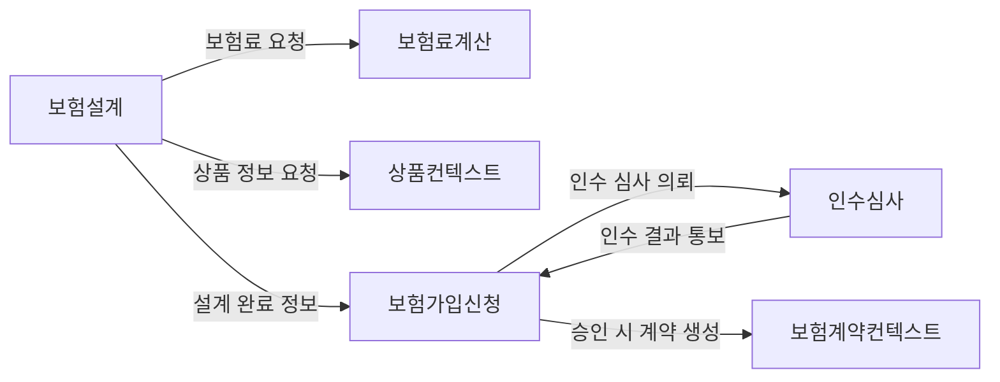

## 1. 바운디드 컨텍스트 식별 

### 보험 설계 컨텍스트
---

보험 설계 컨텍스트는 고객이 온라인에서 원하는 보험 상품을 구성하고 견적을 산출하는 영역. 

1. 상품 구성
2. 견적 산출

위 두가지가 포인트

1. 보험 상품의 보장 범위 선택
2. 담보 금액 조정
3. **가입 설계**  담당

설계 결과로 견적을 생성 및 보여줌.

해당 컨텍스트 내에서는 **영업/마케팅 또는 기획에 가까운 용어**와 고객 친화적인 언어가 쓰이고, 생성되는 견적 정보는 이후 가입 신청이나 인수심사 컨텍스트와는 다른 모델로 관리. 

예를 들어 이 컨텍스트의 핵심은 설계 또는 견적이며, 이는 아직 확정된 계약이 아니기 때문에 효력은 없음.

보험 설계 컨텍스트는 보험 상품 카탈로그나 요율 등의 참조 데이터는 상품 컨텍스트로부터 조회.

따라서 보험 설계 컨텍스트는 상품 컨텍스트로부터 **상품 조건과 규칙**을 조회하여 사용하며, 자체적으로는 고객 맞춤 설계 및 견적 산출 로직에 집중.

이 컨텍스트의 경계는 “보험 가입을 위한 제안 단계”까지로 한정되며, 견적 산출 이후의 신청/심사 로직은 존재하지 않음.
 
### **보험가입 신청 컨텍스트** 
---

사용자가 설계된 보험 상품을 실제로 가입하기 위해 필요한 정보를 입력하고 제출하는 영역

피보험자 정보, 건강진단 질문 등의 절차를 포함. (청약서 확인을 끝으로 마무리)

왜 분리? 

가입 신청 단계는 설계 단계와는 다른 **UB**(Ubiquitous Language)의 범위를 가지며, 계약 체결 전 신청 단계에서의 모델을 다룬다. 

예를 들어, 이 단계에서는 신청인의 건강 정보나 결제 정보 등을 다루지만, 계약이 성립된 후의 계약 모델과는 구분.

설계 견적에는 없었던 추가적인 고객 개인정보, 건강 고지사항 등이 가입 신청 단계에서는 필요하고 의미를 갖게 됨.

가입 신청 컨텍스트의 주요 역할은 제출된 신청 정보를 **유효성 검사**하고, 필요한 추가 서류나 동의 절차를 거친 뒤 **인수심사 컨텍스트**로 넘길 준비를 하는 것

전환점이 되는 이벤트를 경계로 컨텍스트를 나누는 것을 권장 - Pivotal Evnets ([출처 : Seeing Sharply](https://www.blog.jamesmichaelhickey.com/DDD-Use-Case-Life-Insurance-Platform/#:~:text=In%20this%20scenario%2C%20the%20most,wants%20in%20the%20first%20place)). 

실제로 계약 생성 이벤트 시점을 기준으로 프론트엔드의 가입 프로세스와 백오피스의 계약 관리가 구분되는 것이 일반적이다 ([Seeing Sharply](https://www.blog.jamesmichaelhickey.com/DDD-Use-Case-Life-Insurance-Platform/#:~:text=In%20this%20scenario%2C%20the%20most,wants%20in%20the%20first%20place)).

### **인수심사 컨텍스트**
---

보험가입 신청에 대한 인수 가능 여부를 판단하는 영역.

신청인의 위험을 평가하고, 승낙/거절 여부나 추가 조건(할증, 부담보 등)을 결정. 

예를 들어 건강보험의 경우 의료 문진 결과를 평가하여 인수 여부를 결정하며, 일반보험의 경우 가입 대상의 리스크 를 산정한다. 

왜 분리? 

인수심사 영역은 업무 규칙이 매우 복잡하고 전문적이며, 다른 컨텍스트와 사용하는 언어도 다르다. 

예컨대 인수심사에서는 KYC, 인수 위배 코드, 인수유의자, 보험금 부담보 기간 등 심사에서 사용되는 고유한 용어와 도메인 지식을 활용하며, 이는 가입 신청이나 계약 관리 와는 차이가 크다 

이사람은 Medical Question으로 구분함 - ([Seeing Sharply](https://www.blog.jamesmichaelhickey.com/DDD-Use-Case-Life-Insurance-Platform/#:~:text=Also%2C%20if%20we%20dig%20deeper,specific%20to%20the%20medical%20questionnaire)). 

 **복잡도가 높은 하위 도메인**을 별도 컨텍스트로 격리하여 해당 부분의 복잡성을 국지화(localize)하는게 복잡성을 핸들링하는 관점에서 더 유리해 보인다.

인수심사를 분리함으로써 다른 부분에 영향 없이 심사 규칙을 변경/확장할 수 있고, 전체 시스템을 더 이해하기 쉽게 만든다.

각 컨텍스트는 명확한 경계를 가지며 자신의 모델/규칙에 집중한다. 

이렇게 분리함으로써 각 영역 간의 **언어 혼용**을 방지하고, 컨텍스트 내부의 응집도를 높일 수 있다. 

참고자료에서는 보험 도메인을 구현할 때 **Underwriting**, **Premium Calculation**, **Policy Management** 등으로 컨텍스트를 나누어 모듈화하고 있음을 강조한다 ([Introduction to Domain-Driven Design (DDD) in Insurance | by Rajnish Kumar | Mar, 2025 | Medium](https://medium.com/@curiousraj/introduction-to-domain-driven-design-ddd-in-insurance-5826bc8e3112#:~:text=With%20DDD%3A)) 

### 보험 계약 컨텍스트
---

**보험 계약 컨텍스트**는 인수심사를 통과한 신청에 대해 실제 **보험 계약**을 생성하고 관리하는 영역. 

승인된 정보를 기반으로 계약 생성, 계약 상태 변경(취소, 해지, 갱신 등), 보장 내역 관리 등의 기능을 담당. 

계약 생성 컨텍스트의 모델은 보험 증권, 취철해, 배서, 소멸, 갱신, 유지등 **계약 관리**에 초점을 둔 용어로 구성되며, 이전 단계의 견적이나 신청 모델과 구별되는 **정책성 데이터**(예: 갱신 주기, 해지 규정 등)를 포함. 

견적/신청과 계약은 비슷한 데이터 구조를 일부 공유하더라도 규제 요건과 행위가 다름.

예를 들어 **계약 컨텍스트**에서는 보험료 청구 및 수납, 계약 변경/갱신 같은 행위가 중요한 반면, 이런 행위는 신청 컨텍스트에는 존재하지 않음. 

계약 생성 컨텍스트는 인수심사 컨텍스트로부터 **승인된 최종 조건**(인수 결과, 확정 보험료 등)을 인풋으로 받아 계약을 성립시키며, 그 결과로 생성된 **보험 계약 객체**를 영구 저장하고 계약 효력을 개시. 

이 컨텍스트의 경계는 초기 계약 발행까지이며, 계약 이후의 **보험료 청구/수납**이나 **계약 갱신/해지** 등의 업무는 별도의 **청구/Billing 컨텍스트**나 **폴리시 관리 컨텍스트**에서 다뤄도 상관 없어보임. 

### **보험료계산 컨텍스트** 
---

보험료 산정을 전문으로 하는 서비스/엔진 영역. 

각 보험 상품의 요율, 연령별 할인/할증, 담보별 기초보험료 등의 규칙에 따라 보험료를 계산해준다. 

 왜 분리?
 
 보험료 계산은 복잡한 산술적 규칙과 계리 또는 마감 관련 도메인 지식을 포함하며, 여러 컨텍스트(설계, 인수심사 등)에서 공통으로 필요로 한다. 
 
 이를 하나의 컨텍스트로 분리하면 중복 구현을 피하고, 타 컨텍스트와는 명확한 계약(인터페이스)으로 통신하게 할 수 있다. 
 
 또한 계산 로직은 비교적 범용적인 성격이 있어서 독립 배포 및 성능 최적화가 필요하므로, 분리된 컨텍스트로 다루는 것이 효율적이다 
 
 이사람도 별도로 나눴음 [Introduction to Domain-Driven Design (DDD) in Insurance | by Rajnish Kumar | Mar, 2025 | Medium]

## 2. 컨텍스트 간 관계 

화살표 방향은 주요 데이터/요청 흐름을 의미함)

**보험설계 → 보험료계산** 컨텍스트 호출을 통해 보험료 산출이 이루어지고, 설계 완료된 내용이 **가입신청** 단계로 넘어간다. 

가입신청 컨텍스트는 **인수심사**에 필요한 정보를 보내어 심사를 의뢰하며, 심사 결과(승낙/거절)를 다시 받아 처리한다. 

최종적으로 승낙된 건에 대해 **보험계약관리** 컨텍스트에서 실제 보험 계약이 생성된다.

**보험가입신청** 컨텍스트는 **인수심사** 컨텍스트의 결과에 의존하므로 고객(Customer)-공급자(Supplier) 관계로 볼 수 있음

## 3. 핵심 도메인(Core)과 서브도메인(Supporting, Generic) 구분

### **핵심 도메인(Core Domain)** 
---
**인수심사 컨텍스트**가 핵심 도메인이 아닐까? 

보험사의 경쟁력은 어떤 고객을 어떤 조건으로 인수할지 결정하는 **위험 평가 알고리즘**과 **언더라이팅 전략**에서 크게 좌우됨. 

예를 들어 동일한 건강보험이라도 어떤 회사는 간소화된 심사로 빠르게 인수하고, 다른 회사는 보수적으로 심사하여 우량 고객만 받는 등 차별화가 이루어짐. 

이러한 **리스크 관리 역량**은 타사가 쉽게 모방하기 어려운 핵심 지식이며, 자사가 직접 공들여 모델링하고 지속적으로 개선해야 하는 부분임.

### 지원 서브 도메인(Supporting SubDomain)
---

**보험설계**, **보험가입신청**, **보험계약관리** 컨텍스트들은 지원(sub) 도메인으로 분류할 수 있다. 

이러한 부분들은 핵심 도메인을 수행하기 위해 꼭 필요하지만 그 자체로는 사업의 차별점을 만들지 않는 기능들이다 

서브도메인을 구분하는 기준중 하나, 역시 결국 비즈니스 모델이다 - ([Revisiting the Basics of Domain-Driven Design](https://vladikk.com/2018/01/26/revisiting-the-basics-of-ddd/#:~:text=Supporting%20subdomains%2C%20like%20Generic%20subdomains%2C,implementation%20of%20its%20Supporting%20subdomains)) ([Revisiting the Basics of Domain-Driven Design](https://vladikk.com/2018/01/26/revisiting-the-basics-of-ddd/#:~:text=Since%20Supporting%20subdomains%20don%E2%80%99t%20provide,outsourced%20altogether%20for%20offshore%20development)). 

예를 들어 **보험계약 관리**는 모든 보험사가 수행하는 일반적인 업무로서, 계약 정보를 저장/갱신하고 증권을 발행하는 일련의 과정이다. 

이 영역의 업무 로직은 비교적 표준화되어 있고(예: 청약 이후 계약 생성, 보험료 납입 검증 등), 시장에 상용 패키지 소프트웨어도 존재한다(supporting 솔루션들이 이미 있음.)

**보험설계/가입** 과정도 마찬가지로, 고객 편의성과 프로세스 효율이 중요하긴 하나 이를 통해 직접적인 경쟁우위가 발생할수 있는가 아닌가 사실 이부분이 헷갈린다.

아무리 과정에 있어서 편이성이 증대된다고 할지라도 보험 인수 심사에서 거절당하거나, 심사를 위해서 해야하는 프로세스가 좀더 코어하지 않나??.. 설계 가입은 살짝 보류

해당 영역의 비즈니스 로직이 복잡하더라도, 그것이 핵심 가치를 창출하는 복잡성(complexity)인지 아니면 부수적인 복잡성인지 판단해야 한다 ([Revisiting the Basics of Domain-Driven Design](https://vladikk.com/2018/01/26/revisiting-the-basics-of-ddd/#:~:text=Since%20Supporting%20subdomains%20don%E2%80%99t%20provide,outsourced%20altogether%20for%20offshore%20development)). 
다만 지원 도메인이라도 해당 영역이 지나치게 복잡하다면, 그것이 핵심 도메인의 일부가 아닌지 재평가할 필요는 있다 ([Revisiting the Basics of Domain-Driven Design](https://vladikk.com/2018/01/26/revisiting-the-basics-of-ddd/#:~:text=invariants%3F%20The%20business%20people%20might,accidental%20and%20should%20be%20simplified)).

설계 가입 프로세스가 많이 복잡한것은 사실이니 이부분이좀 어떻게 생각하느냐에 따라 다를것 같다.