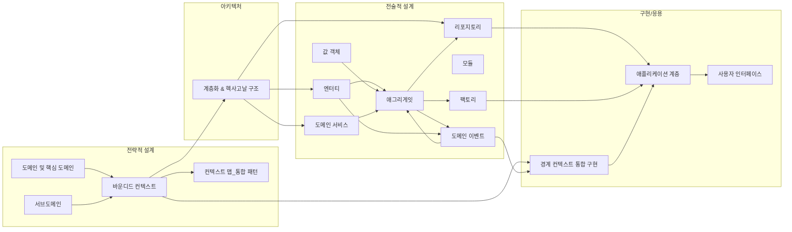

# 도메인 주도 설계 구현: 논리학적 분석과 지식 체계

## Each Chapater's Core Point And logics of Core Point
---

### **1장 DDD를 시작하며** 
---

이 장은 *도메인 주도 설계(DDD)* 의 출발점을 다룸.

복잡한 소프트웨어 문제에서 **도메인 지식의 중요성**과 DDD 적용 시 얻는 이점을 소개하며, DDD가 왜 필요한지를 논리적으로 설득함.

예를 들어 - 무기력증_에 빠진 개발팀의 사례를 통해, 도메인 지식을 코드에 반영하지 못하면 발생하는 문제를 보여주고 DDD가 이를 어떻게 해결하는지 설명함. 

논리학적으로 보면

>  복잡한 도메인 문제 ⇒ **통일된 모델** 필요 라는 **명제**를 세우고, 
>  DDD를 통해 그 **모델의 일관성**을 유지함으로써 문제를 해결할 수 있음을 추론함.

> 또한 유비쿼터스 언어의 개념을 제시하여, 도메인 전문가와 개발자 사이에 **공용어**를 정립함으로써,
> 지식 전달의 논리적 **동등성**(동일한 용어가 동일한 개념을 의미)을 확보하는 방법을 소개함. 

>이 장의 핵심 지식은 “도메인 문제에 집중한 모델링”으로 요약되며, 이는 이후 모든 장의 토대가 되는 **정의** 가 되고있음.

### **2장 도메인, 서브도메인, 바운디드 컨텍스트**
---

여기서는 **도메인**을 세분화하는 개념인 **서브도메인**과 **바운디드 컨텍스트**를 다룸. 

논리적으로, 하나의 큰 문제 영역(도메인)을 **부분 문제**들로 나누는 _분할 정복_ 전략이라고 볼 수 있음. 

서브도메인은 비즈니스 문제 영역을 하위 영역으로 나눈 것이고, 

바운디드 컨텍스트는 그 하위 영역마다 **모델의 경계**를 의미함. 

수리논리학적으로 말하면, 전체 도메인 U를 여러 컨텍스트 집합 {C1, C2, ..., Cn}로 분할하여, 각각 독립적인 **모델** M_i를 가집니다 (U = C1 ∪ C2 ∪ ... ∪ Cn, Ci ∩ Cj = ∅ for i≠j). 

각 컨텍스트 내에서는 용어와 모델의 **정합성**(consistency)이 유지되지만, 컨텍스트 간에는 동일 용어라도 다른 의미를 가질 수 있음. 

예를 들어 “주문(Order)”이라는 개념이 물류 컨텍스트와 결제 컨텍스트에서 다르게 정의될 수 있다. 

이러한 경우 **모델 간 충돌을 막기 위해** 경계를 설정하는 것이 바운디드 컨텍스트의 역할임. 

>2장의 핵심은 **복잡한 도메인은 한 개의 통합된 모델로 다루기 어렵고**, 따라서 **여러 모델**로 나눠야 한다는 점임.
>각 컨텍스트별로 명확한 정의를 내림으로써 정의의 모호성을 논리적으로 제거하고, 모델 내부의 완결성을 보장함.

### **3장: 컨텍스트 맵**
---

여러 바운디드 컨텍스트가 존재할 때, 이들 사이의 **관계와 통합 방법**을 논의하는 장임. 

서로 다른 컨텍스트의 모델을 조율하기 위해 **컨텍스트 맵**이라는 개념적 지도를 사용하는 것으로 보여짐. 

이는 수리논리학에서 말하면 서로 독립적인 이론들(컨텍스트들) 사이에 **사상(mapping)**을 정의하는 과정과 유사함. 

여기서는 다양한 **통합 패턴** – 예를 들어 **공유 커널(Shared Kernel)**, **고객-공급자(Customer-Supplier)**, **반부패 계층(Anti-Corruption Layer)** 등을 소개함. 

각 패턴은 컨텍스트 A와 B 사이의 논리적 관계를 나타내며, 두 컨텍스트가 **모델을 공유**한다든지(공유 커널), 한쪽이 다른 쪽의 모델에 **의존**한다든지(고객-공급자), 또는 한쪽 모델의 부정적 영향으로부터 다른 쪽을 **보호**한다든지(반부패 계층) 하는 식의 **추론 구조**를 가짐.

컨텍스트 맵은 이러한 관계들을 하나의 그림으로 묘사함으로써, 전체 시스템에서 컨텍스트들이 **어떻게 소통하는지**를 파악하게 해줌. 

논리적 구조로 보면, 각 컨텍스트를 하나의 논리 세계로 간주하고, 컨텍스트 맵은 세계들 간의 **동형사상** 또는 컨텍스트간의 **번역 규칙**을 정의한다고 볼 수 있음. 

이로써 전체 시스템이 **모델 간 모순 없이 작동**하도록, 즉 정의들의 정합성이 경계 사이에서도 유지되도록 함.

### **4장: 아키텍처**
---

 이 장에서는 DDD를 지원하는 **소프트웨어 아키텍처** 원리를 다룸.

주요 내용은 **계층화된 아키텍처**(Layered Architecture), **의존성 역전 원리(DIP)**, 그리고 **헥사고날 아키텍처(Ports & Adapters)** 등이 있음. 

논리적으로, 아키텍처는 도메인 모델을 **외부 요소로부터 보호**하는 **논리적 격자 구조**로 볼 수 있음. 

계층화 원리는 _표현 계층(UI)_, _응용 계층(Application)_, _도메인 계층(Domain)_, *인프라 계층(Infrastructure)*를 분리하여, **도메인 계층의 순수성**을 지키는 것. 

이는 공리적으로 “인프라 → 도메인”의 의존성을 **금지**하고 반대로 “도메인 → 인프라” 의존성을 허용하지 않는 제약으로 표현할 수 있음 (DIP 적용: 상위 수준 모듈은 하위 수준 모듈에 의존하지 않는다). 

헥사고날 아키텍처는 도메인을 중앙에 두고, **포트(Port)**와 **어댑터(Adapter)**를 통해 외부 세계(DB, UI, 기타 시스템)와 상호작용하게 함.

이를 논리적으로 보면, 도메인 모델(D)이 있고, 포트(P)는 D가 외부와 통신하기 위해 규정한 _논리 인터페이스_, 어댑터(A)는 각 외부 요소를 P에 **대응**시키는 _구현_임. 

따라서 ∀ 외부 요소 X, ∃ A such that A(X) ↦ P(D) (모든 외부 요소 X에 대해, 그에 대응하는 어댑터 A가 있어 도메인 포트와 연결된다)는 논리적 구조를 갖게됨. 

이 장의 본질은 **도메인 모델의 순수성 유지와 변경 용이성**이며, 논리학적으로는 “도메인 관련 규칙 ↔ (만약 아키텍처 원칙이 지켜진다면) ↔ 시스템의 견고성”이라는 양방향 **함의 관계**에 대한 인식임.

### **5장: 엔터티(Entities)**
---

여기서는 **엔터티** 개념과 설계 원칙을 다룸. 

엔터티는 **고유한 식별자(identity)** 를 가진 객체로서, 시간에 따라 상태가 변해도 **동일성**이 유지되는 도메인 객체. 

>핵심은 식별자와, 시간에 따라 상태가 변해도 동일성이 유지된다는 점.

>논리적으로, 엔터티 E는 다음과 같이 정의할 수 있음
>∃ 식별자 id(E) : ∀ 시간 t1, t2에서 
>
>E의 속성들이 달라도 
>id(E, t1) = id(E, t2) ⇒ E는 동일한 객체. 

>즉 동일성의 판단이 속성 값이 아니라 **식별자**에 의해 이루어짐. 

예를 들어 “주문 객체”에 주문번호(식별자)가 있다면, 주문 내용이 수정되더라도 주문번호가 같으면 같은 엔터티로 간주됨. 

이 장에서는 엔터티 설계 시 **필요한 규칙** (불변식)을 소개하는데, 논리학 용어로는 **항상 만족해야 하는 논리식**으로 볼 수 있음. 

>예를 들어 “엔터티의 ID는 생성 시 부여되며 변경되지 않는다” 는 불변식은 ∀E, □(ID(E)는 불변) 형태로 표현 가능함. 

또한 *동등성(equality)* 과 *동일성(identity)* 의 차이를 강조하여, **동등성은 속성 값 비교**(value equality), **동일성은 식별자 비교**로 구분함. 

이를 통해, 엔터티와 값 객체(Value Object)를 논리적으로 구별함. 

5장에서는 이러한 정의들을 바탕으로, 엔터티 설계의 모범 사례(예: 식별자 생성 전략, 엔터티의 자기 유효성 검사 여부 등)를 다룸. 

>이는 **정의의 정합성** 측면에서, 모든 엔터티가 일정한 규약을 따르면 모델 전체에 모순이 없게 된다는 것을 의미함. 
>P : 모든 엔터티는 고유 ID를 가진다.
>Q : ID는 중복이 존재하지 않는다.
>P ^ Q
>위와 같은 논리 프로세스로 모델전체의 일관성을 보장 및 모순을 없게 가이드함.

### **6장: 값 객체(Value Objects)**
---

값 객체는 **식별자가 없고 값으로만 동일성이 결정되는 객체**를 뜻함. 

이 장에서는 값 객체의 특징과 설계 방법을 다룸. 

>논리적으로, 어떤 객체를 VO로 정의하려면
>∀ 객체 X, Y (X와 Y가 같은 클래스이고 모든 속성 값이 같다면) ⇒ X와 Y는 동일한 것으로 간주. 
>즉 동일성(equality)이 **값의 동등성**에 의해 정의됨. 

예를 들어 화폐 금액(Money) 객체를 생각하면, 1,000원이라는 값 객체는 두 개의 인스턴스가 있더라도 그 금액과 화폐 단위가 같으면 논리적으로 같은 것으로 취급됨. 

값 객체는 **불변(immutable)** 으로 설계하는 것을 권장하며, 이는 수리논리학에서 **상수(값)처럼 취급**된다는 뜻. 

한번 생성된 VO v에 대해, 시간 t에 관계없이 속성 값이 바뀌지 않으므로 
□(v의 상태 불변)이라는 불변성을 갖게됨. 

이 장에서는 값 객체를 사용함으로써 모델을 더 **풍부하게** 표현하고, 엔터티의 속성으로 VO를 조합하여 **의미 있는 개념 단위**로 만드는 기법을 설명함. 

예컨대 주소(Address)를 단순 문자열들이 아닌 VO로 만들어서, 주소 자체의 불변식을 보장하도록 함 (우편번호 형식의 유효성 등). 

이러한 값 객체 개념은 논리적으로 **함축**하는 바가 있음
“어떤 객체에 식별 의미가 없다 ⇒ 그 객체는 값으로 취급되어도 무방”_. 

즉, 한 사람이 두 개의 여권번호를 가질 수 없듯이, **불변의 속성묶음**은 VO로 만들고, 두 VO가 동일한 값을 가지면 같은 것으로 보는 것이 시스템의 모순을 줄임.

### **7장: 도메인 서비스(Services)** 
---

도메인 서비스는 _특정 엔터티나 값 객체에 속하지 않는_ **도메인 로직**을 캡슐화한 무상태 연산. 

논리적으로, 도메인 서비스는 함수나 관계로 표현할 수 있음.

예컨대 S: (Entity1, Entity2, ...) → 도메인 결과 와 같은 **맵핑**으로, 한 개념에 명확히 귀속되지 않는 동작을 정의함. 

7장에서는 **서비스가 필요한 상황**을 규명하는데, **행위**(behavior)가 여러 객체에 걸쳐 있거나 객체 외부에서 정의되는 것이 더 자연스러울 때 서비스를 사용함. 

이는 형식 논리에서 **명제 추출**과 유사함: 

어떤 복잡한 도메인 규칙이 있을 때, 그 규칙이 하나의 객체에 속하면 엔터티 메소드로 표현하지만, 그렇지 않으면 별도의 서비스 명제로 추출하는 것입니다. 

예를 들어 “계좌 이체”라는 도메인 로직은 송금자 계좌와 수취자 계좌 두 엔터티에 걸치지만, 그 자체로 하나의 원자적 행위이므로 `계좌이체서비스.transfer(fromAccount, toAccount, amount)`와 같은 서비스로 구현함. 

이 장의 핵심 개념은 **무상태성(statelessness)** 인데, 서비스는 내부 상태를 가지지 않고 도메인 개념의 조작만 수행해야 함을 강조함. 

이는 논리적으로, 같은 입력이 주어지면 항상 같은 결과를 내는 **순수 함수**에 가깝게 설계해야 한다는 의미. 

또한 서비스 남용에 대한 경고도 제시하는데, 모든 로직을 서비스로 빼면 **빈약한 모델(Anemic Model)** 이 되므로 **필요 최소한의 경우에만** 사용하라는 것. 

즉 논리적 필요충분 조건을 따져서, “어떤 기능이 특정 객체에 속할 수 없다 **그리고** 여러 객체에 걸친 작업이다”가 **참**일 때만 서비스를 도입하는 것이 바람직함.

### **8장: 도메인 이벤트(Domain Events)**
---

도메인 이벤트는 _도메인 내에서 발생한 의미 있는 사건_을 객체로 모델링한 것. 

예를 들어 **“주문이 발송되었다”** 는 사건을 `OrderShipped`이라는 도메인 이벤트 객체로 표현할 수 있음. 

이 장에서는 이벤트를 정의하고, **발행(publish)** 하고 **구독(subscribe)** 하여 처리하는 과정을 다룸. 

논리적으로, 도메인 이벤트는 시간에 따른 **진리 값의 변화**를 나타내는 불 연속점으로 볼 수 있음. 

수리논리학에서는 이벤트를 시점 t에서 참이 되는 명제 P로 표현할 수 있음 (예: P = "OrderShipped(주문123)") – 사건 발생 이전에는 P가 거짓이었다가, 발생 순간에 P가 참이 됨. 

이벤트를 모델에 도입하면 **느슨한 결합**과 **최소한의 상호 작용**으로 컨텍스트나 컴포넌트 간 통신을 설계할 수 있음. 

이는 “한 컨텍스트에서 P가 참이면, 다른 컨텍스트에서 그것을 감지하여 대응한다”는 **논리적 규칙**으로 볼 수 있ㅇ음. 

예컨대 주문 컨텍스트에서 OrderShipped 이벤트가 발생하면, 고객 통보 컨텍스트에서 이를 감지하여 이메일을 발송하는 식임. 

이벤트는 **불변 객체**로 취급되며, 그 발생 자체가 시스템의 상태 전이로 간주됨. 

8장에서는 이러한 이벤트를 설계하는 패턴 (이벤트 이름 명명, 속성 설계), 이벤트 저장소(Event Store)를 통한 **Event Sourcing** 개념 등도 간략히 다룸. 

핵심은 도메인 이벤트를 통해 *결과적 일관성(eventual consistency)* 을 달성하고, 시스템을 **이벤트 중심 아키텍처**로 확장할 수 있다는 점임. 

논리적으로 보면, 강한 일관성을 완화하고 **시간에 걸친 논리적 일관성**(◊(P → □Q) 형태로, 언젠가 P가 발생하면 결국 Q가 참이 됨을 보장하는 성질)을 유지하는 접근이라고 할 수 있음.

### **9장: 모듈(Modules)**
---

모듈은 **도메인 모델을 구성하는 클래스들을 논리적 그룹으로 묶는 단위**입니다. 자바나 C#의 패키지, 모듈 등이 이에 해당하며, DDD에서는 흔히 **컨텍스트 내부**를 다시 모듈로 구분하여 **응집도 높은 객체 묶음**으로 만듭니다. 9장에서는 모듈화를 통해 얻는 이점과 설계 원칙을 다룹니다. 논리적으로, 모듈은 집합 S를 분할(partition)하는 것과 같습니다. 예를 들어 컨텍스트 내에 객체의 집합 O가 있다면, 모듈화는 O를 {O1, O2, ..., Ok}로 분할하여 ∀i≠j, Oi ∩ Oj = ∅이며 O1 ∪ ... ∪ Ok = O를 만족하게 합니다. 이렇게 하면 각 모듈 Oi 내부에서는 객체들 간의 **결합도(cohesion)**를 높이고, 모듈 간에는 **의존성을 최소화**합니다. 이는 **논리적 경계**를 형성하여, 모듈 간에는 직접적인 참조를 제한하거나 엄격한 인터페이스만을 통해 통신하도록 강제합니다. 9장에서는 **모듈 이름**을 도메인 개념에 맞게 짓는 것, 모듈 간 **순환 참조를 피하는 법** 등을 설명합니다. 결국 모듈화의 목적은 **이해와 변경의 용이성**인데, 이는 논리적 복잡도를 분산시켜 _한정된 맥락에서의 추론_을 가능케 하기 때문입니다. 개발자는 각 모듈 단위로 시스템을 이해할 수 있고, 이는 마치 복잡한 증명을 **여러 보조정리(lemma)**로 나누어 푸는 것과 같습니다. 이 장의 정수는: **“높은 응집, 낮은 결합”**을 실현하여, 시스템의 모듈마다 독자적이고 일관된 의미를 갖게 만드는 것입니다.

**10장: 애그리게잇(Aggregates)** – 애그리게잇은 DDD의 중요한 패턴으로, 여러 엔터티와 값 객체를 하나의 **일관성 단위**로 묶은 군집입니다. 애그리게잇에는 **애그리게잇 루트(aggregate root)**라 불리는 대표 **엔터티**가 있으며, 외부에서는 오직 이 루트를 통해서만 애그리게잇 내부에 접근할 수 있습니다. 논리적으로, 애그리게잇 A는 <R, {E_i}, {VO_j}> 의 튜플로 표현할 수 있는데, 여기서 R은 루트 엔터티, E_i는 다른 엔터티들, VO_j는 값 객체들의 모임입니다. 애그리게잇은 **불변식(invariant)**을 갖고 있는데, 이는 애그리게잇 내부 상태들 사이에 항상 유지되어야 하는 논리식입니다. 예를 들어 “주문 애그리게잇”에서는 주문 금액 합계와 주문 항목들의 금액 합이 일치해야 한다는 불변식이 있을 수 있습니다. DDD에서는 이러한 불변식을 애그리게잇 경계 내에서 **원자적으로 유지**하도록 설계합니다 (한 트랜잭션은 한 애그리게잇의 상태만 변경하고 커밋하여, 항상 불변식이 깨지지 않은 상태로 완료됨). 이를 수리논리로 표현하면: 애그리게잇 A에 대한 불변식 P에 대해, □(P(A)) (항상 P가 참)이고, 어떤 연산 후 일시적으로 P가 깨져도 그 연산이 끝나기 전에는 커밋되지 않아야 함. 10장에서는 올바른 애그리게잇 경계 설계 방법 – 한 애그리게잇이 너무 크면 동시작업이 어려워지고, 너무 작으면 불변식 유지가 어려워지는 문제 – 등을 다룹니다. 또한 **외부 참조 규칙**도 강조되는데, 한 애그리게잇 내부의 엔터티를 다른 애그리게잇이 직접 참조하지 않고, 항상 상대 애그리게잇의 루트를 통해 참조하거나 ID로만 참조하도록 합니다. 이를 통해 애그리게잇 간 결합을 약화시켜 **논리적 독립성**을 높입니다. 핵심 지식은: *“트랜잭션 일관성의 경계로서 애그리게잇을 사용하라”*는 원칙과, 올바른 경계 설정을 통해 시스템의 **모델 무결성(model integrity)**을 지킨다는 점입니다.

**11장: 팩토리(Factories)** – 팩토리는 복잡한 객체나 애그리게잇을 생성하는 **전담 컴포넌트**입니다. 단순히 new로 객체를 생성하는 책임을 넘어서, **일련의 불변 조건을 만족하는 완전한 객체를 만들어내는 역할**을 합니다. 논리적으로, 팩토리는 함숫값으로 **객체의 생성 결과를 반환하는 연산**입니다: Factory: input parameters → Entity/ValueObject/Aggregate. 팩토리를 사용하는 이유는 생성 과정에서 여러 객체를 조립하거나 복잡한 로직이 필요한 경우, 해당 로직이 도메인 객체의 생성자나 애플리케이션 서비스에 퍼지지 않고 한 곳에 응집되도록 하기 위함입니다. 예를 들어 회원 가입 시 _User 애그리게잇_을 만들 때, User 엔터티와 초기 프로필 값 객체 등을 한꺼번에 만들어야 한다면, `UserFactory.create(name, email, ...): User` 같은 팩토리를 두어 그 내부에서 **유효성 검사**와 **조합 로직**을 수행하게 합니다. 이는 **객체 생성의 추상화**로, 논리적으로 “어떤 조건을 만족하는 객체가 존재한다”는 것을 보장하는 _증명 절차_에 비유할 수 있습니다. 팩토리는 그 절차를 표준화하여, 개발자가 실수로 불완전한 객체를 생성하는 것을 막습니다. 11장에서는 팩토리를 클래스(정적 팩토리 메서드)로 구현하는 방법, 또는 복잡한 생성은 빌더(Builder) 패턴과 조합하는 방법 등을 다룹니다. 또한 팩토리를 인프라 계층에서 구현하여, 예를 들어 **영속성 모델**에서 객체를 불러오거나 재구성(reconstitute)하는 역할로 확장할 수도 있음을 언급합니다. 중요한 논리 포인트는, 팩토리를 통해 **객체 생성의 사전 조건(precondition)**을 철저히 지키게 된다는 것입니다. 이는 “만들어진 객체는 항상 불변식을 만족한다”는 논리를 보장하므로, 시스템 전체 논리의 **타당성 유지**(soundness)에 기여합니다.

**12장: 리포지토리(Repositories)** – 리포지토리는 **도메인 객체의 영속화(persistence)를 추상화한 컬렉션** 역할을 합니다. 마치 메모리의 컬렉션에 객체를 추가하거나 조회하듯이, 영속화 계층을 캡슐화하여 _도메인 계층_에서 **DB를 의식하지 않고도** 객체를 저장하고 가져올 수 있게 해줍니다. 논리적으로, 리포지토리는 한정된 객체의 집합을 나타내는 **논리적 관계**로 볼 수 있습니다: Repository = { x | P(x) } 꼴로, 어떤 조건 P를 만족하는 객체들의 집합 (예: `OrderRepository`는 P(order) = "주문 엔터티"인 모든 order를 포함). 도메인 측면에서는 Repository를 통해 **객체의 생명주기 관리**를 일관성 있게 수행합니다. 12장에서는 리포지토리 설계의 두 가지 접근을 소개하는데, 하나는 **컬렉션 지향 설계**이고 다른 하나는 **영속성 지향 설계**입니다. 컬렉션 지향은 도메인 모델 관점에서 인터페이스를 컬렉션처럼 정의하고, 구현체가 DB 연동을 숨기도록 합니다. 영속성 지향은 반대로 ORM 같은 기술을 보다 노출하여, 성능 최적화나 쿼리를 활용하기도 합니다. 그러나 가급적 컬렉션 지향으로 리포지토리를 정의함으로써, 도메인 로직이 “데이터 저장”과 분리되도록 권장합니다. 논리적으로 이는 **분리된 관심사(Separation of Concerns)** 원칙의 연장으로, “데이터 존재 여부나 저장 방법에 관한 논리는 리포지토리에 귀속되고, 도메인 논리는 순수하게 도메인 객체 연산으로 남는다”는 구도를 의미합니다. 리포지토리의 주요 연산(`save`, `findById` 등)은 모두 **전역 사상**처럼 동작하여, 예를 들어 findById(id) = O는 “P(O) ∧ O.id = id”를 만족하는 O를 반환하는 함수로 볼 수 있습니다. 이 장의 정수는, 리포지토리를 사용함으로써 **도메인 계층이 영속성 메커니즘으로부터 논리적으로 독립**되며, 마치 in-memory 컬렉션을 다루듯이 도메인 객체를 다룰 수 있다는 점입니다.

**13장: 경계 컨텍스트 통합(Integrating Bounded Contexts)** – 앞서 3장에서 컨텍스트 맵을 개념적으로 다뤘다면, 13장은 실제 구현 차원에서 **복수의 바운디드 컨텍스트를 통합**하는 방법을 다룹니다. 대규모 시스템에서는 각 컨텍스트가 마이크로서비스 등으로 **물리적으로 분리**되는 경우가 많으므로, 이들을 연결하는 전략이 필요합니다. 이 장에서는 **도메인 통합 패턴**들의 구현을 심도 있게 설명합니다. 예를 들어 **이벤트 주도 통합**: 한 컨텍스트에서 발생한 도메인 이벤트를 메시지 브로커 등을 통해 다른 컨텍스트에 전달하여 **최소 결합 통신**을 하는 방법, **반부패 계층(ACL)** 구현: 한 컨텍스트가 다른 컨텍스트의 모델과 상호작용할 때 중간 변환 계층(안티코럽션 계층)을 두어, 수신된 데이터를 **자기 컨텍스트의 언어로 변환**하는 어댑터를 작성하는 방법 등이 있습니다. 또한 **Open Host Service**나 **Published Language** 같은 패턴을 어떻게 적용하는지도 다룹니다. 논리적으로, 컨텍스트 A와 B가 있을 때, A의 사건이나 상태 변화가 B에 영향을 줘야 한다면, _f_: A → B 라는 함수를 직접 호출하는 대신, A에서 이벤트 E를 발행하고 B에서 E를 처리하는 _간접 관계_로 설정합니다. 이는 A와 B 사이의 **논리적 의존성**을 낮추고, E라는 **매개 변수**를 통해 연결하는 방식입니다. 이러한 구조는 모델 간 **논리적 동치성**을 유지합니다. 예컨대, A에서 “고객 등급 상승” 이벤트가 발생하면 B에서는 “할인율 조정”을 수행하는데, 둘은 느슨하게 연결돼 있어도 전체 시스템 논리에는 모순이 없습니다 (이벤트를 매개로 한 **논리적If-Then** 관계: _만약 A에서 P 사건 발생 ⇒ 결국 B에서 Q 동작 실행_). 더불어, 팀 구조와 시스템 통합의 관계도 논의하여 **조직적 분산**과 **모델 통합** 사이의 맥락을 설명합니다. 이는 컨텍스트 간 협력이 원활하려면 조직의 협업도 필요하다는 것으로, 한 컨텍스트의 정의 변경이 다른 컨텍스트에 주는 영향을 논리적으로 추적하고 관리하는 방법 (예: 컨텍스트 맵 문서화)을 제안합니다. 이 장의 지식 정수는: **여러 개의 모델을 가진 시스템에서 일관성을 유지하면서 소통하는 법**이며, 이는 각기 자율적인 컨텍스트들을 _메시지, 서비스, 번역 계층_ 등으로 느슨히 연결함으로써 달성됩니다.

**14장: 애플리케이션(Application)** – 마지막 장은 지금까지의 개념들을 한데 모아, 실제 애플리케이션 계층에서 **DDD를 구현하는 방법**을 다룹니다. **애플리케이션 계층**은 사용자 인터페이스(UI)나 외부 세계와 도메인 모델을 중재하는 역할을 하며, *유스케이스(use case)*나 *응용 서비스(Application Service)*를 통해 동작합니다. 14장에서는 한 예로 사용자의 입력을 받아 도메인 로직을 실행하고 결과를 반환하는 일련의 흐름을 설명합니다. 여기엔 **트랜잭션 관리**나 **보안 검증**, **권한 체크** 등의 크로스커팅 관심사도 포함됩니다. 논리적으로, 애플리케이션 서비스는 _절차적 스크립트_처럼 특정 **시나리오**를 구현하며, 내부에서 도메인 객체들을 불러오고 (리포지토리 활용), 도메인 기능을 수행한 뒤, 결과를 반환하거나 이벤트를 발행합니다. 수리논리로 보면, 애플리케이션 계층은 함수 합성 f ∘ g ∘ h 형태로, 외부 입력을 받아 일련의 도메인 함수들을 적용하고 출력하는 _조합 함수_라고 할 수 있습니다. 이 장에서는 **사용자 인터페이스**와의 연결도 다루는데, 예를 들어 웹 요청을 받으면 그것을 애플리케이션 서비스에 전달하고, 서비스에서 도메인 작업을 한 후 DTO(Data Transfer Object)나 ViewModel로 변환하여 응답하는 과정을 설명합니다. 또한 **테스트** 측면에서 애플리케이션 계층을 통해 시나리오 단위의 통합 테스트를 작성하는 방법도 제시합니다. 최종적으로, 14장은 **전체적인 시스템의 작동 모습**을 그려주면서, 독자가 앞서 배운 DDD 개념들이 실전에 어떻게 조합되는지 이해하도록 합니다. 이로써 _모델-컨텍스트-아키텍처-구현_이 모두 연결된 **지식 네트워크**를 완성하며, 논리적으로도 각 계층과 구성 요소가 맡은 바 역할을 수행할 때 시스템이 **정합성 있게 작동함**을 보여줍니다.

## 2. 주요 개념들의 논리적 연계와 전체 지식 구조

이제 각 장에서 소개된 핵심 개념들이 **어떻게 서로 연결**되는지 논리적으로 살펴보겠습니다. DDD의 지식 체계는 크게 **전략적 설계(Strategic Design)**와 **전술적 설계(Tactical Design)**의 두 영역으로 나뉘며, 이를 이어주는 **아키텍처**가 중간에서 가교 역할을 합니다. 전체 구조를 **수리논리학적 맥락**에서 본다면, 전략적 설계는 **상위 수준의 공리**(axioms)를 설정하는 단계이고, 전술적 설계는 그 공리들을 만족시키는 **구성 요소들의 존재를 증명**하는 단계로 비유할 수 있습니다. 

아래의 Mermaid 다이어그램은 책 전체 개념들의 관계를 시각화한 것입니다.

【도식 설명】 전략적 설계 영역에서 **도메인**은 서브도메인들로 나뉘고, 각 서브도메인(또는 문제 영역)에 **바운디드 컨텍스트**가 매핑됩니다. 여러 컨텍스트들은 **컨텍스트 맵**으로 서로 연결되며(예: 공유 커널, ACL 등의 패턴), 이러한 맵은 _논리적으로 서로 다른 이론들 사이의 관계_를 나타냅니다. 전략적 설계의 산출물인 바운디드 컨텍스트는 전술적 설계의 **무대**가 됩니다 – 각 컨텍스트 내에서 개별적으로 엔터티, 값 객체 등을 사용해 모델을 구성하지요. **아키텍처**는 컨텍스트 내부에서 전술적 요소들이 잘 동작하도록 **제약과 가이드**를 제공합니다. 이를테면 **계층화**와 **의존성 역전** 원칙은 전술적 요소(E, F, G, ... L)가 인프라나 UI에 종속되지 않고 독립성을 유지하도록 보장합니다.

전술적 설계의 내부 논리 연계를 보면, **엔터티(E)**와 **값 객체(F)**는 **애그리게잇(J)** 안에서 결합되어 **일관성 있는 집합**을 이룹니다. 애그리게잇은 여러 엔터티를 포함하므로, 엔터티 속성 변화와 애그리게잇 불변식 사이에 **논리적 제약**(invariant)이 존재합니다. **도메인 서비스(G)**는 엔터티/값 객체만으로 표현하기 애매한 **도메인 행위**를 끌어내 정의하며, 종종 애그리게잇 간 조율이나 복잡한 계산에 쓰입니다. 서비스는 애그리게잇 또는 도메인 객체들을 입력받아 결과를 산출하기 때문에, _서비스 → 애그리게잇_의 **작용 관계**가 있습니다. **도메인 이벤트(H)**는 애그리게잇 또는 엔터티에서 중요한 상태 변화가 일어났을 때 발생하며, 이벤트 객체 안에 해당 사실을 기술합니다. 따라서 애그리게잇과 이벤트는 **양방향 연관**을 지닙니다: 애그리게잇에서 이벤트를 발행하고, 다른 애그리게잇(혹은 컨텍스트)에서는 이벤트를 구독하여 반응합니다. **모듈(I)**은 이러한 요소들을 논리적으로 그룹화하여 대규모 컨텍스트에서도 **복잡성을 관리**하도록 돕습니다. 예를 들어 엔터티와 값 객체 여러 개가 하나의 모듈에 속하면, 다른 모듈에서는 그 내부 구현을 몰라도 되므로, 이는 _정보은닉_ 및 _논리 분리_를 통해 전체 모델의 **정합성**을 높입니다.

전술적 요소들에서 **팩토리(K)**와 **리포지토리(L)**는 특별히 **시스템 경계와의 상호작용** 측면에서 중요합니다. 팩토리는 외부로부터 주어진 입력(예: UI에서 받은 DTO 등)을 가져와 **엔터티나 애그리게잇을 생성**하는데, 이 과정에서 전술적 요소들의 불변식이 지켜지도록 합니다. 즉 팩토리는 “유효한 조합만 생성”이라는 **조건**을 만족시켜 전체 시스템의 논리 무결성을 시작 단계에서 보증합니다. 리포지토리는 영속화된 데이터를 재구성하여 **엔터티/애그리게잇을 제공**하거나 반대로 보관하는 역할을 합니다. 이는 _영속성 계층 -> 도메인_의 매핑이며, 리포지토리가 올바로 동작하면 “DB에 있는 참(true) 사실 ↔ 도메인 객체의 상태” 간에 **논리적 동치**가 성립하게 됩니다. 가령 리포지토리 `findById(X)`를 호출하여 객체 O를 얻었다면, DB에 X에 해당하는 레코드가 존재하고 그 내용 = O의 속성이라는 관계입니다. 따라서 팩토리와 리포지토리는 전술적 설계가 **현실 세계 데이터**와 만나는 접점이고, 이들이 제 역할을 함으로써 전술적 모델과 실제 데이터 상태 사이에 **모순이 없도록(consistency)** 유지됩니다.

**전략적 ↔ 전술적 설계의 연결**: 전략적 설계의 결과인 바운디드 컨텍스트는 각각 별도의 전술적 모델 세트를 가집니다. 각 컨텍스트 내부에서는 지금 설명한 전술적 연계가 적용되지만, **컨텍스트 경계를 넘어서**는 어떻게 연결될까요? 이 부분을 다루는 것이 13장의 컨텍스트 통합과 14장의 응용 계층입니다. **경계 컨텍스트 통합(13장)**에서는 한 컨텍스트에서 발생한 도메인 이벤트를 **다른 컨텍스트로 전달**하거나, ACL(반부패 계층)을 둬서 한쪽 모델의 데이터를 다른 쪽에 **변환**해주는 등 패턴을 적용합니다. 이를 통해 “컨텍스트 A에서 P가 참이면, 컨텍스트 B에서 Q를 수행” 같은 **논리적 규칙**을 시스템에 주입합니다. 예를 들어 A 컨텍스트의 OrderShipped 이벤트 발생 ⇒ B 컨텍스트의 재고 차감 실행, 이런 규칙은 이벤트 메시지 전송과 핸들러 구현으로 실현되지요. 이렇게 함으로써 각 컨텍스트의 **모델 주체성**은 지키면서도, 전체 시스템의 동작은 조화롭게 연결됩니다 (즉, **논리 합의**: A와 B가 일부 개념에 대해 일정한 계약을 맺는 것). 마지막으로 **애플리케이션 계층(14장)**은 사용자나 외부 시스템이 DDD 시스템과 상호작용하는 진입점으로서, 한 요청 단위로 필요한 컨텍스트의 도메인 로직을 호출하고 통합 결과를 제공하는 _조정자_ 역할을 합니다. 애플리케이션 계층에서는 보통 한 컨텍스트의 작업만 다루지만, 필요에 따라 **여러 컨텍스트의 기능을 조합**할 수도 있습니다. 이 경우 애플리케이션 서비스가 각 컨텍스트의 서비스를 호출하고, 필요하면 두 결과를 합치는 식으로, _컨텍스트 간 통합 로직_을 구현할 수 있습니다. 이는 컨텍스트 맵에서 정의한 관계를 실제 코드에서 사용하는 한 방법으로 볼 수 있습니다.

이러한 전체 구조는 논리적으로 **계층적이며 동시에 모듈식**입니다. 전략적 설계의 원리(컨텍스트 구분)는 전체 시스템의 **공리적 기반**이 되고, 아키텍처 원칙은 그 공리가 지켜지도록 하는 **제약**으로 작용하며, 전술적 설계는 그 안에서 **개별 명제들**(모델 규칙들)이 참이 되도록 구체화를 합니다. 마지막으로 응용 계층과 통합 구현이 이 모든 것을 엮어 실제 **사용 사례 시나리오가 완결되도록** 만듭니다. 모든 구성요소 사이의 **정의의 정합성**과 **추론의 타당성**이 확보될 때, 비로소 도메인 지식이 잘 스며든 견고한 소프트웨어가 탄생합니다.

## 3. 논리적 최적 학습 흐름 설계

챕터 순서에 구애받지 않고, 학습자가 DDD 지식을 가장 효과적으로 습득할 수 있는 **논리적 흐름**을 설계하면 다음과 같습니다. 아래의 단계별로 필요한 지식의 핵심과, 왜 그 지식이 논리적으로 선행되어야 하는지, 그리고 그것을 배움으로써 넓어지는 시야를 설명합니다.

1. **DDD의 개념적 필요성 이해**
    
    - _습득 지식:_ 도메인 주도 설계란 무엇이며, 전통적인 개발에서 **어떤 문제를 해결**하기 위해 등장했는가를 파악합니다. 특히 _복잡한 도메인에서 공통 언어(Ubiquitous Language)를 갖춘 모델의 중요성_, _비즈니스 가치를 소프트웨어에 녹이는 방법_ 등을 학습합니다.
        
    - _필요한 논리적 이유:_ 문제의식 없이 기법을 배우는 것은 의미가 없습니다. 왜 DDD가 논리적으로 필요한지 이해함으로써, 이후의 모든 개념들이 **어떤 문제를 해결하기 위한 수단**인지 명확히 자리 잡습니다. 이는 “전제가 이해되어야 결론을 이해할 수 있다”는 논리의 기본에 해당합니다. DDD의 전제(복잡성 해결, 모델 중요성)를 알아야 다음 단계에서 배울 구체적 개념들의 **목적과 쓰임**을 납득할 수 있습니다.
        
    - _확장되는 시야:_ 이 단계를 통해 소프트웨어 설계에 대한 철학적 관점을 얻게 됩니다. 단순 코딩 기술이 아닌, *“소프트웨어 = 도메인 문제 해결 도구”*라는 인식을 갖추게 되어 이후 학습할 모든 DDD 개념을 **큰 그림에서 조망**할 수 있습니다. 또한 다른 접근법 (예: 데이터 중심 설계, 절차적 설계 등)과 DDD를 비교하며 장단점을 평가할 수 있는 비판적 시각도 함께 길러집니다.
        
2. **전략적 설계 – 도메인 분할과 바운디드 컨텍스트**
    
    - _습득 지식:_ **도메인을 분할하는 개념들**인 도메인/서브도메인 및 바운디드 컨텍스트를 배웁니다. 작은 **업무 영역**으로 나누는 법, 각각에 **경계를 설정**하고, 그 안에서 **언어와 모델을 통일**하는 원칙을 익힙니다. 더불어 **핵심 도메인**과 **지원 도메인** 등의 개념도 파악하여, 한정된 자원을 어디에 집중해야 할지 전략적으로 생각하는 방법을 배웁니다.
        
    - _필요한 논리적 이유:_ 시스템의 **전체적인 구조**에 대한 이해는 세부 기술 학습에 앞서 선행되어야 합니다. 바운디드 컨텍스트 개념을 알면, 이후에 배울 엔터티나 서비스 같은 전술적 패턴들이 **어디서, 어떤 범위로 적용되는지** 자연스럽게 제한을 두고 생각할 수 있습니다. 이는 논리적으로 “큰 범주의 특성을 알고 있어야 그 하위 요소의 속성을 제대로 이해한다”는 계층적 추론 구조에 해당합니다. 예를 들어, 엔터티를 배울 때 “한 컨텍스트 안에서만 유효한 엔터티”라는 전제가 있어야 혼란이 없습니다. 또한 컨텍스트 간 언어 차이 개념을 먼저 알면, 이후 용어를 배울 때 “이 용어는 어느 맥락의 것인가”를 자문하게 되어 **정확한 개념 구분**이 가능합니다.
        
    - _확장되는 시야:_ 이 지식을 습득하면 **소프트웨어 시스템을 조망하는 능력**이 커집니다. 마이크로서비스 아키텍처와 연관지어 생각할 수도 있고, 조직 구조(팀별 컨텍스트 담당)와 도메인 경계 설정의 연계도 보이기 시작합니다. 또한, 기존에 경험했던 모놀리식 시스템의 문제가 “경계 없음”에서 왔음을 깨닫게 되어, 추후 **시스템을 설계하거나 개선할 때** 경계를 설정하는 안목이 생깁니다. 요컨대, 복잡한 문제를 다루는 **문제 분할 전략**을 획득하게 됩니다.
        
3. **전략적 설계 – 컨텍스트 맵과 통합 패턴**
    
    - _습득 지식:_ 여러 bounded context 사이의 **관계 맺기 패턴**들을 익힙니다. 컨텍스트 맵을 그리는 방법과, 공유 커널, 고객-공급자, 반부패 계층 등의 패턴 정의와 특징을 학습합니다. 또한 각 패턴의 **적용 시나리오** (예: 두 팀이 협력할 때 vs 기존 레거시와 신규 시스템 연동 등)를 이해합니다.
        
    - _필요한 논리적 이유:_ 컨텍스트 개념을 배웠다면, 그것들이 **고립된 섬처럼 존재하지 않고 상호 작용함**을 알아야 전체 시스템이 보입니다. 논리적으로, 하나의 컨텍스트에서만 사고하면 국소적으로는 일관될지 몰라도, 실제 기업 환경에서는 여러 컨텍스트가 데이터와 프로세스로 얽혀 있습니다. 컨텍스트 맵 패턴을 학습함으로써 “컨텍스트 A와 B 사이에 어떤 계약이 존재한다”는 것을 명시적으로 인지하게 되고, 이는 이후 전술적 설계에서 **경계를 넘는 로직**을 다룰 때 큰 그림을 잃지 않도록 도와줍니다. 특히 13장의 구체적 통합 구현을 나중에 배우기 전에, 먼저 개념적 관계를 알아두는 것은 _정의→구현_의 추론 순서로 보아도 합당합니다 (개념을 정의하고 나중에 실현 방법을 배우는 순서).
        
    - _확장되는 시야:_ 이 단계에서 시스템을 **거시적으로 조율하는 안목**을 얻게 됩니다. 다수의 마이크로서비스나 모듈 간에 데이터를 주고받을 때 어느 정도 느슨한 결합이 필요한지, 또 어느 경우에 강한 통합이 필요한지 판단할 수 있는 근거가 생깁니다. 또한 협력 팀 간에 용어 충돌이나 모델 충돌이 있을 때, 이를 완화할 수 있는 다양한 패턴 레퍼토리를 갖추게 되므로 **소프트 스킬**(팀 협업, 조직적 설계) 측면에서도 통찰을 얻습니다. 이를 통해 **DDD가 기술 방법론을 넘어서 조직과 비즈니스 전략과도 연결**된다는 것을 인식하게 됩니다.
        
4. **아키텍처 원리와 도메인 격리**
    
    - _습득 지식:_ 도메인 계층을 보호하고 지원하기 위한 아키텍처 개념들을 익힙니다. 계층형 아키텍처에서 표현/응용/도메인/인프라 계층의 역할, 의존성 역전 원칙(DIP)의 의미와 적용 방법, 그리고 헥사고날 아키텍처(포트와 어댑터)의 개념을 배웁니다. 또한 이러한 구조가 DDD와 어떻게 조화를 이루는지 구체적인 사례를 통해 학습합니다 (예: 저장소 리포지토리가 인프라와 도메인 사이의 어댑터라는 것 등).
        
    - _필요한 논리적 이유:_ 앞서 전략적 설계 개념들과 앞으로 배울 전술적 설계 패턴들을 **현실에 구현**하려면, 올바른 아키텍처가 필수입니다. 논리적으로 이는 “시스템의 규칙들을 실제로 실행하기 위한 메타-규칙”을 배우는 것과 같습니다. 아키텍처 원리를 미리 이해하면, 전술적 패턴들을 배울 때 그 구현이 _어느 계층에서 이루어지고, 어떻게 호출되는지_ 자연스럽게 그림을 그릴 수 있습니다. 예를 들어, 엔터티나 값 객체를 배울 때 인프라와 분리된 도메인 계층에 위치함을 인지하고, 리포지토리를 배울 때 인프라 계층 구현이지만 도메인 인터페이스를 따른다는 것을 알게 됩니다. 만약 아키텍처 지식 없이 전술 패턴만 배우면, _“이건 어디서 동작하지?”_ 같은 혼란이 생길 수 있습니다. 따라서 아키텍처 원리는 **전술적 지식의 운영 맥락**을 제공하며, 논리적으로 전술 개념들을 **제자리에 위치시키는 함수**와 같습니다.
        
    - _확장되는 시야:_ 다양한 아키텍처 패턴을 학습함으로써, DDD에 국한되지 않고 **소프트웨어 아키텍처 전반에 대한 이해**가 높아집니다. 특히 헥사고날 아키텍처 등을 알면, 훗날 기술 트렌드가 바뀌더라도 (예: 새로운 DB 등장, UI 기술 교체) 도메인 모델을 지켜내는 원리를 적용할 수 있습니다. 또한 **테스트 용이성**, **유연한 변경** 등 품질 속성과 아키텍처의 관계도 보이기 시작해, 시스템을 여러 관점에서 평가하는 안목이 넓어집니다. 결과적으로, 도메인 지식과 기술 구현을 연결짓는 다리 역할을 하는 아키텍처 개념을 습득함으로써 **전체적인 시스템 설계 능력**이 향상됩니다.
        
5. **전술적 설계 – 엔터티와 값 객체**
    
    - _습득 지식:_ DDD 모델링의 기본 빌딩 블록인 **엔터티(Entity)**와 **값 객체(Value Object)**의 개념, 차이점, 설계 방법을 배웁니다. 엔터티는 고유식별자를 통한 동일성, 값 객체는 속성 값으로 정의되는 동등성을 갖는다는 점, 그리고 각각 언제 사용하는 것이 적절한지를 학습합니다. 또한 **불변 객체 설계**, **Equals/hashCode 구현** (동등성 비교) 등 구체적인 구현 팁도 함께 얻습니다.
        
    - _필요한 논리적 이유:_ 도메인 모델의 가장 기초 단위들을 이해하는 것은, 마치 수학에서 공리와 기본 정의를 익히는 것과 같습니다. 이를 건너뛰면 이후 나오는 서비스, 애그리게잇 등의 개념을 **담을 그릇**이 없어집니다. 예를 들어, 애그리게잇을 이해하려면 그것이 엔터티와 VO의 집합임을 알아야 하고, 도메인 이벤트도 결국 엔터티의 상태 변화와 관련됨을 이해해야 합니다. 논리적으로, 엔터티/VO는 다른 전술 패턴들의 **토대(predicate)**입니다. “모든 도메인 객체는 엔터티 또는 값 객체로 분류된다”는 분류 체계를 먼저 알아야, 이후 개념들을 이 체계 위에서 배치할 수 있습니다. 또한 엔터티와 VO 개념은 구현 시에도 자주 부딪히는 실용적인 내용이므로, 초기에 확실히 해두어야 **잘못된 모델링으로 인한 모순**을 피할 수 있습니다 (예: 값 객체로 해야 할 것을 엔터티로 만드는 오류 등).
        
    - _확장되는 시야:_ 이 지식을 통해 **객체 지향 설계의 본질**에 대한 이해도 깊어집니다. 단순히 DDD에 국한되지 않고 “어떤 객체에 식별을 부여해야 하는가?” 같은 철학적 질문을 던질 수 있게 됩니다. 이는 곧 **모델링 능력**의 향상으로 이어집니다. 또한 현실 세계의 사물/개념을 소프트웨어 객체로 옮길 때, 엔터티/VO 관점으로 분석해보는 습관이 생겨서, 도메인 이해와 모델 설계 사이의 연결 고리가 탄탄해집니다. 결과적으로, 비즈니스 개념을 코드로 표현하는 **표현력**이 증가하며, 왜 DDD가 객체 지향과 떼어낼 수 없는지 깨닫게 됩니다.
        
6. **전술적 설계 – 도메인 서비스와 모듈**
    
    - _습득 지식:_ **도메인 서비스**의 역할과 쓰임, 그리고 **모듈화**(패키지 구조)를 통한 도메인 구성 정리를 배웁니다. 서비스는 특정 모델 요소에 속하지 않은 행동을 캡슐화하며, _에너믹 도메인 모델_을 피하기 위해 남용을 경계해야 함을 학습합니다. 모듈은 컨텍스트 내에서 또 다른 구조화를 제공하므로, 어떤 기준으로 모듈을 나누고, 모듈 간 의존을 관리하는지 이해합니다.
        
    - _필요한 논리적 이유:_ 엔터티와 값 객체를 학습한 뒤에는, **모델링의 빈틈**을 채우는 서비스 개념을 바로 배우는 것이 논리적입니다. 이는 “모든 개념을 객체로 표현할 수 없다”는 현실을 받아들이고, 논리적 예외를 다루는 규칙을 추가하는 과정과 비슷합니다. 서비스 개념을 알면, 모델을 깔끔히 유지하면서도 비즈니스 로직을 완성하는 **균형 감각**을 익히게 됩니다. 모듈 역시, 작은 범위의 설계 원칙을 넘어 더 큰 구조에서 **일관성**을 유지하는 방법을 제시하므로, 엔터티/VO/서비스를 배치하는 방법을 알게 해줍니다. 논리적으로, 이는 이전 단계에서 정의한 요소들을 **조직화하는 준칙**을 배우는 것입니다. 이러한 준칙이 있어야 복잡도가 커져도 전체를 이해하기 쉬운 구조를 유지할 수 있습니다.
        
    - _확장되는 시야:_ 도메인 서비스 개념을 통해, 우리는 **함수형 프로그래밍의 영향**이나 **비즈니스 로직의 추상화 수준**에 대해 생각해볼 수 있습니다. “무상태 연산”이라는 특징은 서비스가 어떻게 마이크로서비스의 API나 애플리케이션 서비스와 연관될 수 있는지도 보여줍니다. 모듈화를 학습하면, 거대한 코드베이스를 다룰 때 **높은 응집도/낮은 결합도** 원리를 적용하는 실질적 감이 생깁니다. 이는 곧 **패키지 설계나 컴포넌트 설계**로 이어지며, 규모가 큰 시스템에서 아키텍처를 유지하는 데 필요한 안목이기도 합니다. 결과적으로, 전술적 설계의 세부 요소들을 체계적으로 정리하는 능력이 배양되고, “설계는 코드의 물리적 구조와도 연관된다”는 깨달음을 얻습니다.
        
7. **전술적 설계 – 애그리게잇과 이벤트**
    
    - _습득 지식:_ **애그리게잇**의 개념과 불변식 유지, 트랜잭션 경계 설정 방법을 배우고, **도메인 이벤트**를 다시 한 번 자세히 살펴봅니다 (전에는 개념 위주였다면, 이번엔 구현 및 활용 측면). 특히 애그리게잇 루트의 책임, 애그리게잇 간 참조 방식을 이해하고, 도메인 이벤트를 활용한 **일관성 해결 (사후 이벤트 처리로 최종 일관성 맞추기)**를 학습합니다.
        
    - _필요한 논리적 이유:_ 엔터티, VO를 알고 어느 정도 모델을 구성했다면, 그다음 과제는 **일관성 있는 집합**으로 모델을 관리하는 것입니다. 애그리게잇은 여러 객체를 하나로 묶는 상위 개념이고, 여기서 불변식을 지키는 것이 핵심입니다. 이 논리는, 수학에서 여러 명제가 동시에 참이어야 할 때 그 묶음을 관리하는 것과 유사합니다. 애그리게잇 없이 각각 객체 단위로만 생각하면, 시스템 전체 논리를 놓치기 쉽습니다. 따라서 논리적으로 “부분들의 논리 → 전체의 논리”로 상승하는 개념을 배우는 순서입니다. 또한 도메인 이벤트는 이전에 개념을 접수했으므로, 구체적으로 애그리게잇 경계를 넘는 데이터 변경을 처리하는 실무 기법으로 다시 다뤄야 합니다. 이는 이벤트가 **애그리게잇 간, 컨텍스트 간 데이터 최종 일관성**을 확보하는 도구임을 이해하게 합니다. 만약 애그리게잇을 배우지 않고 바로 이벤트를 배웠다면, 이벤트의 역할과 필요성이 분명히 다가오지 않을 수 있습니다. 애그리게잇 학습 후 이벤트를 보면, “트랜잭션 경계를 넘는 작업은 이벤트로 해결한다”는 논리적 해법이 명쾌해집니다.
        
    - _확장되는 시야:_ 이 단계에서 **거시적 시각**과 **미시적 시각**을 연결짓는 능력이 강화됩니다. 즉, 한 객체 내부의 일관성과 시스템 전체 일관성을 동시에 고려하는 수준으로 올라섭니다. 또한 이벤트를 활용하는 패턴을 익힘으로써 **Reactive Architecture**, **메시지 기반 시스템**에 대한 이해로 확장됩니다. 이는 오늘날 분산 시스템, 마이크로서비스에서 널리 쓰이는 개념이므로, DDD를 넘어서 **이벤트 드리븐 디자인**이나 **CQRS**와 같은 아키텍처 패턴에 대한 관심과 준비로 이어집니다. 결국 이 단계를 거치면 “도메인 모델링은 트랜잭션과 분산 시스템 상에서 어떻게 적용되는가?”라는 깊은 질문에 답할 수 있는 기반 지식을 얻게 됩니다.
        
8. **전술적 설계 – 팩토리와 리포지토리**
    
    - _습득 지식:_ **객체 생성과 영속화 관리**라는 두 측면의 지원 패턴인 팩토리와 리포지토리를 학습합니다. 팩토리는 복잡한 객체나 애그리게잇 생성 시의 일관성을 책임지고, 리포지토리는 영속화된 데이터를 객체로 재구성하는 역할이라는 것을 이해합니다. 이들의 인터페이스 설계와 구현상의 트레이드오프(컬렉션처럼 보이게 vs 데이터소스 쿼리 최적화 노출 등)도 배웁니다.
        
    - _필요한 논리적 이유:_ 앞서 배운 모든 도메인 개념들을 **실제 애플리케이션에 녹여내기 위한 마무리 기술**이 바로 이 둘입니다. 팩토리는 말하자면 “올바른 인스턴스가 존재함을 보장하는 증명자”이고, 리포지토리는 “지속되는 상태와 메모리 객체의 동등성 관계”를 관리하는 논리 장치입니다. 논리적으로, 팩토리를 통해 모델의 **초기 조건**이 항상 만족되고 시작하며, 리포지토리를 통해 **영속 조건**(데이터 일관성)이 유지됩니다. 이 둘을 학습함으로써, 이제 도메인 모델이 애플리케이션 안에서 **생성되고 유지**되는 전 과정을 이해하게 됩니다. 만약 이 단계를 건너뛰었다면, 이전 단계에서 공부한 멋진 모델도 생성이나 DB 저장 단계에서 잘못 다뤄져 **논리적 오염**이나 **깨짐**이 발생할 수 있습니다. 따라서 팩토리/리포지토리는 전술적 설계의 마지막 퍼즐 조각이며, 논리적으로 “모델을 현실 세계에 매핑하는 최종 함수”들을 배우는 것과 같습니다.
        
    - _확장되는 시야:_ 이 지식을 얻으면, DDD를 적용한 실제 구현이 **끝에서 끝(end-to-end)**으로 보이게 됩니다. 즉, 사용자의 요청 혹은 외부 입력이 들어와서, 팩토리를 거쳐 객체가 생성되고, 비즈니스 로직이 수행된 뒤, 리포지토리를 통해 상태가 저장되는 **일련의 사이클**을 머릿속에 그릴 수 있습니다. 이는 소프트웨어 공학에서 매우 중요한 _라이프사이클_ 개념을 체득하는 것으로, 추후 **애플리케이션 아키텍처를 설계**하거나 **새로운 기능을 추가**할 때 큰 도움이 됩니다. 또한 ORM 프레임워크나 데이터베이스 연동에 대한 이해도 자연스럽게 따라오며, 도메인 모델과 관계형 데이터베이스 설계의 차이를 고려할 줄 아는 **균형 잡힌 시각**을 가지게 됩니다.
        
9. **컨텍스트 통합 구현 및 응용 계층**
    
    - _습득 지식:_ 마지막으로, 복수의 컨텍스트를 실제로 통합하는 **구현 기술**과 **응용 계층**의 역할을 학습합니다. 이벤트 버스를 사용한 비동기 통합, REST API나 RPC를 통한 동기 통합, Anti-Corruption Layer의具체적인 구현 등을 배우고, **애플리케이션 서비스**가 이 모든 요소를 오케스트레이션하는 방식을 이해합니다. 실제 프런트엔드/UI가 도메인 로직을 호출하는 방법, DDD에서 프레젠테이션 계층을 다루는 방안 (MV* 패턴과의 연계 등)도 짚고 넘어갑니다.
        
    - _필요한 논리적 이유:_ 앞 단계들에서 각각의 컨텍스트 내지는 하나의 애플리케이션 관점에서 DDD를 배웠다면, 이제 **전체 시스템 관점**에서 배워야 합니다. 이는 전략적 설계에서 개념적으로 다뤘던 것을 기술적으로 완성하는 단계로, 논리적으로 “이기적 진리들의 연합”을 이룹니다. 각 컨텍스트가 자체 논리를 갖고 있지만, 시스템 차원에서 볼 때는 이들이 **협동하여 하나의 목적**을 이뤄야 하므로, 통합 구현 지식을 통해 **전역적 일관성**을 달성하는 방법을 깨닫게 됩니다. 또한 애플리케이션 계층은 사용자나 외부 시스템의 관점에서 DDD 요소들을 사용하는 창구이므로, 이를 배우면 전체 DDD 흐름이 _사용 시나리오_와 만나 완결됩니다. 논리적으로, 이는 우리가 설정한 모든 규칙과 패턴들이 실제 **운용 단계**에서 호환성과 효과를 유지하는지를 확인하는 마지막 검증과도 같습니다.
        
    - _확장되는 시야:_ 이 마지막 단계를 통해, **DDD를 넘어서 시스템 설계 전반**으로 시야가 확장됩니다. 이벤트 주도 아키텍처, 마이크로서비스, 데이터 복제 및 동기화, Saga 패턴 등 **분산 시스템 설계**의 화두를 접하게 되어, DDD 지식을 토대로 새로운 아키텍처 스타일들을 탐구할 준비가 됩니다. 또한 애플리케이션 계층을 다룸으로써, 사용자 경험(UX)과 도메인 설계의 연결, 클린 아키텍처나 onion 아키텍처 등 다양한 변형에 대해서도 사고할 수 있게 됩니다. 끝으로, 이 모든 과정을 거치면 학습자는 단순히 DDD 책 한 권의 내용을 아는 것을 넘어, **실제 현업에서 DDD 철학을 구현하고 진화시킬 수 있는 폭넓은 식견**을 갖추게 됩니다.
        

以上의 흐름은 학습자가 논리적인 맥락을 따라 점진적으로 지식을 쌓도록 설계되었습니다. 각 단계는 이전 단계의 개념을 **전제 조건**으로 삼고, 그 위에 새로운 개념을 쌓는 **추론**의 형태를 띱니다. 이러한 구조화된 학습은 챕터 순서와 다를 수 있지만, 논리적으로는 **기초 → 심화 → 응용**의 최적 경로를 따르므로, 배운 내용을 통합적으로 이해하고 응용하는 데 큰 도움을 줄 것입니다.

## 4. 2025년 지식 확장 방향과 탐구 과제

마지막으로, 2025년 현재 시점을 기준으로 **이 책의 내용을 바탕으로 확장할 지식 분야와 향후 탐구 과제**를 제안합니다. DDD의 기본을 습득했다면, 다음의 주제들을 논리적으로 연결하여 학습하면 좋습니다.

- **마이크로서비스 아키텍처와 DDD의 접목**: 앞서 배운 바운디드 컨텍스트 개념은 마이크로서비스 설계와 밀접한 관련이 있습니다. 앞으로는 DDD 원칙을 활용해 **마이크로서비스 경계**를 설정하고, 컨텍스트 맵 패턴을 실제 서비스 간 통신에 적용하는 방법을 연구해야 합니다. 예를 들어 각 서비스가 하나의 컨텍스트가 될 때, 반부패 계층을 서비스 API 앞단에 구현하거나, 이벤트 브로커를 통한 비동기 통합을 활용하는 방안을 탐구할 수 있습니다. 현대 분산 시스템에서 데이터 일관성과 성능을 양립시키는 도전과제도 있으므로, **사가(Saga) 패턴**이나 **이벤트 소싱(Event Sourcing)**, **CQRS(Command Query Responsibility Segregation)** 같은 기법을 DDD와 함께 공부하여, **분산 환경에서의 논리적 일관성 유지**라는 난제를 해결하는 방향으로 지식을 넓혀가야 합니다.
    
- **이벤트 주도 설계 및 실시간 처리**: 도메인 이벤트를 학습했다면, 이를 확장하여 **이벤트 주도 아키텍처(EDA)** 전반을 탐구할 수 있습니다. 예를 들어 **Apache Kafka**나 **이벤트 스트리밍 플랫폼**을 활용하여 대규모 시스템의 컨텍스트 통합을 구현하는 실용 기술을 익히는 것입니다. 또한 이벤트 Storming 같은 워크숍 기법을 활용해 도메인 이벤트 중심으로 모델을 도출하는 방법도 연습해볼 수 있습니다. 논리적으로, 이벤트는 시간에 따른 시스템 상태 변화의 추론 단위를 제공하므로, **복잡 이벤트 처리(Complex Event Processing)**나 **도메인 이벤트 로그를 활용한 분석** 등으로도 영역을 확장할 수 있습니다. 이는 비즈니스 인텔리전스나 실시간 모니터링과 연계돼, **도메인 지식의 실시간 활용**이라는 새로운 가치를 창출할 수 있는 길입니다.
    
- **논리적 모델 검증과 formal methods 도입**: DDD에서 말하는 불변식과 모델 간 정합성은 사실상 소프트웨어의 **논리 명제**들입니다. 2025년 현재 주목할 만한 확장 방향은 이러한 도메인 모델을 *형식 명세(formal specification)*로 검증하는 기법입니다. 예를 들어 **TLA+**, **Alloy** 또는 **Event-B** 같은 도구를 사용하여 애그리게잇의 불변식을 수학적으로 증명하거나, 컨텍스트 통합 시 일어날 수 있는 **모순 사례를 모델 체크**하는 연구를 시도해볼 수 있습니다. 한 예로, **Event-B**를 활용한 DDD 시스템 모델링 연구는 도메인 모델을 형식 논리로 표현하고, 중요한 도메인 속성(안전성, 선행 조건 등)이 항상 만족됨을 검증하는 방향을 제시합니다. 이러한 formal method 접근은 도메인 지식과 수리논리를 접목하는 것으로, DDD 구현의 **정밀도와 신뢰성**을 높이는 차세대 방법론이 될 수 있습니다. 이를 탐구 과제로 삼아, 작은 도메인이라도 직접 형식 명세를 작성하고 검증해보는 경험을 권장합니다.
    
- **DDD와 데이터 과학/머신러닝의 접합**: DDD는 주로 소프트웨어 모델링 관점이지만, 현대 기업에서는 **데이터 중심 분석**과 **AI 모델**과의 협업도 중요합니다. 도메인 모델과 데이터 모델(데이터 레이크의 스키마 등)을 연결하거나, 도메인 이벤트 스트림을 머신러닝 피처로 활용하는 방안을 연구할 수 있습니다. 예를 들어 **이벤트 기반 예측 모델**을 만들어, 도메인 이벤트 발생 이력을 토대로 비즈니스 지표를 예측하는 시도를 들 수 있습니다. 이는 DDD의 이벤트 개념과 데이터 과학을 결합하는 흥미로운 분야입니다. 또한 **도메인 모델을 그래프**(ontology)로 표현하여 지식 그래프로 활용하는 것도 생각해볼 수 있습니다. 이러한 확장은 DDD를 단순 소프트웨어 설계 기법이 아닌, **비즈니스 지식 관리 기법**으로 승화시켜줄 것입니다.
    
- **조직적 측면과 협업 기법**: DDD의 성공은 기술 뿐 아니라 조직과 문화에 좌우됩니다. 2025년 현재에도 **이벤트 스토밍**, **DDDD(Domain-Driven Design Discovery)** 등의 협업 기법이 각광받고 있습니다. 책에서 다루진 않았지만, 학습자는 이러한 기법들을 탐구하여 도메인 전문가와 개발자 사이의 **의사소통을 구조화**하는 법을 익혀야 합니다. 이는 논리적으로 사람들 간 지식 공유를 **형식화**하는 작업으로 볼 수 있습니다. 예를 들어 이벤트 스토밍은 도메인 이벤트를 중심으로 업무 흐름을 포스트잇으로 배열함으로써, 도메인 지식을 **시각적 논리 다이어그램**으로 표현합니다. 이러한 과제를 통해, DDD 개념을 실제 조직에 퍼뜨리고 적용하는 **사회적 알고리즘**을 연구하는 셈입니다. 좋은 설계 아이디어도 팀의 공감과 참여가 없으면 빛을 발하지 못하므로, **DDD 워크숍 설계**, **컨텍스트 맵 공동 작성** 같은 활동을 주도해보는 것을 권합니다.
    

요약하면, _“도메인 주도 설계 구현”_ 책의 내용은 출발점에 불과하며, 2025년의 환경에서는 이를 토대로 **마이크로서비스**, **이벤트 주도 아키텍처**, **Formal Verification**, **데이터 및 AI와의 통합**, **조직적 실천** 등으로 지식을 넓혀가야 합니다. 이러한 주제들은 겉보기엔 다양해 보여도, 모두 **도메인 모델을 정확하고 유연하게 활용**한다는 공통된 목표를 갖습니다. 논리적인 안목을 가지고 새로운 분야를 접하면, 어디서든 DDD의 핵심 원리 – 즉 **복잡성은 올바른 모델링으로 다스릴 수 있다** – 를 응용해 나갈 수 있을 것입니다. 마지막으로, 독자는 끊임없는 실험과 학습을 통해 자기만의 통찰을 축적해야 합니다. 도메인 주도 설계의 철학을 견지하며 최신 기술에 비추어 해석하고 발전시키는 노력이야말로, 앞으로의 소프트웨어 설계에서 **창조적인 해법**을 찾는 열쇠일 것입니다.