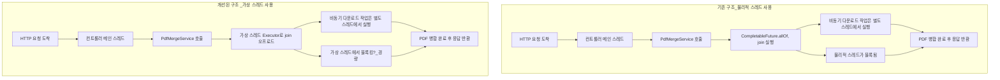

apache pdfbox를 사용함.

page별로 s3에 저장되어있음
page가 600개 가량 있음

request로
600정도의 page s3 objectkey 정보와 combinationorder라고 해서 pdf 머지시 위치해야할 위치정보가 들어옴.

s3에서 꺼내와서 서버에서 pdfbox로 merge 작업을진행함.

pdfmerge한것을 client에 bytestream으로 반환함.


spring boot 환경의 java21임

성능을생각해서 어떻게 성능을 좋게 할수 있을까요?

s3에 pdf가 파편화되어있고
사용자는 pdf 완성본을 봐야함 (최대600페이지)

### 본인이 생각한 해결법
아래구조로 개발한다


```java
package com.example.demo.dto;

import lombok.Data;
import java.util.List;

/**
 * 클라이언트가 보내는 PDF 병합 요청.
 * 여러 개의 PDF '조각' (S3에 저장된)의 키와 병합 순서가 들어 있음.
 */
@Data
public class PdfMergeRequest {
    private List<PageInfo> pageInfos;

    @Data
    public static class PageInfo {
        private String s3Key;         // S3 오브젝트 키
        private int combinationOrder; // 최종 병합 순서 (1-based, 2-based... 가능)
    }
}


```

```java
package com.example.demo.controller;

import com.example.demo.dto.PdfMergeRequest;
import com.example.demo.service.PdfMergeService;
import lombok.RequiredArgsConstructor;
import org.springframework.http.HttpHeaders;
import org.springframework.http.MediaType;
import org.springframework.http.ResponseEntity;
import org.springframework.web.bind.annotation.*;

@RestController
@RequiredArgsConstructor
@RequestMapping("/api/pdf")
public class PdfMergeController {

    private final PdfMergeService pdfMergeService;

    /**
     * 1) byte[] 형태로 병합된 PDF 응답
     *    - 서버 메모리에 병합 결과 전체가 올라간 뒤 반환됨
     */
    @PostMapping("/merge/bytearray")
    public ResponseEntity<byte[]> mergePdfByteArray(@RequestBody PdfMergeRequest request) {

        byte[] mergedPdf = pdfMergeService.mergePdfToByteArray(request.getPageInfos());

        return ResponseEntity.ok()
                .contentType(MediaType.APPLICATION_PDF)
                .header(HttpHeaders.CONTENT_DISPOSITION, "inline; filename=merged.pdf")
                .body(mergedPdf);
    }
}


```

bytestream 버전
```java
package com.example.demo.controller;

import com.example.demo.dto.PdfMergeRequest;
import com.example.demo.service.PdfMergeService;
import lombok.RequiredArgsConstructor;
import org.springframework.http.HttpHeaders;
import org.springframework.http.MediaType;
import org.springframework.http.ResponseEntity;
import org.springframework.web.bind.annotation.*;
import org.springframework.web.servlet.mvc.method.annotation.StreamingResponseBody;

@RestController
@RequiredArgsConstructor
@RequestMapping("/api/pdf")
public class PdfMergeStreamController {

    private final PdfMergeService pdfMergeService;

    /**
     * 2) StreamingResponseBody 형태로 병합된 PDF 전송
     *    - 병합된 데이터를 "바로바로" HTTP 응답 스트림에 흘려보냄
     *    - 대용량 PDF에 유리(서버 메모리 절약)
     */
    @PostMapping("/merge/stream")
    public ResponseEntity<StreamingResponseBody> mergePdfStream(@RequestBody PdfMergeRequest request) {

        StreamingResponseBody responseBody = outputStream -> {
            // Service 로직에서, 병합 결과를 outputStream에 직접 write
            pdfMergeService.mergePdfToOutputStream(request.getPageInfos(), outputStream);
        };

        return ResponseEntity.ok()
                .contentType(MediaType.APPLICATION_PDF)
                .header(HttpHeaders.CONTENT_DISPOSITION, "inline; filename=merged_stream.pdf")
                .body(responseBody);
    }
}

```

```java
package com.example.demo.config;

import org.springframework.context.annotation.Bean;
import org.springframework.context.annotation.Configuration;
import software.amazon.awssdk.core.client.config.ClientOverrideConfiguration;
import software.amazon.awssdk.services.s3.S3AsyncClient;
import software.amazon.awssdk.transfer.s3.S3TransferManager;

@Configuration
public class S3Config {

    /**
     * AWS SDK v2 - S3AsyncClient Bean
     */
    @Bean
    public S3AsyncClient s3AsyncClient() {
        return S3AsyncClient.builder()
                .overrideConfiguration(ClientOverrideConfiguration.builder().build())
                // region, credentials 등 필요한 설정 추가
                .build();
    }

    /**
     * S3TransferManager Bean
     * - 병렬(비동기) 업/다운로드를 쉽게 처리
     */
    @Bean
    public S3TransferManager s3TransferManager(S3AsyncClient s3AsyncClient) {
        return S3TransferManager.builder()
                .s3Client(s3AsyncClient)
                .build();
    }
}


```

```java
package com.example.demo.service;

import com.example.demo.dto.PdfMergeRequest.PageInfo;
import lombok.RequiredArgsConstructor;
import org.apache.pdfbox.io.MemoryUsageSetting;
import org.apache.pdfbox.multipdf.PDFMergerUtility;
import org.springframework.stereotype.Service;
import software.amazon.awssdk.transfer.s3.S3TransferManager;
import software.amazon.awssdk.transfer.s3.Download;
import software.amazon.awssdk.transfer.s3.model.DownloadFileRequest;

import java.io.ByteArrayOutputStream;
import java.io.IOException;
import java.io.OutputStream;
import java.nio.file.Files;
import java.nio.file.Path;
import java.util.List;
import java.util.concurrent.CompletableFuture;

/**
 * PDF 병합을 담당하는 Service.
 */
@Service
@RequiredArgsConstructor
public class PdfMergeService {

    private final S3TransferManager s3TransferManager;
    private static final String BUCKET_NAME = "your-bucket-name"; // 실제 버킷명 지정

    /**
     * (A) 병합된 PDF를 최종적으로 byte[] 형태로 리턴하는 방식
     *     - 서버 메모리에 모두 올린 뒤 반환.
     */
    public byte[] mergePdfToByteArray(List<PageInfo> pageInfos) {
        // 1) 페이지 순서대로 정렬 (combinationOrder 기준)
        pageInfos.sort((a, b) -> Integer.compare(a.getCombinationOrder(), b.getCombinationOrder()));

        // 2) S3 병렬 다운로드 -> 임시파일 생성
        List<Path> downloadedPaths = downloadAllPdfsInParallel(pageInfos);

        // 3) PDFBox 병합 (결과를 byte[]로)
        byte[] mergedBytes = mergeLocalPdfFilesToByteArray(downloadedPaths);

        // 4) 임시파일 삭제
        cleanUpTempFiles(downloadedPaths);

        return mergedBytes;
    }

    /**
     * (B) 병합된 PDF를 'Streaming(바로바로) 전송' 방식으로,
     *     주어진 OutputStream에 직접 쓰는 방식
     *     - 크게 보면, Controller에서 HttpServletResponse OutputStream을 넘겨받아 써도 됨
     */
    public void mergePdfToOutputStream(List<PageInfo> pageInfos, OutputStream outputStream) {
        pageInfos.sort((a, b) -> Integer.compare(a.getCombinationOrder(), b.getCombinationOrder()));

        List<Path> downloadedPaths = downloadAllPdfsInParallel(pageInfos);

        // PDFBox 병합, 직접 outputStream에 쓴다
        mergeLocalPdfFilesToStream(downloadedPaths, outputStream);

        cleanUpTempFiles(downloadedPaths);
    }

    /**
     * S3 병렬 다운로드 - 임시파일로 저장 후 Path 목록 반환
     */
    private List<Path> downloadAllPdfsInParallel(List<PageInfo> pageInfos) {
        List<CompletableFuture<Path>> futures = pageInfos.stream()
                .map(info -> downloadSinglePdfAsync(info.getS3Key()))
                .toList();

        // 모든 다운로드가 끝날 때까지 대기
        CompletableFuture.allOf(futures.toArray(new CompletableFuture[0])).join();

        // Path 리스트로 반환
        return futures.stream()
                .map(CompletableFuture::join)
                .toList();
    }

    /**
     * 개별 PDF 파일(조각)을 S3에서 비동기로 다운로드 -> 임시파일 -> 완료 후 Path 반환
     */
    private CompletableFuture<Path> downloadSinglePdfAsync(String s3Key) {
        try {
            // OS 임시 디렉토리에 임시파일 생성
            Path tempFile = Files.createTempFile("pdfmerge-", ".pdf");

            // TransferManager를 이용한 비동기 다운로드
            DownloadFileRequest request = DownloadFileRequest.builder()
                    .getObjectRequest(b -> b.bucket(BUCKET_NAME).key(s3Key))
                    .destination(tempFile)
                    .build();

            Download download = s3TransferManager.downloadFile(request);

            // 다운로드 완료 후 tempFile Path 반환
            return download.completionFuture()
                    .thenApply(result -> tempFile);

        } catch (IOException e) {
            throw new RuntimeException("Failed to create temp file for PDF download", e);
        }
    }

    /**
     * PDFBox: 로컬 임시 PDF 파일 목록을 병합하여 byte[]로 반환
     */
    private byte[] mergeLocalPdfFilesToByteArray(List<Path> pdfPaths) {
        try (ByteArrayOutputStream baos = new ByteArrayOutputStream()) {

            PDFMergerUtility merger = new PDFMergerUtility();
            merger.setDestinationStream(baos);

            // [중요] 메모리 사용/임시파일 사용 전략
            // 여기서는 임시파일만 사용하도록 설정 (대용량 대응)
            MemoryUsageSetting memSetting = MemoryUsageSetting.setupTempFileOnly();

            // 순서대로 addSource
            for (Path path : pdfPaths) {
                merger.addSource(path.toFile());
            }

            // 병합 실행
            merger.mergeDocuments(memSetting);

            return baos.toByteArray();

        } catch (IOException e) {
            throw new RuntimeException("PDF merge error (toByteArray)", e);
        }
    }

    /**
     * PDFBox: 로컬 임시 PDF 파일들을 병합하여 주어진 OutputStream에 바로 쓴다
     */
    private void mergeLocalPdfFilesToStream(List<Path> pdfPaths, OutputStream outputStream) {
        PDFMergerUtility merger = new PDFMergerUtility();
        merger.setDestinationStream(outputStream);

        // 메모리 + 임시파일 혼합 사용 (예: 128MB까지 메모리, 초과시 디스크)
        // 필요에 따라 setupMainMemoryOnly() or setupTempFileOnly() 선택
        MemoryUsageSetting memSetting = MemoryUsageSetting.setupMixed(128 * 1024 * 1024);

        try {
            for (Path path : pdfPaths) {
                merger.addSource(path.toFile());
            }
            merger.mergeDocuments(memSetting);

        } catch (IOException e) {
            throw new RuntimeException("PDF merge error (toStream)", e);
        }
    }

    /**
     * 임시 파일 정리
     */
    private void cleanUpTempFiles(List<Path> paths) {
        for (Path path : paths) {
            try {
                Files.deleteIfExists(path);
            } catch (IOException e) {
                // 로깅 후 무시
                e.printStackTrace();
            }
        }
    }
}


```

동시 처리 배치작업 제한 버전

```java
package com.example.demo.service;

import com.example.demo.dto.PdfMergeRequest.PageInfo;
import lombok.RequiredArgsConstructor;
import org.apache.pdfbox.io.MemoryUsageSetting;
import org.apache.pdfbox.multipdf.PDFMergerUtility;
import org.springframework.stereotype.Service;
import software.amazon.awssdk.transfer.s3.S3TransferManager;
import software.amazon.awssdk.transfer.s3.Download;
import software.amazon.awssdk.transfer.s3.model.DownloadFileRequest;

import java.io.ByteArrayOutputStream;
import java.io.IOException;
import java.io.OutputStream;
import java.nio.file.Files;
import java.nio.file.Path;
import java.util.List;
import java.util.concurrent.CompletableFuture;
import java.util.concurrent.Semaphore;

/**
 * PDF 병합을 담당하는 Service.
 */
@Service
@RequiredArgsConstructor
public class PdfMergeService {

    private final S3TransferManager s3TransferManager;
    private static final String BUCKET_NAME = "your-bucket-name"; // 실제 버킷명 지정

    // 최대 동시 다운로드 개수 제한
    private static final int MAX_CONCURRENT_DOWNLOADS = 10;

    /**
     * (A) 병합된 PDF를 최종적으로 byte[] 형태로 리턴하는 방식
     *     - 서버 메모리에 모두 올린 뒤 반환.
     */
    public byte[] mergePdfToByteArray(List<PageInfo> pageInfos) {
        // 1) 페이지 순서대로 정렬 (combinationOrder 기준)
        pageInfos.sort((a, b) -> Integer.compare(a.getCombinationOrder(), b.getCombinationOrder()));

        // 2) S3 병렬 다운로드 -> 임시파일 생성
        List<Path> downloadedPaths = downloadAllPdfsInParallel(pageInfos);

        // 3) PDFBox 병합 (결과를 byte[]로)
        byte[] mergedBytes = mergeLocalPdfFilesToByteArray(downloadedPaths);

        // 4) 임시파일 삭제
        cleanUpTempFiles(downloadedPaths);

        return mergedBytes;
    }

    /**
     * (B) 병합된 PDF를 'Streaming(바로바로) 전송' 방식으로,
     *     주어진 OutputStream에 직접 쓰는 방식
     */
    public void mergePdfToOutputStream(List<PageInfo> pageInfos, OutputStream outputStream) {
        pageInfos.sort((a, b) -> Integer.compare(a.getCombinationOrder(), b.getCombinationOrder()));

        List<Path> downloadedPaths = downloadAllPdfsInParallel(pageInfos);

        // PDFBox 병합, 직접 outputStream에 쓴다
        mergeLocalPdfFilesToStream(downloadedPaths, outputStream);

        cleanUpTempFiles(downloadedPaths);
    }

    /**
     * S3 병렬 다운로드 - 임시파일로 저장 후 Path 목록 반환
     * 동시 다운로드 수를 MAX_CONCURRENT_DOWNLOADS로 제한함.
     */
    private List<Path> downloadAllPdfsInParallel(List<PageInfo> pageInfos) {
        Semaphore semaphore = new Semaphore(MAX_CONCURRENT_DOWNLOADS);
        List<CompletableFuture<Path>> futures = pageInfos.stream()
                .map(info ->
                    CompletableFuture.supplyAsync(() -> {
                        try {
                            semaphore.acquire();
                        } catch (InterruptedException e) {
                            Thread.currentThread().interrupt();
                            throw new RuntimeException("Semaphore interrupted", e);
                        }
                        return info.getS3Key();
                    }).thenCompose(s3Key -> downloadSinglePdfAsync(s3Key)
                            .whenComplete((result, error) -> semaphore.release()))
                )
                .toList();

        CompletableFuture.allOf(futures.toArray(new CompletableFuture[0])).join();
        return futures.stream()
                .map(CompletableFuture::join)
                .toList();
    }

    /**
     * 개별 PDF 파일(조각)을 S3에서 비동기로 다운로드 -> 임시파일 -> 완료 후 Path 반환
     */
    private CompletableFuture<Path> downloadSinglePdfAsync(String s3Key) {
        try {
            // OS 임시 디렉토리에 임시파일 생성
            Path tempFile = Files.createTempFile("pdfmerge-", ".pdf");

            // TransferManager를 이용한 비동기 다운로드
            DownloadFileRequest request = DownloadFileRequest.builder()
                    .getObjectRequest(b -> b.bucket(BUCKET_NAME).key(s3Key))
                    .destination(tempFile)
                    .build();

            Download download = s3TransferManager.downloadFile(request);

            // 다운로드 완료 후 tempFile Path 반환
            return download.completionFuture()
                    .thenApply(result -> tempFile);

        } catch (IOException e) {
            throw new RuntimeException("Failed to create temp file for PDF download", e);
        }
    }

    /**
     * PDFBox: 로컬 임시 PDF 파일 목록을 병합하여 byte[]로 반환
     */
    private byte[] mergeLocalPdfFilesToByteArray(List<Path> pdfPaths) {
        try (ByteArrayOutputStream baos = new ByteArrayOutputStream()) {

            PDFMergerUtility merger = new PDFMergerUtility();
            merger.setDestinationStream(baos);

            // [중요] 메모리 사용/임시파일 사용 전략
            MemoryUsageSetting memSetting = MemoryUsageSetting.setupTempFileOnly();

            // 순서대로 addSource
            for (Path path : pdfPaths) {
                merger.addSource(path.toFile());
            }

            // 병합 실행
            merger.mergeDocuments(memSetting);

            return baos.toByteArray();

        } catch (IOException e) {
            throw new RuntimeException("PDF merge error (toByteArray)", e);
        }
    }

    /**
     * PDFBox: 로컬 임시 PDF 파일들을 병합하여 주어진 OutputStream에 바로 쓴다
     */
    private void mergeLocalPdfFilesToStream(List<Path> pdfPaths, OutputStream outputStream) {
        PDFMergerUtility merger = new PDFMergerUtility();
        merger.setDestinationStream(outputStream);

        // 메모리 + 임시파일 혼합 사용 (예: 128MB까지 메모리, 초과시 디스크)
        MemoryUsageSetting memSetting = MemoryUsageSetting.setupMixed(128 * 1024 * 1024);

        try {
            for (Path path : pdfPaths) {
                merger.addSource(path.toFile());
            }
            merger.mergeDocuments(memSetting);

        } catch (IOException e) {
            throw new RuntimeException("PDF merge error (toStream)", e);
        }
    }

    /**
     * 임시 파일 정리
     */
    private void cleanUpTempFiles(List<Path> paths) {
        for (Path path : paths) {
            try {
                Files.deleteIfExists(path);
            } catch (IOException e) {
                // 로깅 후 무시
                e.printStackTrace();
            }
        }
    }
}

```

가상스레드를 활용하여 join 지점을 최소화 한다면

가상 스레드 bean 등록

```java
package com.example.demo.config;

import org.springframework.context.annotation.Bean;
import org.springframework.context.annotation.Configuration;
import java.util.concurrent.ExecutorService;
import java.util.concurrent.Executors;

@Configuration
public class VirtualThreadConfig {

    /**
     * Java 21 가상 스레드를 활용한 Executor.
     * 이 Executor는 각 작업마다 가상 스레드를 생성하여,
     * 블록킹 호출이 발생해도 OS 스레드를 점유하지 않습니다.
     */
    @Bean
    public ExecutorService virtualThreadExecutor() {
        return Executors.newVirtualThreadPerTaskExecutor();
    }
}
```

```java
package com.example.demo.service;

import com.example.demo.dto.PdfMergeRequest.PageInfo;
import lombok.RequiredArgsConstructor;
import org.apache.pdfbox.io.MemoryUsageSetting;
import org.apache.pdfbox.multipdf.PDFMergerUtility;
import org.springframework.stereotype.Service;
import software.amazon.awssdk.transfer.s3.S3TransferManager;
import software.amazon.awssdk.transfer.s3.Download;
import software.amazon.awssdk.transfer.s3.model.DownloadFileRequest;

import java.io.ByteArrayOutputStream;
import java.io.IOException;
import java.io.OutputStream;
import java.nio.file.Files;
import java.nio.file.Path;
import java.util.List;
import java.util.concurrent.CompletableFuture;
import java.util.concurrent.ExecutorService;
import java.util.concurrent.Semaphore;

@Service
@RequiredArgsConstructor
public class PdfMergeService {

    private final S3TransferManager s3TransferManager;
    private final ExecutorService virtualThreadExecutor; // 가상 스레드 Executor 주입
    private static final String BUCKET_NAME = "your-bucket-name"; // 실제 버킷명 지정

    // 최대 동시 다운로드 개수 제한
    private static final int MAX_CONCURRENT_DOWNLOADS = 50;

    /**
     * (A) 병합된 PDF를 byte[]로 리턴하는 방식
     */
    public byte[] mergePdfToByteArray(List<PageInfo> pageInfos) {
        pageInfos.sort((a, b) -> Integer.compare(a.getCombinationOrder(), b.getCombinationOrder()));

        List<Path> downloadedPaths = downloadAllPdfsInParallel(pageInfos);

        byte[] mergedBytes = mergeLocalPdfFilesToByteArray(downloadedPaths);

        cleanUpTempFiles(downloadedPaths);

        return mergedBytes;
    }

    /**
     * (B) 병합된 PDF를 StreamingResponseBody로 전송하는 방식
     */
    public void mergePdfToOutputStream(List<PageInfo> pageInfos, OutputStream outputStream) {
        pageInfos.sort((a, b) -> Integer.compare(a.getCombinationOrder(), b.getCombinationOrder()));

        List<Path> downloadedPaths = downloadAllPdfsInParallel(pageInfos);

        mergeLocalPdfFilesToStream(downloadedPaths, outputStream);

        cleanUpTempFiles(downloadedPaths);
    }

    /**
     * S3 병렬 다운로드 – 임시파일 저장 후 Path 목록 반환.
     * 동시 다운로드 수를 MAX_CONCURRENT_DOWNLOADS로 제한.
     * 개선: 전체 대기(join) 호출을 가상 스레드에서 처리하여 메인 스레드 블록킹을 피함.
     */
    private List<Path> downloadAllPdfsInParallel(List<PageInfo> pageInfos) {
        Semaphore semaphore = new Semaphore(MAX_CONCURRENT_DOWNLOADS);
        List<CompletableFuture<Path>> futures = pageInfos.stream()
                .map(info ->
                        CompletableFuture.supplyAsync(() -> {
                            try {
                                semaphore.acquire();
                            } catch (InterruptedException e) {
                                Thread.currentThread().interrupt();
                                throw new RuntimeException("Semaphore interrupted", e);
                            }
                            return info.getS3Key();
                        })
                        .thenCompose(s3Key -> downloadSinglePdfAsync(s3Key)
                                .whenComplete((result, error) -> semaphore.release()))
                )
                .toList();

        // 전체 대기를 가상 스레드에서 처리하여 메인 스레드의 블록킹을 피함
        return CompletableFuture.supplyAsync(() -> {
            CompletableFuture.allOf(futures.toArray(new CompletableFuture[0])).join();
            return futures.stream()
                    .map(CompletableFuture::join)
                    .toList();
        }, virtualThreadExecutor).join();
    }

    /**
     * 개별 PDF 파일을 S3에서 비동기로 다운로드 후 임시파일 Path 반환.
     */
    private CompletableFuture<Path> downloadSinglePdfAsync(String s3Key) {
        try {
            Path tempFile = Files.createTempFile("pdfmerge-", ".pdf");
            DownloadFileRequest request = DownloadFileRequest.builder()
                    .getObjectRequest(b -> b.bucket(BUCKET_NAME).key(s3Key))
                    .destination(tempFile)
                    .build();
            Download download = s3TransferManager.downloadFile(request);
            return download.completionFuture().thenApply(result -> tempFile);
        } catch (IOException e) {
            throw new RuntimeException("Failed to create temp file for PDF download", e);
        }
    }

    /**
     * 로컬 임시 PDF 파일 목록을 병합하여 byte[]로 반환.
     */
    private byte[] mergeLocalPdfFilesToByteArray(List<Path> pdfPaths) {
        try (ByteArrayOutputStream baos = new ByteArrayOutputStream()) {
            PDFMergerUtility merger = new PDFMergerUtility();
            merger.setDestinationStream(baos);
            MemoryUsageSetting memSetting = MemoryUsageSetting.setupTempFileOnly();
            for (Path path : pdfPaths) {
                merger.addSource(path.toFile());
            }
            merger.mergeDocuments(memSetting);
            return baos.toByteArray();
        } catch (IOException e) {
            throw new RuntimeException("PDF merge error (toByteArray)", e);
        }
    }

    /**
     * 로컬 임시 PDF 파일들을 병합하여 주어진 OutputStream에 직접 씀.
     */
    private void mergeLocalPdfFilesToStream(List<Path> pdfPaths, OutputStream outputStream) {
        PDFMergerUtility merger = new PDFMergerUtility();
        merger.setDestinationStream(outputStream);
        MemoryUsageSetting memSetting = MemoryUsageSetting.setupMixed(128 * 1024 * 1024);
        try {
            for (Path path : pdfPaths) {
                merger.addSource(path.toFile());
            }
            merger.mergeDocuments(memSetting);
        } catch (IOException e) {
            throw new RuntimeException("PDF merge error (toStream)", e);
        }
    }

    /**
     * 임시 파일 삭제.
     */
    private void cleanUpTempFiles(List<Path> paths) {
        for (Path path : paths) {
            try {
                Files.deleteIfExists(path);
            } catch (IOException e) {
                e.printStackTrace(); // 로깅 후 무시
            }
        }
    }
}

```

```java
package com.example.demo.controller;

import com.example.demo.dto.PdfMergeRequest;
import com.example.demo.service.PdfMergeService;
import lombok.RequiredArgsConstructor;
import org.springframework.http.HttpHeaders;
import org.springframework.http.MediaType;
import org.springframework.http.ResponseEntity;
import org.springframework.web.bind.annotation.*;
import org.springframework.web.servlet.mvc.method.annotation.StreamingResponseBody;

@RestController
@RequiredArgsConstructor
@RequestMapping("/api/pdf")
public class PdfMergeStreamController {

    private final PdfMergeService pdfMergeService;

    /**
     * StreamingResponseBody 방식으로 병합된 PDF를 bytestream으로 반환.
     */
    @PostMapping("/merge/stream")
    public ResponseEntity<StreamingResponseBody> mergePdfStream(@RequestBody PdfMergeRequest request) {

        StreamingResponseBody responseBody = outputStream -> {
            pdfMergeService.mergePdfToOutputStream(request.getPageInfos(), outputStream);
        };

        return ResponseEntity.ok()
                .contentType(MediaType.APPLICATION_PDF)
                .header(HttpHeaders.CONTENT_DISPOSITION, "inline; filename=merged_stream.pdf")
                .body(responseBody);
    }
}
```

비교



주요 스레드 보호:

기존 구조: PDF 병합 작업 대기(join) 시, 주요(물리적) 스레드가 블록되어 다른 요청 처리에 영향을 줄 수 있음.
가상 스레드 개선: 전체 대기(join) 호출을 가상 스레드에서 처리하므로, 웹 서버의 주요 스레드는 블록되지 않아 높은 응답성을 유지할 수 있음.

경량화된 블록킹:
가상 스레드는 OS 스레드보다 가볍기 때문에, 블록킹 호출이 다수 발생해도 전체 시스템에 미치는 부하가 매우 적음.

높은 동시성 및 확장성:
가상 스레드를 사용하면, 블록킹 작업이 있어도 물리적 스레드 수의 한계에 구애받지 않고 많은 동시 요청을 처리할 수 있음.

리소스 효율성:
가상 스레드는 적은 메모리와 CPU 오버헤드로 수천 개의 블록킹 작업을 효율적으로 처리하여, 시스템 확장성을 크게 향상시킴.